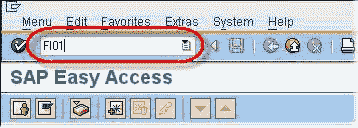
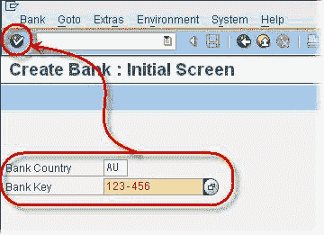
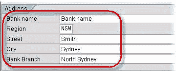
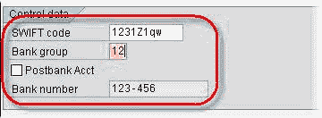

# SAP FI01：如何创建银行密钥

> 原文： [https://www.guru99.com/how-to-create-a-bank-key.html](https://www.guru99.com/how-to-create-a-bank-key.html)

在本教程中，我们将学习如何创建银行密钥

**步骤 1）**在 SAP 交易代码框中输入 **FI **01****

**步骤 2）**在下一个 SAP 屏幕中

*   输入**银行国家/地区**。
*   输入新的 **Bank Key** 。
*   单击输入按钮

**步骤 3）**在下一个 SAP 屏幕的“地址”部分下

*   输入**银行的**名称。
*   选择适当的**区域**。
*   输入银行的**街道地址**。
*   输入**银行所在的城市。**
*   输入适当的**分支名称**

**步骤 4）**在控制数据部分

*   输入银行的 **SWIFT** 代码
*   输入**银行的组**
*   勾选帖子。 银行帐户复选框

**步骤 5）**单击保存。 创建一个新的银行密钥。