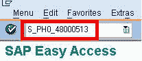
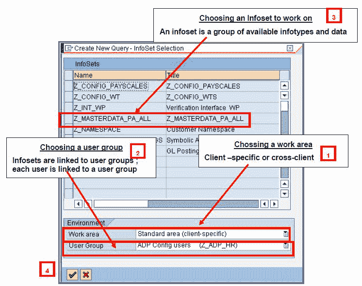
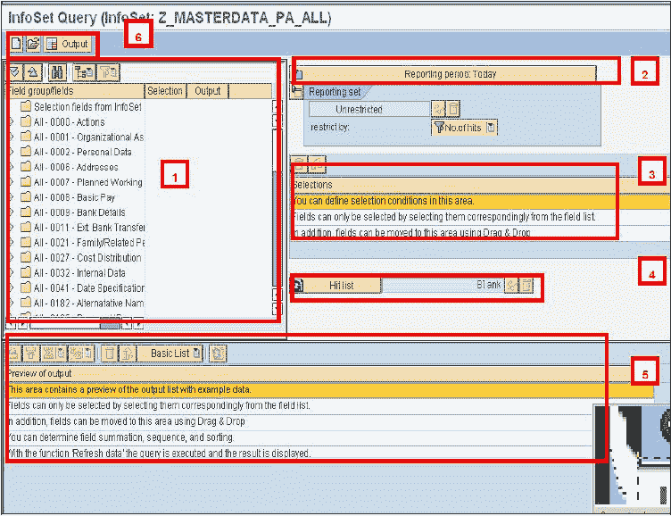
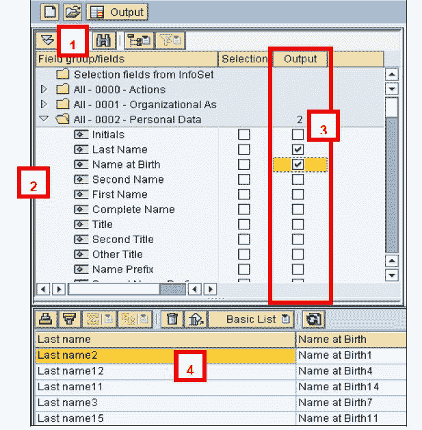
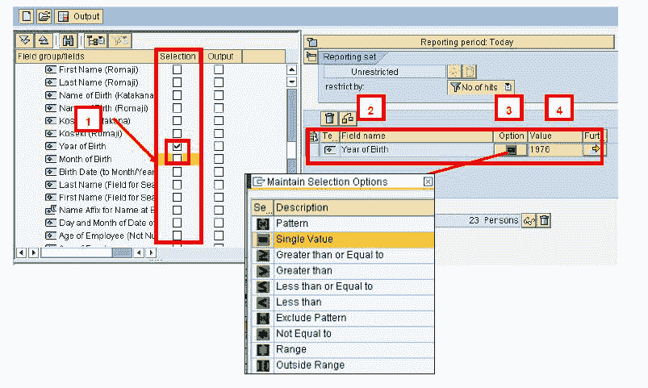
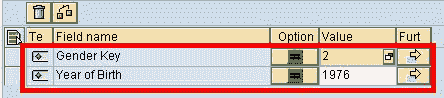
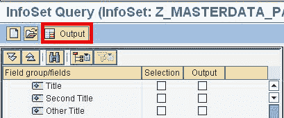
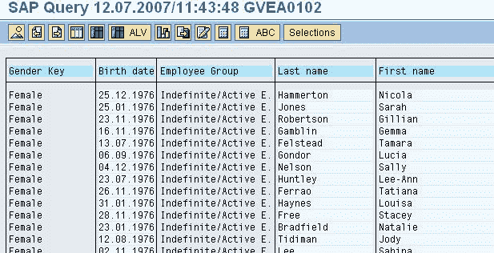
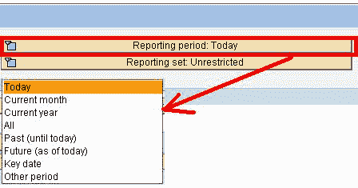

# SAP AD HOC 查询教程（S_PH0_48000513）

> 原文： [https://www.guru99.com/all-about-ad-hoc-query.html](https://www.guru99.com/all-about-ad-hoc-query.html)

临时查询是用于构建员工基本数据的报告和查询的工具，它提供对所有 SAP 信息类型的数据的访问。 该工具可以处理链接到的数据：o 时间管理 o 组织管理 o 薪酬管理 o 培训等。

**步骤 1）**在 SAP Command 提示符下，输入事务 **S_PH0_48000513**

**步骤 2）**在下一个 SAP 屏幕**中，**

1.  选择工作区-链接到特定于**的**客户端或所有客户端的查询
2.  选择一个用户组-访问**可用信息集**
3.  选择一个信息集**-**在清单中选择所需的信息集
4.  单击复选标记按钮

**步骤 3）**显示了 SAP 即席查询工作面板-

各节概述

1.  **字段组/字段** =定义选择和输出字段的位置
2.  **报告周期** =在此定义要检索选定对象的周期。
3.  **选择** =在“字段组/字段”部分的“选择”列中打勾的字段之后，它将出现在“选择”部分中，您可以在其中限制所选员工
4.  **测试选择** =更新查询获得的“匹配”数
5.  **功能** =仅通过使用鼠标或通过“输出预览”中的按钮即可访问某些布局功能
6.  **主要功能** =创建一个新查询，打开现有查询，执行一个查询

### 执行查询：选择输出

1.  部分字段/组字段显示所有可用信息类型的列表
2.  选择要输出其数据的 Infotye
3.  通过选中“输出”来选择信息类型字段
4.  数据显示在工作面板的底部

### 选择输入

通过使用任何元素，可以限制或限制所选人口。 在“字段组/字段”部分的“选择”列中勾选一个字段后，该字段将显示在“选择”部分中，您可以在其中设置限制。

1.  例如，检查出生年份的选择列
2.  它出现在选择部分中
3.  您可以选择通过模式，单个值等来限制值
4.  输入限制值

如果有多个选择，则选择之间的链接自动为**和**

**** 

上面的示例将产生一个女性列表（性别键= 2），并且出生于 1976 年

### 结果

点击输出。

显示结果

**注意：**确保为查询选择正确的报告期间

