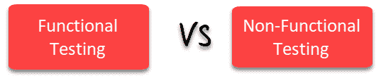

# 功能测试与非功能测试：有什么区别？

> 原文： [https://www.guru99.com/functional-testing-vs-non-functional-testing.html](https://www.guru99.com/functional-testing-vs-non-functional-testing.html)

## 什么是功能测试？

功能测试是一种测试，它可以验证软件应用程序的每个**功能**是否符合要求规范。 该测试主要涉及黑匣子测试，并且与应用程序的源代码无关。

通过提供适当的输入，验证输出并将实际结果与预期结果进行比较，来测试系统的每种功能。 该测试涉及检查用户界面，API，数据库，安全性，客户端/服务器应用程序以及被测应用程序的功能。 测试可以手动完成，也可以使用自动化完成

## 什么是非功能测试？

非功能测试是一种检查软件应用程序的非功能性方面（性能，可用性，可靠性等）的测试。 它明确设计为根据非功能性参数测试系统的就绪状态，而功能性测试永远不会解决这些参数。

非功能测试的一个很好的例子是检查可以同时登录软件的人数。

非功能测试与功能测试同等重要，并影响客户满意度。

## 关键区别

*   功能测试验证软件的每个功能/特征，而非功能测试则验证非功能方面，例如性能，可用性，可靠性等。
*   功能测试可以手动完成，而非功能测试很难手动执行。
*   功能测试基于客户的需求，而非功能测试则基于客户的期望。
*   功能测试的目的是验证软件操作，而非功能测试的目的是验证软件的性能。
*   “功能测试”示例用于检查登录功能，而“非功能”测试示例用于检查仪表板应在 2 秒钟内加载。
*   功能描述产品的功能，非功能描述产品的工作方式。
*   功能测试在非功能测试之前执行。

## 功能 VS。 非功能测试

| **参数** | **功能性** | **非功能测试** |
| --- | --- | --- |
| **执行** | 它在非功能测试之前执行。 | 在功能测试后执行。 |
| **焦点区域** | 它根据客户的要求。 | 它专注于客户的期望。 |
| **要求** | 定义功能需求很容易。 | 很难定义非功能测试的要求。 |
| **用法** | 帮助验证应用程序的行为。 | 帮助验证应用程序的性能。 |
| **目标** | 进行验证软件操作。 | 这样做是为了验证软件的性能。 |
| **要求** | 使用功能规范进行功能测试。 | 这种测试是根据性能规格进行的 |
| **手动测试** | 功能测试易于通过手动测试执行。 | 手动执行非功能测试非常困难。 |
| **功能** | 它描述了产品的功能。 | 它描述了产品的工作方式。 |
| **示例测试用例** | 检查登录功能。 | 仪表板将在 2 秒内加载。 |
| **测试类型** | 功能测试类型的示例

*   单元测试
*   烟雾测试
*   用户接受度
*   集成测试
*   回归测试
*   本地化
*   全球化
*   互操作性

 | 非功能测试类型的示例

*   性能测试
*   容量测试
*   可伸缩性
*   可用性测试
*   负载测试
*   压力测试
*   一致性测试
*   便携性测试
*   灾难恢复测试

 |