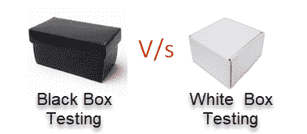

# 黑匣子测试与 白盒测试：主要差异

> 原文： [https://www.guru99.com/back-box-vs-white-box-testing.html](https://www.guru99.com/back-box-vs-white-box-testing.html)

## 什么是黑匣子测试？

在黑盒测试中，测试人员没有有关软件系统内部工作的任何信息。 黑匣子测试是针对软件行为的高级测试。 它涉及从外部或最终用户的角度进行测试。 黑匣子测试几乎可以应用于软件测试的每个级别：单元，集成，系统和验收。

## 什么是白盒测试？

白盒测试是一种检查系统内部功能的测试技术。 在这种方法中，测试基于代码语句，分支，路径或条件的覆盖范围。 白盒测试被视为低级测试。 它也称为玻璃盒，透明盒，透明盒或代码库测试。 白盒测试方法假定单元或程序中逻辑的路径是已知的。

## 关键区别

*   在 Black Box 中，测试是在不了解程序或应用程序的内部结构的情况下进行的；而在 White Box 中，测试是在了解程序的内部结构的情况下进行的。
*   黑盒测试不需要编程知识，而白盒测试则需要编程知识。
*   黑盒测试的主要目标是测试软件的行为，而白盒测试的主要目标是测试系统的内部操作。
*   黑盒测试侧重于外部或最终用户的角度，而白盒测试侧重于代码的结构，条件，路径和分支。
*   黑盒测试提供低粒度报告，而白盒测试提供高粒度报告。
*   黑盒测试不是一个耗时的过程，而白盒测试是一个耗时的过程。

## **黑盒测试**和**白盒测试**之间的区别

| **参数** | **黑匣子测试** | **白盒测试** |
| --- | --- | --- |
| **定义** | 这是一种测试方法，用于在不了解程序或应用程序内部结构的情况下测试软件。 | 这是一种测试方法，其中测试人员知道内部结构。 |
| **别名** | 它也称为数据驱动，箱式测试，数据和功能测试。 | 也称为结构测试，透明盒测试，基于代码的测试或玻璃盒测试。 |
| **测试基础** | 测试基于外部期望； 应用程序的内部行为是未知的。 | 内部工作是已知的，测试人员可以相应地进行测试。 |
| **用法** | 这种类型的测试非常适合更高级别的测试，例如系统测试，验收测试。 | 测试最适合单元测试，集成测试等较低级别的测试。 |
| **编程知识** | 无需编程知识即可执行黑匣子测试。 | 需要具备编程知识才能执行白盒测试。 |
| **实施知识** | 实施知识不需要进行黑盒测试。 | 全面了解需要实施 WhiteBox 测试。 |
| **自动化** | 测试和程序员彼此依赖，因此很难实现自动化。 | 白盒测试很容易实现自动化。 |
| **目标** | 该测试的主要目的是检查被测系统的功能。 | 白盒测试的主要目的是检查代码的质量。 |
| **测试用例的依据** | 可以在准备需求规格说明文件后开始测试。 | 准备好详细设计文档后，即可开始测试。 |
| **已通过**测试 | 由最终用户，开发人员和测试人员执行。 | 通常由测试人员和开发人员完成。 |
| **粒度** | 粒度低。 | 粒度高。 |
| **测试方法** | 它基于反复试验方法。 | 可以测试数据域和内部边界。 |
| **时间** | 它不那么详尽且耗时。 | 详尽而费时的方法。 |
| **算法测试** | 不是算法测试的最佳方法。 | 最适合算法测试。 |
| **代码访问** | 黑匣子测试不需要密码访问。 | 白盒测试需要访问代码。 因此，如果将测试外包，则代码可能会被盗。 |
| **利益** | 非常适合大型代码段，并且高效。 | 它允许删除多余的代码行，这可能带来隐藏的缺陷。 |
| **技能等级** | 低技能的测试人员可以在不了解编程语言或操作系统实现的情况下测试应用程序。 | 需要具有丰富经验的专家测试员来执行白盒测试。 |
| **技术** | 等效分区是黑盒测试技术，用于黑盒测试。

等效分区将输入值分为有效分区和无效分区，并从测试数据的每个分区中选择相应的值。

边界值分析

检查输入值的边界。 | 语句覆盖率，分支覆盖率和路径覆盖率是白盒测试技术。

语句覆盖率验证代码的每一行是否至少执行一次。

分支覆盖率验证每个分支是否至少执行一次。

路径覆盖率方法测试程序的所有路径。 |
| **缺点** | 如果您经常修改应用程序，那么更新自动化测试脚本至关重要。 | 如果代码库在快速变化，则自动化的测试用例可能变得毫无用处。 |