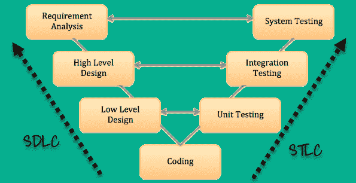

# SDLC 与 STLC：有什么区别？

> 原文： [https://www.guru99.com/sdlc-vs-stlc.html](https://www.guru99.com/sdlc-vs-stlc.html)

## 什么是 SDLC？

SDLC（软件开发生命周期）定义了软件开发过程中涉及的所有标准阶段。 SDLC 生命周期是按照以下顺序分阶段进行软件开发的过程

1.  需求收集
2.  设计软件
3.  编译软件
4.  测试
5.  部署方式
6.  维护**。**

每个阶段都有明确的进入和退出标准以及可交付成果。

## 什么是 STLC？

软件测试生命周期（STLC）是按计划良好的方式执行的测试过程。 在 STLC 过程中，开展了各种活动来提高产品质量。 但是，STLC 阶段仅处理测试和检测错误，而不处理开发本身。

不同的公司在 STLC 中定义了不同的阶段。 但是，通用软件测试生命周期具有以下阶段。

1.  需求分析
2.  测试计划
3.  测试开发
4.  测试环境设置
5.  测试执行&关闭

## 关键区别

*   SDLC 定义了软件开发过程中涉及的所有标准阶段，而 STLC 过程定义了各种活动来提高产品质量。
*   SDLC 是开发生命周期，而 STLC 是测试生命周期。
*   在 SDLC 中，开发团队将创建高级和低级设计计划，而在 STLC 中，测试分析师将创建系统，集成测试计划
*   在 SDLC 中，将开发实际代码，并根据设计文档进行实际工作，而在 STLC 中，测试团队准备测试环境并执行测试用例。
*   SDLC 生命周期可帮助团队成功完成软件开发，而 STLC 阶段仅涵盖软件测试。

## 为什么要使用 SDLC？

这里是使用 SDLC 方法的一些主要原因：

*   它旨在产生一个高质量的软件系统，以帮助您满足客户的期望
*   在提供最佳管理控制的每个阶段完成之后，将创建正式审查。
*   SDLC 可帮助您创建大量的系统文档
*   它生产许多中间产品，可以对它们进行审查，以验证它们是否可以满足用户的需求并符合规定的要求。
*   SDLC 帮助您确保系统需求可以追溯到既定的业务需求
*   每个阶段都有特定的可交付，进入和退出标准
*   开发阶段是一个接一个的阶段，这是明确要求的中小型项目的理想选择

## 为什么选择 STLC？

这里是使用 STLC 方法的重要原因：

*   STLC 帮助使测试过程更加复杂，一致和有效
*   您可以为项目的每个步骤包括里程碑和可交付成果
*   即使将模型扩展到各个级别，也易于理解和实施
*   时间约束是项目制定中的重要内容
*   项目的每个模块在另一个模块开始之前都要经过测试
*   特定项目的需求是根据实际结果来衡量的

## SDLC 和 STLC 之间的区别

| **参数** | **SDLC** | **STLC** |
| 起源 | 开发生命周期 | 测试生命周期 |
| 目的 | SDLC 生命周期的主要目的是完成软件的成功开发，包括测试和其他阶段。 | STLC 阶段的唯一目标是测试。 |
| 需求收集 | 在 SDLC 中，业务分析师收集需求并创建开发计划 | 在 STLC 中，质量检查团队会分析功能和非功能性文件之类的需求文档，并创建系统测试计划 |
| 高&低层设计 | 在 SDLC 中，开发团队可以创建高层次和低层次的设计计划 | 在 STLC 中，测试分析师创建集成测试计划 |
| 编码 | 实际代码已开发，实际工作根据设计文档进行。 | 测试团队准备测试环境并执行它们 |
| 保养 | SDLC 阶段还包括部署后支持和更新。 | 测试人员执行回归测试，通常是自动化脚本来检查部署的维护代码。 |

## SDLC 的功能

*   模型结构&的功能有据可查，并且可以轻松获得测试结果
*   该项目可以在另一个项目开始之前逐步完成。 项目单位是独特的，易于识别。
*   风险管理是模型不可或缺的，可以有效地处理。
*   可以对项目进行设计，以便采购零件

## STLC 的特点

*   STLC 分析从客户和利益相关者那里收集的系统需求
*   帮助您创建可追溯性矩阵
*   确定测试技术和测试类型
*   优先考虑应主要针对测试的功能
*   您可以使用 STLC 分析自动化的可行性
*   标识有关应在其中执行实际测试的测试环境的信息