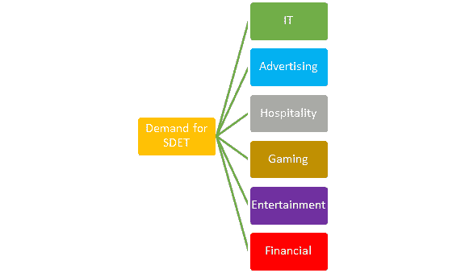
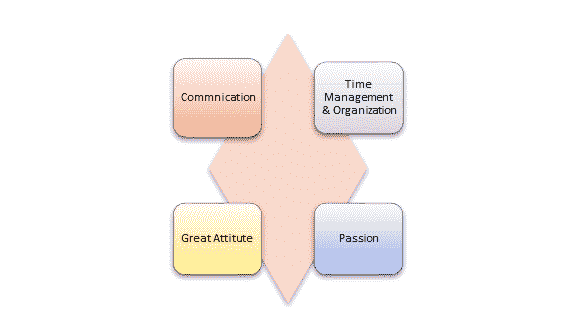
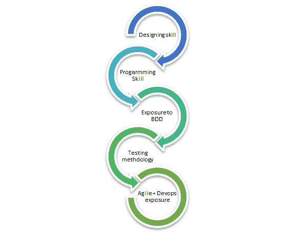

# 什么是 SDET？ 完整的形式，含义，作用和职责

> 原文： [https://www.guru99.com/software-developer-engineer-test-sdet.html](https://www.guru99.com/software-developer-engineer-test-sdet.html)

## 什么是 SDET？

**SDET** 是一位 IT 专业人员，可以在开发和测试角色中同样有效地工作。 SDET 的完整形式是受测软件开发工程师，他/她参与了完整的软件开发过程。 SDET 专业人员的知识完全集中在可测试性，鲁棒性和性能上。

他们还可以在创建生产软件的设计中扮演贡献者或审阅者的角色。

在本教程中，我们将学习-

*   [SDET 和测试仪之间的区别？](#1)
*   [您何时需要 SDET？](#2)
*   [需要 SDET 的行业](#3)
*   [SDET 工作所需的技术和非技术技能](#4)
*   [SDET 的角色和职责是什么？](#5)
*   [薪金](#6)
*   [典型工作日](#7)
*   [职业发展](#8)
*   [结论](#9)

## SDET 和测试仪之间的区别？

| **SDET** | **手动测试仪** |
| 知道整个系统从头到尾 | 有关系统的知识有限 |
| SDET 参与了软件开发过程的每个步骤，例如设计，开发和测试。 | 质量检查仅涉及软件开发过程的测试生命周期。 |
| 具有开发和测试知识的高技能专业人员。 | 软件测试人员仅参与准备和执行测试用例 |
| SDET 可以参与测试自动化工具的开发，并且可以使其通用。 | 不期望开发测试自动化工具或框架。 |
| SDET 需要执行诸如性能测试，自动生成测试数据等职责。 | 测试人员将仅执行与测试相关的任务。 |
| 了解产品的要求和准则 | 质量检查专家不会提供此类知识。 |

## 什么时候需要 SDET？

如今，组织正在寻找可以参与软件开发的专业人员。 同时，他还应该处理开发的软件的测试。 这就是为什么雇用 SDET 可以帮助他们，因为他们可以开发高性能代码或设计测试框架。

**SDET 专业人士的优势：**

*   SDETs 专业人员可以利用其编码技能来自动化验收测试
*   这些专业人员处理最终用户或客户及其体验。 他们已经具备工程技能，因此他们也可以像开发人员一样思考。
*   通过单元测试进行广泛的代码覆盖
*   可以构建，部署，运行&分别管理应用程序
*   影响开发，程序管理，&设计团队的技术实施和用户方案

## 需要 SDET 的行业

公司之间存在采用新技术和新方法的趋势。 因此，SDET 软件专业人员非常需要。 测试中的软件开发工程师主要在以下领域中需要：

 

## 技术和非技术技能

**以下是 SDET 的一些基本非技术技能：**

 

### 交流技能

SDET 必须具有出色的口头和书面交流能力。 测试材料（如测试用例，计划，测试策略，创建的错误报告）应易于阅读和理解。

### 时间管理&组织技能

SDET 的工作非常艰巨，尤其是在代码发布期间。 软件测试人员必须有效地管理工作负载，具有高生产率，时间管理技能

### 伟大的态度

要成为测试中的优秀软件开发工程师，您必须具有伟大的态度。 您应该能够通过不断变化的技术来升级自己的技术技能。 您的态度应具有一定程度的独立性。 这样，您就可以在没有太多监督的情况下获得分配任务的所有权。

### 热情

要在任何 IT 专业人员中享受成功，您必须对它充满热情。 SDET 应该对测试，开发和设计充满热情。

**以下是 SDET 预期提供的一些技术技能：**

*   了解 C＃、. NET，Java 或其他编程语言。
*   具有使用“ AGILE + DevOps”流程管理方法的经验。
*   SDET 应该具有有关各种测试方法&的相应工具的知识，例如 MS Test，NUnit，TestNG，Selenium WebDriver 等。
*   SDET 应该接触行为驱动开发。
*   借助自动化工具，能够在现有代码中找到瓶颈和阈值。
*   了解面向对象的设计

## SDET 的角色和职责是什么？

*   SDET 应该能够在多个应用程序平台（例如 Web，Mobile 和 Desktop）上执行测试自动化并设置框架。
*   调查技术支持团队推荐的客户问题。
*   创建&管理错误报告并与团队沟通。
*   能够构建不同的测试方案和验收测试。
*   SDET 需要与合作伙伴进行技术交流，以了解客户的系统或 API。
*   SDET 还与部署团队合作，解决系统的任何级别问题。
*   SDET 还应该能够建立，维护和运行测试自动化框架。

以上是 SDET 的关键技能和职责。 它们可能因不同的公司而异。

## 薪金

SDET 的薪金结构因公司而异。 在印度，测试软件开发工程师（SDET）的平均年薪为 6,92,692 卢比，在美国为 74,291 美元。

SDET 还获得了健康保险，酬金和其他津贴。

## 典型工作日

每天，您将忙于了解项目文档，创建&，执行测试用例，报告和测试错误。 您还将把您的意见投入设计团队，建议开发团队和其他团队建设活动。

## 职业发展

在典型的 CMMI 5 级公司中，您作为 SDET 的职业发展将遵循以下步骤，但因公司而异

SDET（Fresher）= >高级 SDET（2-3 年的经验）= > SDET 团队协调员（5-8 年的经验> = > SDET 经理（8 年以上的经验）

### 总结

SDET 专业人员是开发人员和测试人员的组合，他们具有项目管理的经验。 这一切都是一种技能，这使得 SDET 在当前市场上的工作更具挑战性和更高的要求。