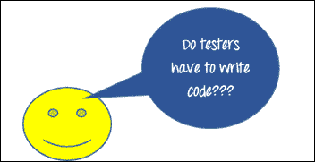
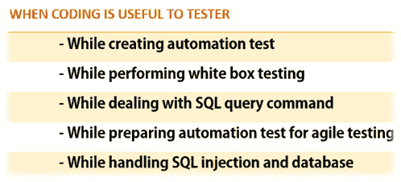

# 测试人员必须编写代码吗？

> 原文： [https://www.guru99.com/testers-write-code.html](https://www.guru99.com/testers-write-code.html)

测试有抱负的软件[的一个非常普遍的问题是……**测试人员必须编写代码吗？**](/software-testing.html)

在回答这个问题之前，必须全面了解各种软件测试角色。

软件质量检查通常分为两类，

1.  质量分析师：质量检查人员会验证测试的功能和完整性。 质量检查仅在开发阶段之后才验证软件。 质量检查角色不像开发人员那样技术娴熟，并且可能不需要编码。
2.  SDET（测试中的软件设计工程师）：另一方面，SDET 是了解产品内部工作原理的人。 他们了解数据库概念，编程语言等，并且还参与产品设计，数据设计和用户界面。 SDET 必须在开发阶段工作，并且需要编码知识。 因此，SDET 的角色更具挑战性，它涉及开发人员和测试人员的工作。 自动化测试仪（使用 [QTP](/quick-test-professional-qtp-tutorial.html) ， [Selenium](/selenium-tutorial.html) 之类的工具）也可以归类为 SDET。

因此，根据测试人员的角色，可以确定测试人员是否需要编码知识？ 让我们再回答几个与此有关的问题。

在本教程中，我们将看到以下内容。

*   成为一名优秀的测试员需要具备哪些技能？
*   什么测试员应该知道？
*   要成为一名优秀的测试人员，需要多少编程知识？

### 优秀测试员的属性

软件测试方法会根据软件产品的需求和规格而有所不同。 一个好的 QA 或软件测试人员在完成测试过程中起着重要的作用。

优秀测试人员的属性是；

*   良好的领域知识
*   良好的逻辑思维和
*   精通编程技巧。

### 测试人员需要多少编码知识

编写代码和调试是开发人员的工作。

然后出现了一个问题，为什么测试人员需要编码知识？

让我们看看一些原因，为什么对测试人员来说必须知道编码。

软件测试主要涉及两种方法[手动测试](/manual-testing.html)和[自动化测试](/automation-testing.html)。 在高级级别，测试可以分为白盒测试，黑盒测试或灰盒测试。 不同的测试技术要求测试人员具备不同的技能。

*   在执行黑匣子测试时，测试人员不需要编码知识。 测试仪只需输入数据即可测试软件，然后检查输出。
*   白盒测试或代码驱动的测试需要代码知识。 了解各种编程概念，例如 C，C＃，C ++，RDBMS 概念等可能会有所帮助。
*   测试人员在进行自动化测试或白盒测试后需要具备良好的编码知识。 这是因为自动化测试涉及语句覆盖率，代码覆盖率，[循环复杂度](/cyclomatic-complexity.html)等。所有这些概念都需要对编程技能和数据库有充分的了解。
*   SQL（结构化查询语言）-有时测试需要数据库验证。 因此，测试人员需要具有 [SQL](/sql.html) 命令的基本知识，例如–“选择”，“创建”，“更新”等。
*   SQL 注入“ [SQL 注入](/learn-sql-injection-with-practical-example.html)”是通过插入不需要的命令来进行数据库黑客攻击的技术之一。 对 [JavaScript](/interactive-javascript-tutorials.html) 和 [SQL](/sql.html) 命令的充分了解有助于避免此类软件安全威胁。
*   敏捷测试-在[敏捷测试中，](/agile-testing-a-beginner-s-guide.html)整个团队负责软件的质量。 在整个敏捷过程中，测试人员将与一个或多个程序员一起编写测试。 因此，对于创建自动化测试，测试人员必须知道代码。

**软件质量检查分析师的一些重要提示**

*   手动测试的知识以及脚本语言，例如 [JavaScript](/interactive-javascript-tutorials.html) 等，都将有助于您提高测试技能。
*   作为测试人员，您应该掌握诸如 [Java](/java-tutorial.html) ， [VBScript](/vbscript-tutorials-for-beginners.html) 之类的编程语言的基础知识。这不是必须的，但有必要。 对 SQL 概念（DBMS 概念）的了解对您来说是一个好习惯。

除了这些，很少有一般性提示可以帮助软件质量检查分析师，

*   交流技能
*   分析心态
*   才智

知道软件测试中的代码对质量保证分析师或测试人员整个职业生涯都有很大帮助。

**摘要：**

Software QA is typically divided into two categories,

*   质量检查人员：不需要编码知识
*   SDET：它需要编码知识

优秀测试人员的属性是

*   良好的领域知识
*   良好的逻辑思维和
*   精通编程技巧。

测试人员在进行自动化测试后需要良好的编码知识