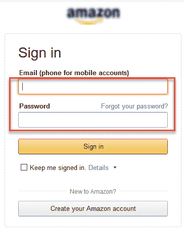
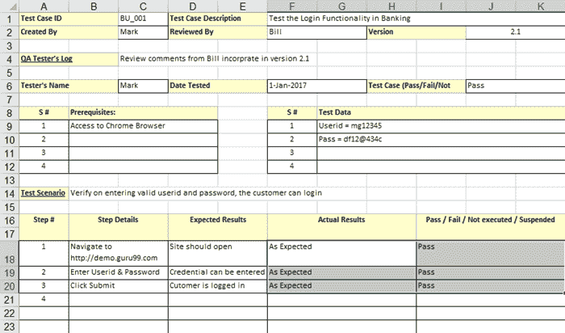
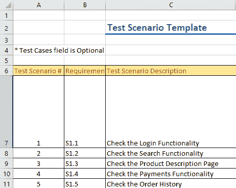

# 测试用例与测试方案：有什么区别？

> 原文： [https://www.guru99.com/test-case-vs-test-scenario.html](https://www.guru99.com/test-case-vs-test-scenario.html)

## 什么是测试用例？

**测试用例**是一组执行的操作，用于验证软件应用程序的特定功能。 测试用例包含为特定测试场景开发的测试步骤，测试数据，前提条件，后置条件，以验证任何要求。 测试用例包括特定的变量或条件，测试工程师可以使用这些变量或条件比较预期的结果和实际的结果，以确定软件产品是否按照客户的要求运行。

## 什么是测试方案？

测试方案定义为可以测试的任何功能。 它是一组测试用例，可帮助测试团队确定项目的正面和负面特征。

测试方案给出了我们需要测试的高级概念。

## 测试方案示例

对于电子商务应用程序，一些测试方案将是

**测试方案 1：**检查搜索功能

**测试方案 2：**检查付款功能

**测试方案 3：**检查登录功能

## 关键区别

*   测试用例是执行以验证特定功能或特性的一组操作，而测试场景是可以测试的任何功能。
*   测试用例主要来自测试场景，而测试场景则来自测试工件（例如 BRS 和 SRS）。
*   测试用例有助于对应用程序进行详尽的测试，而测试方案则有助于敏捷地测试端到端功能。
*   测试用例侧重于测试内容和测试方式，而测试场景则更侧重于测试内容。
*   测试用例是低级操作，而测试方案是高级别操作。
*   测试用例需要更多的资源和时间来执行测试，而测试场景需要的资源和时间则更少。
*   测试用例包括测试步骤，数据，预期的测试结果，而测试方案则包括要测试的端到端功能。

## 测试用例示例

**测试方案的测试用例：**“检查登录功能”为

1.  输入有效的电子邮件 ID 和密码后，检查系统行为。
2.  输入无效的电子邮件 ID 和有效的密码时，请检查系统行为。
3.  输入有效的电子邮件 ID 和无效的密码时，请检查系统行为。
4.  输入无效的电子邮件 ID 和无效的密码时，请检查系统行为。
5.  将电子邮件 ID 和密码留空并输入登录名后，检查系统行为。
6.  检查忘记密码是否按预期工作
7.  输入有效/无效的电话号码和密码后，请检查系统行为。
8.  选中“保持我签名”后检查系统行为

## 我们为什么要编写测试用例？

这是创建测试用例的一些重要原因-

*   测试用例有助于验证是否符合适用的标准，准则和客户要求
*   帮助您验证期望和客户要求
*   增加控制，逻辑和数据流覆盖范围
*   您可以模拟“实际”最终用户方案
*   暴露错误或缺陷
*   当编写测试用例以进行测试执行时，将更好地简化测试工程师的工作

## 我们为什么要编写测试方案？

以下是创建测试方案的重要原因：

*   编写测试方案的主要原因是要验证软件应用程序的完整功能
*   它还可以帮助您确保业务流程和流程符合功能要求
*   测试场景可以由业务分析人员，开发人员，客户等各种利益相关者批准，以确保对被测应用程序进行全面测试。 它确保该软件适用于最常见的用例。
*   它们可作为确定测试工作量的快速工具，从而为客户制定建议或组织工作人员。
*   它们帮助确定最关键的端到端事务或软件应用程序的实际使用。
*   一旦完成这些测试方案，就可以轻松地从测试方案中得出测试用例。

## 测试案例与测试场景

这是测试方案和测试用例之间的重大区别

| **测试场景** | **测试用例** |
| 测试方案包含高级文档，这些文档描述了要测试的端到端功能。 | 测试用例包含确定的测试步骤，数据，用于测试应用程序所有功能的预期结果。 |
| 与“如何测试”相比，它侧重于更多的“测试内容” **。** | 完全强调“要测试的内容” **和**“如何测试”。 |
| 测试方案是单线的。 因此，在测试过程中始终存在歧义的可能性。 | 测试用例已定义了步骤，先决条件，预期结果等。因此，此过程中没有歧义。 |
| 测试场景源自 BRS，SRS 等测试工件。 | 测试用例主要来自测试场景。 多个测试用例可以从单个测试方案中得出 |
| 它以敏捷的方式测试端到端功能 | 它有助于对应用程序进行详尽的测试 |
| 测试方案是高级操作。 | 测试用例是低级操作。 |
| 使用场景创建&测试所需的时间和资源相对较少。 | 需要更多资源来记录和执行测试用例。 |

## 创建测试用例的最佳实践

<figure style="margin-left: auto;margin-right: auto;">

<figcaption style="display: table;">Test Case Example</figcaption>

</figure>

*   测试用例应透明，直接
*   通过牢记最终用户来创建测试用例
*   避免重复测试用例
*   您需要确保编写测试用例以检查规范文档中提到的所有软件要求
*   准备测试用例时，切勿假定软件应用程序的功能和特性
*   测试用例必须易于识别

## 创建测试方案的最佳实践

<figure style="margin-left: auto;margin-right: auto;">

<figcaption style="display: table;">Test Scenario Example</figcaption>

</figure>

*   测试场景大多是单行语句，告诉应该测试什么
*   场景描述应该简单易懂
*   应仔细评估所述要求
*   在测试过程开始之前，需要积累测试所需的工具和资源