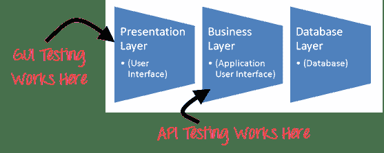

# API 测试教程：10 分钟内学习！

> 原文： [https://www.guru99.com/api-testing.html](https://www.guru99.com/api-testing.html)

在进行 API 测试之前，我们先了解一下

## 什么是 API？

API（完整格式 **A** 复制 **P** 编程 **I** 接口）可实现两个单独的软件系统之间的通信和数据交换。 实现 API 的软件系统包含可以由另一个软件系统执行的功能/子例程。

## 什么是 API 测试？

**API 测试**是一种软件测试类型，用于验证应用程序编程接口（API）。 API 测试的目的是检查编程接口的功能，可靠性，性能和安全性。 在 API 测试中，您可以使用软件将调用发送到 API，获取输出并记下系统的响应，而不是使用标准的用户输入（键盘）和输出。 API 测试与 GUI 测试有很大不同，并且不会专注于应用程序的外观。 它主要集中在软件体系结构的业务逻辑层。



API 测试需要可以通过 API 进行交互的应用程序。 为了测试 API，您需要

*   使用测试工具来驱动 API
*   编写自己的代码以测试 API

在本教程中，您将了解有关-

*   [设置 API 测试环境](#3)
*   [API](#4) 的输出类型
*   [API 测试用例](#5)
*   [API 测试方法](#6)
*   [API 测试和单元测试](#7)之间的区别
*   [API 测试中要测试的内容](#8)
*   [API 测试的最佳做法](#9)
*   [API 测试检测到的错误的类型](#10)
*   [API 测试工具](#11)
*   [API 测试的挑战](#12)

## API 测试环境的设置

*   API 测试与其他软件测试类型不同，因为 GUI 不可用，但是您需要设置初始环境，该初始环境使用一组必需的参数来调用 API，然后最终检查测试结果。
*   因此，为 API 测试设置测试环境似乎有些复杂。
*   数据库和服务器应根据应用程序要求进行配置。
*   安装完成后，应调用 API 函数以检查该 API 是否正常工作。

## API 的输出类型

API 的输出可能是

1.  任何类型的数据
2.  状态（例如通过或失败）
3.  调用另一个 API 函数。

让我们看一下上述每种类型的示例

**任何类型的数据**

示例：有一个 API 函数应将两个整数相加。

```
Long add(int a, int b)

```

这些数字必须作为输入参数给出。 输出应该是两个整数的总和。 需要验证此输出是否具有预期结果。

呼叫需要完成，例如

```
add (1234, 5656)

```

如果数字超过整数限制，则必须处理异常。

**状态（例如通过或失败）**

考虑以下 API 函数-

1.  锁（）
2.  开锁（）
3.  删除（）

它们返回任何值，例如 True（成功的情况下）或 false（错误的情况下）作为输出。

更准确的[测试用例](/test-case.html)是，可以调用任何脚本中的函数，然后在数据库或应用程序 GUI 中检查是否有更改。

**调用另一个 API /事件**


在这种情况下，我们调用 API 函数之一，而 API 函数又将调用另一个函数。

例如，-第一个 API 函数可用于删除表中的指定记录，然后该函数调用另一个函数来刷新数据库。

## API 测试用例：

API 测试的测试用例基于

*   **基于输入条件的返回值：**相对容易测试，因为可以定义输入并可以验证结果
*   **不返回任何内容：**当没有返回值时，将检查系统上 API 的行为
*   **触发其他一些 API /事件/中断：**如果 API 的输出触发了某些事件或中断，则应跟踪那些事件和中断侦听器
*   **更新数据结构：**更新数据结构将对系统产生某些结果或影响，因此应进行身份验证
*   **修改某些资源：**如果 API 调用修改了某些资源，则应通过访问相应资源来对其进行验证

## API 测试方法：

以下几点可帮助用户进行 API 测试：


1.  了解 API 程序的功能并明确定义程序范围
2.  应用诸如等效类，边界值分析和错误猜测之类的测试技术，并为 API 编写测试用例
3.  需要适当计划和定义 API 的输入参数
4.  执行测试用例，并比较预期结果和实际结果。

## API 测试和单元测试之间的区别

<colgroup><col style="width: 312px;"><col style="width: 312px;"></colgroup>
| 单元测试 | API 测试 |
| 

*   开发人员执行它

 | 

*   测试人员可以执行

 |
| 

*   测试了单独的功能

 | 

*   端到端功能经过测试

 |
| 

*   开发人员可以访问源代码

 | 

*   测试人员无法访问源代码

 |
| 

*   UI 测试也涉及到

 | 

*   仅测试 API 函数

 |
| 

*   仅测试了基本功能

 | 

*   所有功能问题均经过测试

 |
| 

*   限于范围

 | 

*   范围更广

 |
| 

*   通常在签到前运行

 | 

*   建立建立后执行

 |

## 如何进行 API 测试

API 测试应至少涵盖除常规 SDLC 流程以外的以下测试方法

*   **发现测试：**测试组应手动执行 API 中记录的一组调用，例如验证可以适当地列出，创建和删除 API 公开的特定资源
*   **可用性测试：**此测试可验证 API 是否功能正常且用户友好。 API 是否也可以与其他平台很好地集成
*   **安全测试：**此测试包括要求进行哪种类型的身份验证以及是否通过 HTTP 加密敏感数据或同时对两者进行加密
*   **自动化测试：** API 测试应最终创建一组脚本或可用于定期执行 API 的工具
*   **文档：**测试团队必须确保文档足够，并提供足够的信息以与 API 交互。 文档应成为最终交付成果的一部分

## API 测试的最佳做法：

*   测试用例应按测试类别分组
*   在每个测试的顶部，您应包括被调用的 API 的声明。
*   测试用例中应明确提及参数选择
*   确定 API 函数调用的优先级，以便测试人员轻松进行测试
*   每个测试用例应尽可能独立，并且与依赖关系尽可能独立
*   在开发中避免“测试链”
*   处理诸如-Delete，CloseWindow 等一次性调用函数时必须格外小心。
*   呼叫排序应执行且计划合理
*   为确保完整的测试范围，请为 API 的所有可能的输入组合创建测试用例。

## API 测试检测到的错误类型

*   无法优雅地处理错误情况
*   未使用的标志
*   功能缺失或重复
*   可靠性问题。 很难连接 API 并从 API 获得响应。
*   安全问题
*   多线程问题
*   性能问题。 API 响应时间非常高。
*   错误的错误/警告呼叫者
*   对有效参数值的错误处理
*   响应数据的结构不正确（JSON 或 XML）

## API 测试工具

由于 API 和[单元测试](/unit-testing-guide.html)都是目标源代码，因此可以使用工具/框架进行自动化。

*   Runscope
*   邮差
*   卷曲
*   固定
*   检查一下
*   CTESK
*   点测试
*   Eclipse SDK 工具-自动化 API 测试

查看顶级 API 测试工具[列表](/top-6-api-testing-tool.html)

## API 测试的挑战

API 测试的挑战包括：

*   Web API 测试中的主要挑战是**参数组合，参数选择和调用排序**
*   没有可用的 GUI **来测试应用程序，这使**难以提供输入值
*   对测试人员而言，在不同系统中验证和验证输出几乎没有困难
*   测试人员必须知道参数的选择和分类
*   异常处理功能**需要测试**
*   测试人员必须具备编码知识

## 结论：

API 由代表业务逻辑层的一组类/函数/过程组成。 如果未正确测试 API，则可能不仅会导致 API 应用程序出现问题，还会导致调用应用程序出现问题。 它是软件工程中必不可少的测试。