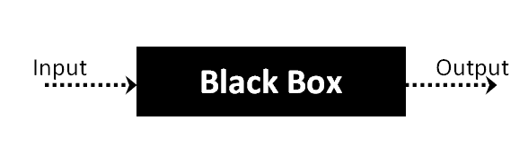
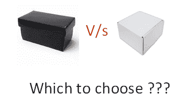

# 什么是黑盒测试？ 技术，示例&类型

> 原文： [https://www.guru99.com/black-box-testing.html](https://www.guru99.com/black-box-testing.html)

## 什么是黑匣子测试？

**黑盒测试**被定义为一种测试技术，其中在不查看内部代码结构，实现细节和软件内部路径知识的情况下测试被测应用程序（AUT）的功能。 这种类型的测试完全基于软件要求和规格。 在 BlackBox 测试中，我们只关注软件系统的输入和输出，而无需担心软件程序的内部知识。

上面的 Black-Box 可以是您要测试的任何软件系统。 例如，一个操作系统，例如 Windows，一个网站，例如 Google，一个数据库，例如 Oracle，甚至您自己的自定义应用程序。 在“黑匣子测试”下，您可以只关注输入和输出而无需了解其内部代码实现，从而测试这些应用程序。 考虑以下视频教程-

## 如何进行黑匣子测试

以下是执行任何类型的黑匣子测试所遵循的一般步骤。

*   首先，检查系统的要求和规格。
*   测试人员选择有效的输入（正测试方案）以检查 SUT 是否正确处理了它们。 同样，选择了一些无效的输入（负测试方案）以验证 SUT 能够检测到它们。
*   测试人员确定所有这些输入的预期输出。
*   软件测试人员使用选定的输入构建测试用例。
*   测试用例被执行。
*   软件测试仪将实际输出与预期输出进行比较。
*   如有缺陷，请修复并重新测试。

## 黑匣子测试的类型

黑匣子测试有很多类型，但以下是主要的测试类型-

*   **功能测试**-这种黑匣子测试类型与系统的功能要求有关； 这是由软件测试人员完成的。
*   **非功能测试**-这种类型的黑匣子测试与特定功能的测试无关，但与非功能要求（例如性能，可伸缩性，可用性）无关。
*   **回归测试**-[回归测试](/regression-testing.html)是在代码修复，升级或进行任何其他系统维护以检查新代码未影响现有代码之后进行的。

## 用于黑匣子测试的工具：

用于黑盒测试的工具在很大程度上取决于您正在执行的黑盒测试的类型。

*   对于功能/回归测试，可以使用- [QTP](/quick-test-professional-qtp-tutorial.html) ，[硒](/selenium-tutorial.html)
*   对于非功能测试，可以使用- [LoadRunner](/loadrunner-v12-tutorials.html) ， [Jmeter](/jmeter-tutorials.html)

## 黑匣子测试技术

以下是黑匣子测试中使用的许多重要策略[测试策略](/how-to-create-test-strategy-document.html)

*   **等效类测试：**用于将可能的测试用例的数量最小化到最佳水平，同时保持合理的测试范围。
*   **边界值测试：**边界值测试着重于边界值。 该技术确定系统是否接受一定范围的值。 这对于减少测试用例的数量非常有用。 最适合输入在一定范围内的系统。
*   **决策表测试**：决策表将原因及其影响放在一个矩阵中。 每列中都有一个唯一的组合。

## 黑盒和白盒测试的比较：

| 黑匣子测试 | 白盒测试 |
| 黑匣子测试的主要重点是验证您的功能需求。 | [白盒测试](/white-box-testing.html)（单元测试）验证软件代码的内部结构和工作方式 |
| 黑盒测试提供了代码的抽象性，并着重于对软件系统行为的测试工作。 | 要进行白盒测试，必须具备底层编程语言的知识。 当今的软件系统使用各种编程语言和技术，因此不可能一一理解。 |
| 黑匣子测试有助于测试模块之间的通信 | 白盒测试不利于测试模块之间的通信 |

## 黑匣子测试和软件开发生命周期（SDLC）

黑匣子测试有其自己的生命周期，称为软件测试生命周期（ [STLC](/software-testing-life-cycle.html) ），它与软件工程的软件开发生命周期的每个阶段有关。

*   **需求**-这是 SDLC 的初始阶段，在此阶段，已收集了需求。 软件测试人员也参与此阶段。
*   确定**测试计划&分析**-[适用于项目的测试类型](/types-of-software-testing.html)。 创建了[测试计划](/what-everybody-ought-to-know-about-test-planing.html)，该计划确定了可能的项目风险及其缓解措施。
*   **设计**-在此阶段，根据软件需求文档创建测试用例/脚本
*   **测试执行**-在这一阶段，执行准备好的测试用例。 错误（如有）已修复并重新测试。