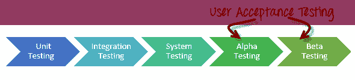

# Alpha 测试与 Beta 测试：有什么区别？

> 原文： [https://www.guru99.com/alpha-beta-testing-demystified.html](https://www.guru99.com/alpha-beta-testing-demystified.html)

## 什么是 Alpha 测试？

Alpha 测试是一种验收测试； 在将产品发布给日常用户或公众之前执行以识别所有可能的问题/错误。 该测试的重点是通过使用黑盒和白盒技术来模拟真实用户。 目的是执行普通用户可能执行的任务。 Alpha 测试是在实验室环境中进行的，通常，测试人员是组织的内部员工。 简而言之，将这种测试称为 Alpha 只是因为它是在软件开发的早期，即将结束和 Beta 测试之前完成的。

## 什么是 Beta 测试？

产品的 Beta 测试是在“真实环境”中由软件应用程序的“真实用户”执行的，可以视为外部[用户接受测试](/user-acceptance-testing.html)的一种形式。

Beta 版本的软件已发布给产品的有限最终用户，以获取有关产品质量的反馈。 Beta 测试降低了产品故障风险，并通过客户验证提高了产品质量。

这是将产品运送给客户之前的最终测试。 来自客户的直接反馈是 Beta 测试的主要优势。 该测试有助于在客户环境中测试产品。

## Alpha 测试与 Beta 测试：

以下是 Alpha 和 Beta 测试之间的区别：

| 

**Alpha 测试**

 | 

**Beta 测试**

 |
| 由通常是组织内部员工的测试人员执行的 Alpha 测试 | Beta 测试由不是组织员工的客户或最终用户执行 |
| 在开发人员站点上执行的 Alpha 测试 | Beta 测试是在产品的客户位置或最终用户处执行的 |
| 未执行可靠性和[安全测试](/what-is-security-testing.html)的深度 Alpha 测试 | Beta 测试期间检查了可靠性，安全性和鲁棒性 |
| Alpha 测试涉及白盒和黑盒技术 | Beta 测试通常使用[黑盒测试](/black-box-testing.html) |
| Alpha 测试需要实验室环境或测试环境 | Beta 测试不需要任何实验室环境或测试环境。 该软件向公众开放，并且被称为实时环境 |
| Alpha 测试可能需要较长的执行周期 | Beta 测试只需要执行几周 |
| 开发人员可以在 Alpha 测试中立即解决关键问题或修复程序 | 从 Beta 测试收集的大多数问题或反馈将在该产品的未来版本中实现 |
| Alpha 测试旨在确保产品质量，然后再进行 Beta 测试 | Beta 测试还着重于产品的质量，但是收集了用户对产品的投入，并确保产品可供实时用户使用。 |

## Beta 测试的类型

软件测试中有不同类型的 Beta 测试，如下所示：

**传统 Beta 测试：**产品已分发到目标市场，并收集了各个方面的相关数据。 此数据可用于产品改进。

**公开 Beta 测试：**产品通过在线渠道公开发布给外界，并且可以从任何人那里收集数据。 根据反馈，可以进行产品改进。 例如，在正式发布 Windows 8 之前，微软对其操作系统进行了最大的 Beta 测试。

**技术 Beta 测试：**产品已发布到组织的内部小组，并从组织的员工那里收集反馈/数据。

**重点测试版：**产品已投放市场，以收集有关程序特定功能的反馈。 例如，软件的重要功能。

**发布后的 Beta 版：**产品已投放市场，并收集了数据以改进产品的将来版本。

## 测试阶段

通常针对“现货”软件或面向产品的公司进行 Alpha 和 Beta 测试。 产品公司的测试阶段通常与面向服务的组织不同。 以下是产品公司通过的测试阶段

**Pre-Alpha** ：-软件为原型。 用户界面已完成。 但并非所有功能都已完成。 在此阶段，软件尚未发布。

**Alpha** ：该软件已接近开发阶段，并且已针对错误/问题进行了内部测试

**Beta** ：该软件稳定并且已发布给有限的用户群。 目的是获得客户对产品的反馈并相应地对软件进行更改

**候选发布版（RC）：**根据 Beta 测试的反馈，您对软件进行了更改，并想测试错误修复程序。 在此阶段，您不想对功能进行重大更改，而只需检查错误即可。 RC 也向公众推出

**发布：**所有作品，软件均已公开发布。

**注意**：以上是测试阶段的标准定义，但为了引起市场的关注，公司将“ pre-alpha beta”，“ pre-beta”等阶段合并在一起。

## Alpha 测试的进入标准：

*   软件需求文档或业务需求规范
*   所有需求的测试用例
*   对软件应用程序有丰富知识的测试团队
*   测试实验室环境设置
*   质量检查构建准备执行
*   测试管理工具，用于上传测试用例和记录缺陷
*   可追溯性矩阵，以确保每个设计要求都至少有一个[测试用例](/test-case.html)对其进行验证

## Alpha 测试的退出标准

*   所有测试用例均已执行并通过。
*   所有严重性问题都需要修复和解决
*   交付测试总结报告
*   确保不再包含其他功能
*   退出 Alpha 测试

## Beta 测试的入学标准：

*   签署有关 Alpha 测试的文档
*   Beta 版本的软件应已准备就绪
*   准备向公众发布软件应用程序的环境
*   捕获实时故障的工具

## Beta 测试的退出标准：

*   所有主要和次要问题均已关闭
*   反馈报告应由公众准备
*   交付 Beta 测试摘要报告

## Alpha 测试的优势：

*   尽早提供有关软件可靠性的更好视图
*   帮助模拟实时用户行为和环境。
*   检测许多热门或严重错误
*   能够提早发现与设计和功能有关的错误

## Beta 测试的优势

*   通过客户验证降低产品故障风险。
*   Beta Testing 允许公司测试发布后的基础架构。
*   通过客户反馈提高产品质量
*   与类似的数据收集方法相比具有成本效益
*   与客户建立商誉并提高客户满意度

## Alpha 测试的缺点：

*   从深度上讲，无法测试功能，因为软件仍处于开发阶段，有时开发人员和测试人员对 alpha 测试的结果不满意

## Beta 测试的缺点

*   测试管理是一个问题。 与通常在受控环境中在公司内部执行的其他测试类型相比，beta 测试是在您几乎没有控制权的现实世界中执行的。
*   寻找合适的 Beta 用户并保持其参与度可能是一个挑战

## Alpha 和 Beta 测试的神话：

误解：Alpha 和 Beta 测试在测试生命周期中进行得太迟，无法带来好处

真相：Alpha 和 Beta 测试有助于突出显示软件应用程序中的关键问题并提供用户反馈。

误解：在 Alpha 和 Beta 测试中完成了相同类型的测试，并且它们不是不同的场景

真相：Alpha 测试是在实验室环境中完成的，而 Beta 测试是由真实用户根据第一手经验报告实际问题而完成的。 两种情况都明显不同。

误解：Beta 类型的测试既困难又费时

真相：Beta 测试需要时间/经验才能获得最大价值。 但是它提供的数据/反馈非常宝贵。

误解：Beta 测试生成的有用数据很少或没有

真相：成功的 Beta 测试可以生成大量有价值的信息，否则这些信息很难在实验室环境中获得。

## 结论

在软件工程中，无论您执行了多少测试，杀死了多少错误，如果最终用户不喜欢它，那么您的软件都是无用的。 Beta 测试（希腊字母的第二个字母）有助于提供真实用户对软件的真实反馈。

Alpha 测试（希腊字母的第一个字母）有助于在发送软件进行 Beta 测试之前模拟实时用户环境，并帮助塑造稳定的，适合进行 Beta 测试的候选软件。

Alpha 和 Beta 测试在您的测试生命周期中必不可少。