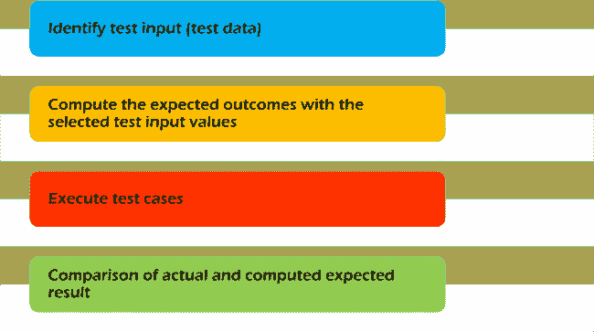
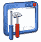

# 什么是功能测试？ 类型&示例（完整教程）

> 原文： [https://www.guru99.com/functional-testing.html](https://www.guru99.com/functional-testing.html)

## 什么是功能测试？

**功能测试**是一种软件测试，可以根据功能要求/规格验证软件系统。 功能测试的目的是通过提供适当的输入来测试软件应用程序的每个功能，并根据功能要求验证输出。

功能测试主要涉及黑盒测试，而与应用程序的源代码无关。 此测试检查被测应用程序的用户界面，API，数据库，安全性，客户端/服务器通信和其他功能。 测试可以手动完成，也可以使用自动化完成。

## 您在功能测试中测试什么？

功能测试的主要目的是检查软件系统的功能。 主要集中于-

*   **主线功能**：测试应用程序的主要功能
*   **基本可用性**：它涉及系统的基本可用性测试。 它检查用户是否可以自由浏览屏幕而没有任何困难。
*   **可访问性**：为用户检查系统的可访问性
*   **错误条件**：使用测试技术检查错误条件。 它检查是否显示适当的错误消息。

## 如何执行功能测试：完整过程

为了对应用程序进行功能测试，必须遵循以下步骤。

*   了解软件工程要求
*   识别测试输入（测试数据）
*   用选定的测试输入值计算预期结果
*   执行测试用例
*   比较实际和预期的结果

## 功能对比非功能测试：

| **功能测试** | **非功能测试** |
| 使用客户端提供的功能规范执行功能测试，并根据功能要求验证系统。 | 非功能测试检查软件系统的性能，可靠性，可伸缩性和其他非功能方面。 |
| 首先执行功能测试 | 功能测试后应执行非功能测试 |
| [手动测试](/manual-testing.html)或自动化工具可用于功能测试 | 使用工具将对该测试有效 |
| 业务需求是功能测试的输入 | 诸如速度，可伸缩性之类的性能参数是非功能测试的输入。 |
| 功能测试描述了产品的功能 | 非功能测试描述了产品的性能 |
| 易于进行手动测试 | 很难做手动测试 |
| 功能测试的示例包括

*   [单元测试](/unit-testing-guide.html)
*   烟雾测试
*   健全性测试
*   [集成测试](/integration-testing.html)
*   白盒测试
*   黑盒测试
*   用户接受度测试
*   [回归测试](/regression-testing.html)

 | 非功能测试的示例包括

*   [性能测试](/performance-testing.html)
*   负载测试
*   体积测试
*   压力测试
*   安全测试
*   安装测试
*   渗透测试
*   兼容性测试
*   迁移测试

 |

## 功能测试工具

 市场上有几种执行功能测试的工具。 解释如下：

*   [硒](/selenium-tutorial.html)-流行的开源功能测试工具
*   [QTP](/quick-test-professional-qtp-tutorial.html) -惠普非常人性化的功能测试工具
*   [JUnit](/junit-tutorial.html) -主要用于 [Java](/java-tutorial.html) 应用程序，可用于单元和[系统测试](/system-testing.html)
*   [soapUI](/soapui-tutorial.html) -这是一个开放源代码功能测试工具，主要用于 Web 服务测试。 它支持多种协议，例如 HTTP，SOAP 和 JDBC。
*   Watir-这是针对 Web 应用程序的功能测试工具。 它支持在 Web 浏览器上执行的测试，并使用 ruby 脚本语言

**结论：**

在软件测试中，功能测试是测试系统功能的过程，并确保系统按照业务文档中指定的功能运行。 该测试的目的是检查系统是否功能完善！！！