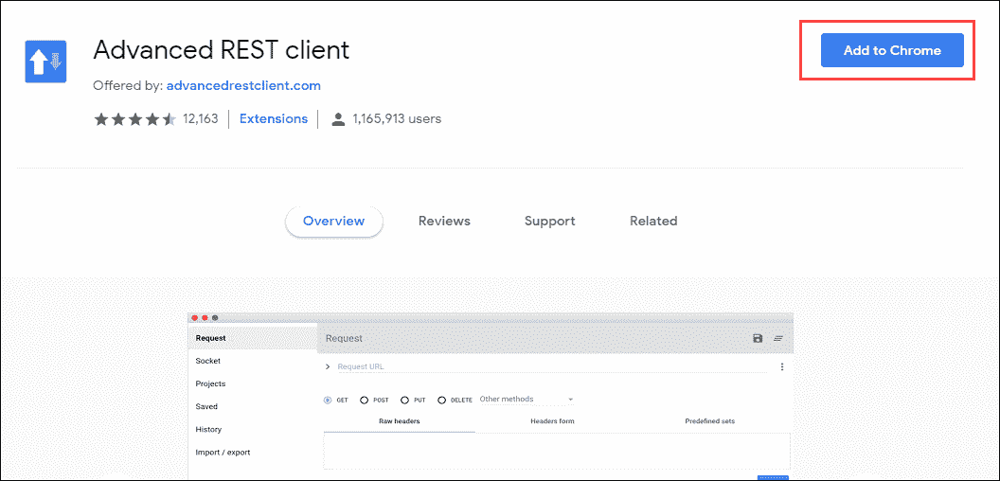
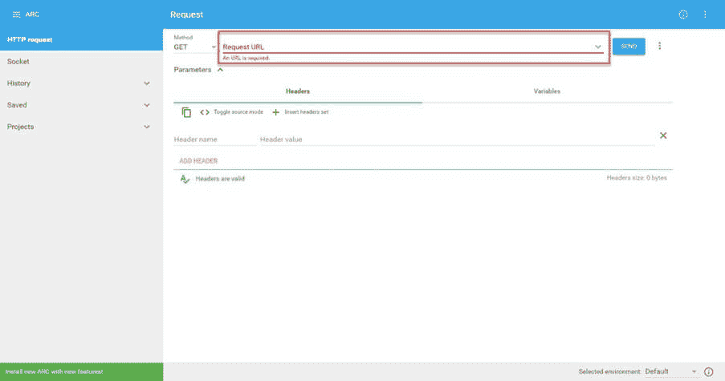
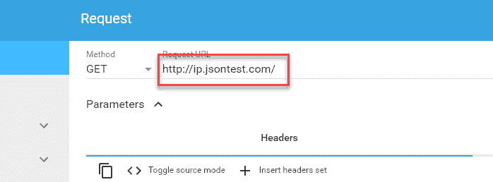
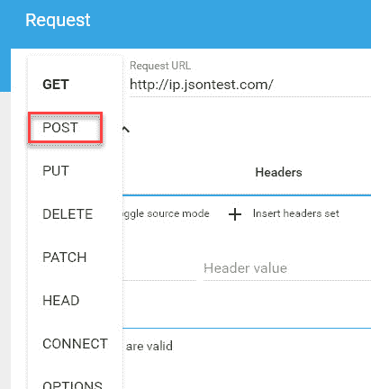
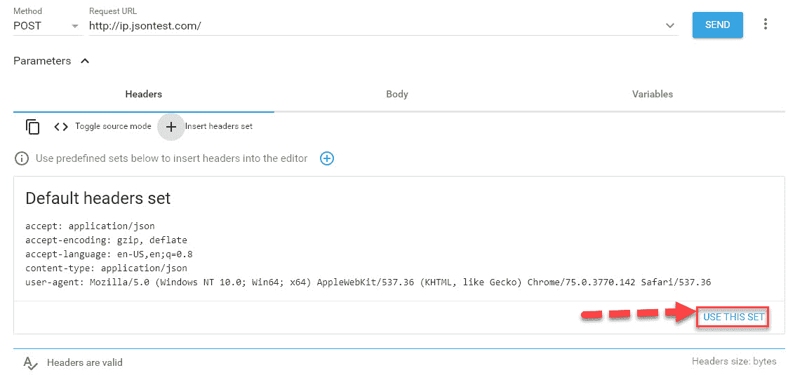
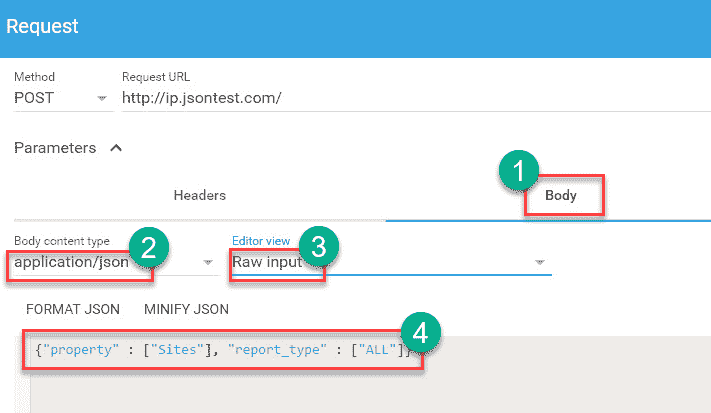
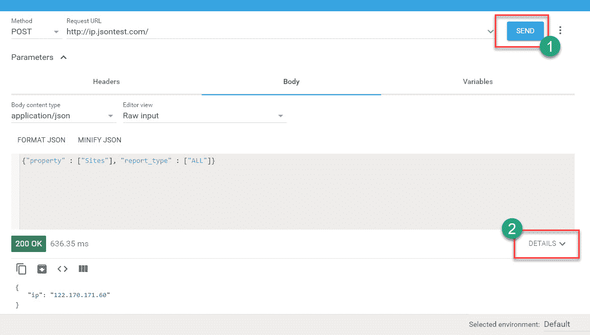
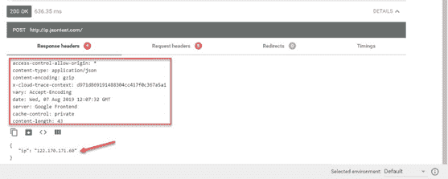
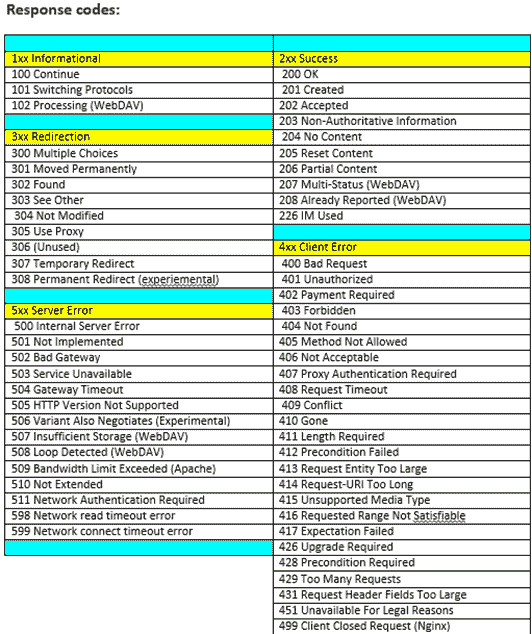

# REST API 测试教程：手动测试案例示例

> 原文： [https://www.guru99.com/testing-rest-api-manually.html](https://www.guru99.com/testing-rest-api-manually.html)

## 什么是 REST API？

API 或应用程序编程接口是用于访问基于 Web 的软件应用程序的一组编程指令。

换句话说，单个程序使用的一组命令直接彼此通信并使用彼此的功能来获取信息。

[Rest](/restful-web-services.html) 代表代表性状态转移。 它是 [Web 服务](/web-services-tutorial.html)开发中使用的一种体系结构样式和一种通信方法。 REST 已成为构建 API 的合理选择。 它使用户可以有效地连接云服务并与之交互。

例如，Google 网站可以具有用于各种功能（例如搜索，翻译，日历等）的 API。

通常，API 如下所示，它们具有服务器名称，路径等。

```
http://<server name>/v1/export/Publisher/Standard_Publisher_Report?format=csv
```

[API 测试](/api-testing.html)主要涉及 4 种方法，例如 GET，POST，Delete 和 PUT。

*   **GET** -GET 方法用于使用给定 URI 从给定服务器中提取信息。 在使用 GET 请求时，它应该仅提取数据，并且对数据没有其他影响。

*   **POST** -POST 请求用于创建新实体。 它还可以用于使用 HTML 表单将数据发送到服务器，例如，客户信息，文件上传等。

*   **PUT** -创建一个新实体或更新现有实体。

*   **DELETE** -删除 URI 给定的目标资源的所有当前表示。

在本教程中，您将学习-

*   [什么是 REST API？](#1)
*   [如何测试 REST API](#2)
*   [测试 REST API 的步骤](#3)
*   [验证结果](#4)
*   [REST API 测试工具](#5)
*   [API 测试面临的挑战](#6)

## 如何测试 REST API

API 测试需要应用程序与 API 进行交互。 要测试 API，您需要做两件事：

*   测试工具/框架以驱动 API
*   写下自己的代码以测试 API

Rest API 可以使用以下工具进行测试：

*   高级休息客户
*   邮递区客户
*   在 Linux 中卷曲

在这里，我们将使用 Advanced Rest Client，以下是获取 Advance Rest Client 的步骤，

**如何获取 Advanced Rest Client**

*   转到谷歌浏览器的网上商店
*   搜索“ Advanced Rest Client”或直接在此处进入[并安装扩展](https://chrome.google.com/webstore/detail/advanced-rest-client/hgmloofddffdnphfgcellkdfbfbjeloo)



*   选择 chrome 的“应用”部分下的“ Advanced Rest Client”图标-chrome：// apps /

安装完成后，请按照以下测试测试 RESTful API

## 测试 REST API 的步骤

在这里，我们在 Chrome 浏览器中使用 rest 客户扩展。 为了清楚理解，我们使用了虚拟 API“

```
http://ip.jsontest.com/
```

**步骤 1）**：安装成功后，启动应用程序高级 REST 客户端（ARC）。



**步骤 2）**：在 URL 文本框中输入 API 的 URL。



**步骤 3）**：选择要命中的 HTTP 方法类型的方法。 开机自检



**步骤 4）**：在标题文本框中提供标题集。 单击插入标题集。


**步骤 5）**：下一步单击“使用此设置”。

[ ](/images/1/081419_0518_StepsforTes5.png) 

**步骤 6）**：

1.  现在切换到“身体”选项卡。
2.  设置所需的正文内容类型和编辑器视图，例如 正文内容类型：application / json
3.  编辑器视图：原始输入。
4.  在有效负载下，以键值对的形式传递 API 的请求正文，例如 {{“ key1”：“ value1”，“ key2”：“ value2”}。 如果是 post API，那么我们需要传递主体或参数。 我们将在给定的有效载荷下通过。

```
{"property" : ["Sites"], "report_type" : ["ALL"]}

```



**步骤 7）**

1.  点击发送按钮。
2.  您可以单击“详细信息”按钮以查看“响应”标题。



以下是回复详细信息：



## 验证结果

主要是，对于 Web API 测试，我们需要检查响应代码，响应消息和响应正文。

以下是各种响应代码，在进行 API 测试时可能会遇到。



## REST API 测试工具

*   [JMeter](/jmeter-tutorials.html)
*   [SOA 测试](https://prsft.co/2n5b5lj)
*   [API 要塞](https://bit.ly/2GZcQbf)

## API 测试面临的挑战

对于测试人员而言，有趣的问题是：

1.  为了确保测试工具改变 API 调用的参数，以使其能够验证功能并暴露故障。 它包括探索边界条件和分配通用参数
2.  为具有两个或多个参数的调用创建有趣的参数值组合
3.  标识必须进行 API 调用的内容。 其中可能包括设置外部环境条件（外围设备，文件等）以及影响 API 的内部存储数据
4.  按照函数执行的顺序对 API 调用进行排序
5.  为了使 API 从连续的调用中产生有用的结果。

**摘要：**

*   API 或应用程序编程接口是用于访问基于 Web 的软件应用程序的一组编程指令。
*   API 测试主要涉及 4 种方法，例如 GET，POST，Delete 和 PUT。
*   我们需要在 API 测试中检查响应代码，响应消息和响应正文。