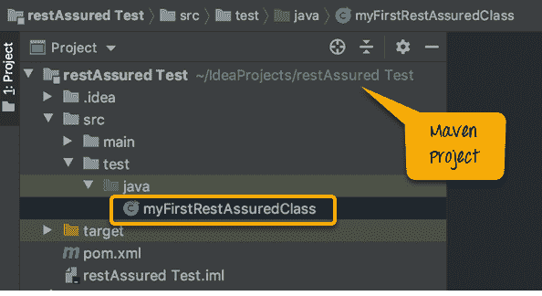
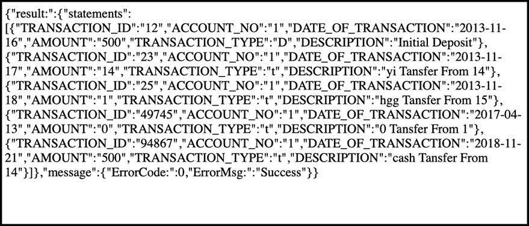
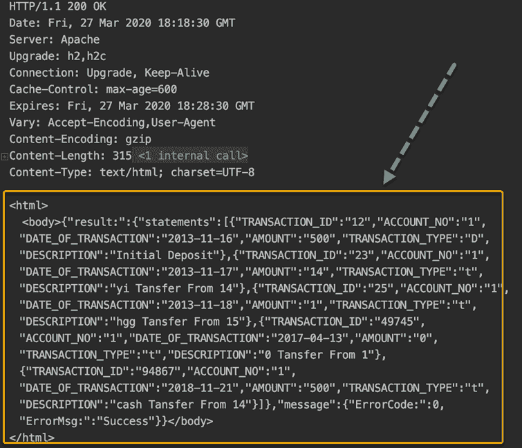
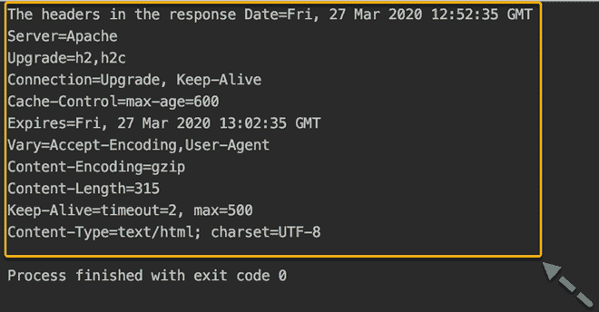
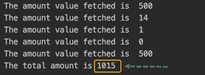

# REST 保证教程：如何使用示例测试 API

> 原文： [https://www.guru99.com/rest-assured.html](https://www.guru99.com/rest-assured.html)

## 什么是安心？

**保证放心**使您可以使用 Java 库测试 REST API，并与 Maven 很好地集成。 它具有非常有效的匹配技术，因此断言您的预期结果也非常简单。 无论 JSON 结构多么复杂，Rest Assured 都具有从请求和响应的几乎每个部分获取数据的方法。

对于测试社区而言，API 自动化测试仍然是新兴且小众的。 JSON 的复杂性使 API 测试无法进行。 但这并没有使它在测试过程中不那么重要。 Rest Assured.io 框架使用核心 Java 基础知识使其变得非常简单，这使它成为非常值得学习的东西。

在本教程中，您将学习，

*   [什么是放心的？](#1)
*   [为什么需要安心？](#2)
*   [逐步指南，用于设置 Rest Assured.io](#3)
*   [第一个简单的 Rest Assured 脚本](#4)
*   [用于获取响应的不同部分的脚本](#5)

## 为什么需要安心？

想象一下，您打开了 Google 地图视图并寻找了想要去的地方，立即看到附近的餐馆，看到了通勤路线的选项； 从一些领先的旅游提供商那里获得，触手可及的众多选择。 我们都知道它们不是 Google 产品，那么 Google 如何显示它。 他们使用这些提供程序的公开 API。 现在，如果要求您测试这种设置，甚至在构建 UI 或正在开发 UI 之前，测试 API 都变得非常重要，并使用不同的数据组合对其进行重复测试，这非常适合自动化。

早些时候，我们使用诸如 groovy，ruby 之类的动态语言来实现这一目标，这极具挑战性。 因此，功能测试并未探索 API 测试。

但是，如果使用具有 Java 基本背景的 API，则可以使用 Rest Assured 对 API 进行自动化测试，以用户友好的自定义方式发送简单的 https 请求非常简单。 需要了解 API 测试和集成测试，但需要指出的是，自动化的“确保有保证”对后端提供了很好的信心，而前端测试可以仅专注于 UI 和客户端操作。 Rest Assured 是开放源代码，具有许多其他方法，并且添加了库，使其成为 API 自动化的理想选择。

## 逐步指南，用于设置 Rest Assured.io

步骤 1）安装 Java。 请参阅本[指南](https://www.guru99.com/install-java.html)

步骤 2）下载一个 IDE 开始： [eclipse](https://www.eclipse.org/downloads/)

步骤 3）InstallMaven 并设置您的 Eclipse。 在处参考[。](https://www.guru99.com/maven-jenkins-with-selenium-complete-tutorial.html)

### 设置放心

1.  在您的 IDE 中创建一个 Maven 项目。 我们正在使用 Intellij，但是您可能会在使用的任何 IDE 上获得类似的结构。
2.  打开您的 POM.xml

<center>

<figure>

<figcaption style="display: table;">Project structure</figcaption>

</figure>

</center>

对于 Rest Assured.io：对于 Java 版本< 9 个用户：

将以下依赖项添加到您的 POM.xml 中：

```
<dependency>
<groupId>io.rest-assured</groupId>
<artifactId>json-path</artifactId>
<version>4.2.0</version>
<scope>test</scope>
</dependency>

<dependency>
<groupId>io.rest-assured</groupId>
<artifactId>xml-path</artifactId>
<version>4.2.0</version>
<scope>test</scope>
</dependency>

<dependency>
<groupId>io.rest-assured</groupId>
<artifactId>json-schema-validator</artifactId>
<version>4.2.0</version>
<scope>test</scope>
</dependency>

```

对于 Rest Assured.io：对于 Java 9+版本的用户：

```
<dependency>
<groupId>io.rest-assured</groupId>
<artifactId>rest-assured-all</artifactId>
<version>4.2.0</version>
<scope>test</scope>
</dependency>

```

### 故障排除：

如果您看到错误并且不确定依赖项是否下载正确，

1.  执行 maven 构建以导入所有依赖项，同样，您会在 guru99 上找到的 Maven 设置方面获得帮助。
2.  尽管如此，您仍然会看到错误，然后先进行 maven 清理，再进行 maven 安装，并且它应该可以正确构建。
3.  您可以在 Java 类中添加以下行，然后查看没有编译错误。

```
import io.restassured.RestAssured.*;
import io.restassured.matcher.RestAssuredMatchers.*;
import org.hamcrest.Matchers.*;

```

## 第一个简单的 Rest Assured 脚本

### 句法：

Rest Assured.io 的语法是最漂亮的部分，因为它非常像 BDD 并且易于理解。

```
Given(). 
        param("x", "y"). 
        header("z", "w").
when().
Method().
Then(). 
        statusCode(XXX).
        body("x, ”y", equalTo("z"));

```

### **说明：**

| 码 | 说明 |
| 给定（） | “给定”关键字，可让您设置背景，在这里，您传递请求标头，查询和路径参数，正文，cookie。 如果请求中不需要这些项目，则这是可选的 |
| 什么时候（） | “何时”关键字标志着您的情况的前提。 例如，“当”您获得/张贴/放置某些东西时，做其他事情。 |
| 方法（） | 用任何 CRUD 操作替换它（获取/发布/放入/删除） |
| 然后（） | 你的断言和匹配条件在这里 |

现在您已经有了语法的设置和一些背景知识，让我们创建我们的第一个简单测试。 到目前为止，这种结构对您来说似乎还不错，随着您对每一行代码的进一步解释，您将了解它的本质。

### **您将获取什么？**

打开浏览器，然后点击- [http://demo.guru99.com/V4/sinkministatement.php?CUSTOMER_ID=68195 & PASSWORD = 1234！ & Account_No = 1](http://demo.guru99.com/V4/sinkministatement.php?CUSTOMER_ID=68195&PASSWORD=1234!&Account_No=1) 。 确保您看到以下内容。



如果您尝试获取请求的响应时浏览器出现错误，

1.  查看您是否使用过 Https 或 Http。 您的浏览器可能具有无法打开不安全网站的设置。
2.  查看是否有代理或防火墙阻止浏览器打开网站。

* **注意** –您在此处未使用任何标题，没有正文，也没有 cookie。 这是一个 URL，而且您正在从 API 获取内容，而不是发布或更新任何现有内容，因此使其成为 GET 调用。 记住这一点，以更好地了解我们的第一个测试。

### 测试目标：

脚本的目标是在 IDE 控制台上打印与通过 Rest Assured 在浏览器上收到的输出相同的输出。

让我们通过以下步骤对此进行编码：

### 获取响应主体

**步骤 1）**创建一个名为“ myFirstRestAssuredClass”的类

**步骤 2）**创建一个名为“ getResponseBody”的方法

**步骤 3）**与给定的先前学习的结构类似，何时然后键入以下代码

给定（）。 ->不需要标题，没有查询或路径参数。

什么时候（）。 ->未设置特定条件

get（' [http://demo.guru99.com/V4/sinkministatement.php?CUSTOMER_ID=68195 & PASSWORD = 1234！& Account_No = 1](http://demo.guru99.com/V4/sinkministatement.php?CUSTOMER_ID=68195&PASSWORD=1234!&Account_No=1) '）。 ->仅需提供网址

然后（）。 ->不需要特定的断言

log（）。 all（）->获取所有响应后，记录响应，标头，本质上是请求返回给您的所有内容。

```
public static void getResponseBody(){
   given().when().get("http://demo.guru99.com/V4/sinkministatement.php?CUSTOMER_ID=68195&PASSWORD=1234!&Account_No=1").then().log()
  .all();

}

```

现在请注意，使用的 URL 较长且可读性较差，如果仔细观察，您会注意到正在使用 3 个查询参数，分别是

1.  顾客 ID
2.  密码
3.  户口号码

保证安全，帮助我们分别传递每个部分（查询，路径，标头参数），使代码更易读和易于维护。 同样，我们可以根据需要参数化来自外部文件的数据。

对于使用查询参数，我们返回到语法定义，然后将所有语法作为给定的一部分传递。

```
public static void getResponseBody(){

   given().queryParam("CUSTOMER_ID","68195")
           .queryParam("PASSWORD","1234!")
           .queryParam("Account_No","1")
           .when().get("http://demo.guru99.com/V4/sinkministatement.php").then().log()
           .body();
}

```

**请注意，我们使用“ body”代替“ all”； 这有助于我们仅提取响应的主体。

**输出：**

<center>

<figure>

<figcaption style="display: table;">Output for getResponseBody</figcaption>

</figure>

</center>

### 获取响应状态代码

我们编写脚本的下一个方法将是获取状态代码，并放置一个断言以验证该状态码。

**步骤 1）**创建一个名为 getResponseStatus（）的方法

**步骤 2）**使用与上面相同的请求结构。 复制并粘贴。

**步骤 3）**而不是将其记录下来，我们使用 Rest Assured 的'getStatusCode'内置方法来获取状态码值

**步骤 4）**为了声明您的状态码为 200，我们使用关键字-assertThat（）。statusCode（expectedCode）

**注意-URL 是用于简化的变量。 URL 包含整个 API 请求 URL

```
public static void getResponseStatus(){
   int statusCode= given().queryParam("CUSTOMER_ID","68195")
           .queryParam("PASSWORD","1234!")
           .queryParam("Account_No","1") .when().get("http://demo.guru99.com/V4/sinkministatement.php").getStatusCode();
   System.out.println("The response status is "+statusCode);

   given().when().get(url).then().assertThat().statusCode(200);
}

```

**Output:**

<center>

<figure>

<figcaption style="display: table;">Output for getResponseStatus</figcaption>

</figure>

</center>

**业务需求**

自动化的基本规则之一是，我们必须放置检查点，以便仅在满足所有必需条件的情况下进行测试。 在 API 测试中，最基本的验证是检查请求的状态码是否为 2XX 格式。

到目前为止的完整代码：

```
import java.util.ArrayList;
import static io.restassured.RestAssured.*;
import static java.util.concurrent.TimeUnit.MILLISECONDS;

public class myFirstRestAssuredClass {

   final static String url="http://demo.guru99.com/V4/sinkministatement.php?CUSTOMER_ID=68195&PASSWORD=1234!&Account_No=1";

   public static void main(String args[]) {

     getResponseBody();
     getResponseStatus();

; }

   //This will fetch the response body as is and log it. given and when are optional here
   public static void getResponseBody(){
       given().when().get(url).then().log()
      .all();

  given().queryParam("CUSTOMER_ID","68195")
               .queryParam("PASSWORD","1234!")
               .queryParam("Account_No","1") .when().get("http://demo.guru99.com/V4/sinkministatement.php").then().log().body();
   }

public static void getResponseStatus(){
   int statusCode= given().queryParam("CUSTOMER_ID","68195")
           .queryParam("PASSWORD","1234!")
           .queryParam("Account_No","1")
           .when().get("http://demo.guru99.com/V4/sinkministatement.php").getStatusCode();
   System.out.println("The response status is "+statusCode);

   given().when().get(url).then().assertThat().statusCode(200);
}

}

```

***注意：**

1.  200 是此情况的成功响应。 有时，您也需要请求失败，然后才可以使用 4XX 或 5XX。 请尝试通过提供无效参数来更改状态代码并进行检查。
2.  当我们断言一个条件时，除非有错误，否则控制台上将不会进行任何打印。

## 用于获取响应的不同部分的脚本

上面的部分已经介绍了获取响应主体和响应状态代码。 值得注意的是，要获取响应的不同部分，关键字“提取”非常重要。

### 标头

Rest Assured 是一种非常简单的语言，获取标头也很简单。 方法名称是 headers（）。 像以前一样，我们将创建一个独立的方法来执行相同的操作。

```
public static void getResponseHeaders(){
   System.out.println("The headers in the response "+
                   get(url).then().extract()
           .headers());
}

```

请注意，这里跳过了'given（）。when（）'，而代码行从 get（）开始，这是因为这里没有进行任何先决条件或验证来达到请求并获得响应。 在这种情况下，可以选择使用相同的选项。

**输出：**

<center>

<figure>

<figcaption style="display: table;">Output for getResponseHeader</figcaption>

</figure>

</center>

**业务需求：**

有时，您需要为后续请求使用授权令牌或会话 cookie，而且大多数情况下，这些详细信息将作为响应的标头返回。

### 响应时间

为了获得从后端或其他下游系统获取响应所需的时间，Rest Assured 提供了一种名为“ timeIn”的方法，该方法具有合适的 timeUnit 来获取返回响应所花费的时间。

```
public static void getResponseTime(){
  System.out.println("The time taken to fetch the response "+get(url)
         .timeIn(TimeUnit.MILLISECONDS) + " milliseconds");
}

```

**Output:**

<center>

<figure>

<figcaption style="display: table;">Output for getResponseTime</figcaption>

</figure>

</center>

**业务需求：**

测试 API 的一个非常重要的功能是它们的响应时间，以衡量应用程序的性能。 请注意，呼叫所花费的时间可能会花费更多或更少的时间，具体取决于您的互联网速度，当时的 API 性能，服务器负载以及其他影响时间的因素。

### 内容类型

您可以获得使用方法“ contentType（）”返回的响应的 content-Type。

```
public static void getResponseContentType(){
   System.out.println("The content type of response "+
           get(url).then().extract()
              .contentType());
}

```

输出量

<center>

<figure>

<figcaption style="display: table;">Output for getContentType</figcaption>

</figure>

</center>

**业务需求：**

有时，获取内容类型对于确保任何跨域威胁都没有安全漏洞，或者只是确保所传递的内容符合 API 标准至关重要。

### 获取单个 JSON 元素

从给定的响应中，要求您计算总金额，您需要提取每个金额并将其汇总。

**步骤：**

**步骤 1）**数量字段位于具有“声明”键的数组内，该数组又位于具有“结果”键的列表中

**步骤 2）**放心，提供了一种使用“路径”在 API 中获取值的机制

**步骤 3）**达到金额的路径是“ result.statements.AMOUNT”。 可以将它想像硒中的 Xpath。

**步骤 4）**提取集合中的所有金额，然后循环查找所有值以计算总和

```
public static void getSpecificPartOfResponseBody(){

ArrayList<String> amounts = when().get(url).then().extract().path("result.statements.AMOUNT") ;
int sumOfAll=0;
for(String a:amounts){

    System.out.println("The amount value fetched is "+a);
    sumOfAll=sumOfAll+Integer.valueOf(a);
}
System.out.println("The total amount is "+sumOfAll);

}

```

注意：由于数量值是字符串数据类型，因此我们将转换为整数并将其用于求和。

**Output:**

<center>

<figure>

<figcaption style="display: table;">Output for getSpecificPartOfResponse</figcaption>

</figure>

</center>

### 摘要：

*   Rest Assured 是一组 Java 库，使我们能够自动化 Rest API 测试
*   Rest Assured 是基于 Java 的，对于 Java 的了解足以满足需要
*   它有助于从复杂的 JSON 结构中获取请求和响应的值
*   可以使用各种标头，查询，路径参数以及要设置的任何会话或 cookie 来定制 API 请求。
*   它有助于设置断言语句和条件。
*   当响应为 JSON 类型时，虽然 Rest Assured 很有帮助，但如果内容类型为 HTML 或纯文本，则该方法可能无法无缝运行。