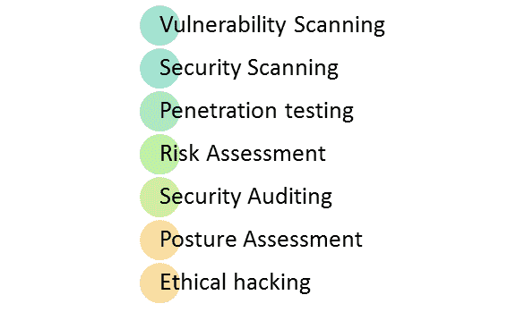
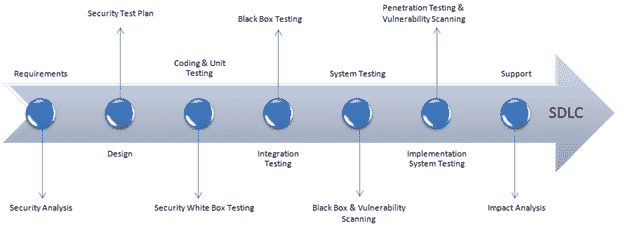

# 什么是安全测试？ 带示例的类型

> 原文： [https://www.guru99.com/what-is-security-testing.html](https://www.guru99.com/what-is-security-testing.html)

## 什么是安全测试？

**安全测试**是一种软件测试，可发现软件应用程序中的漏洞，威胁，风险并防止来自入侵者的恶意攻击。 安全测试的目的是确定软件系统的所有可能漏洞和弱点，这些漏洞和弱点可能导致信息，收入损失，组织雇员或外部人员的声誉受损。

安全测试的目标是识别系统中的威胁并衡量其潜在漏洞，以使系统不会停止运行或被利用。 它还有助于检测系统中所有可能的安全风险，并帮助开发人员通过编码解决这些问题。

在本教程中，您将学习-

*   [什么是安全测试？](#1)
*   [安全测试的类型](#2)
*   [如何进行安全性测试](#3)
*   [安全测试](#4)的示例测试方案
*   [安全测试的方法/方法/技术](#5)
*   [安全测试角色](#6)
*   [安全测试工具](#61)
*   [安全测试的神话和事实](#7)

## 安全测试的类型：

根据《开源安全测试方法手册》，安全测试主要有七种类型。 解释如下：

*   **漏洞扫描**：这是通过自动化软件完成的，以针对已知漏洞签名扫描系统。
*   **安全扫描：**它涉及识别网络和系统漏洞，后来提供了降低这些风险的解决方案。 可以为手动和自动扫描执行此扫描。
*   **渗透测试**：这种测试模拟来自恶意黑客的攻击。 此测试涉及对特定系统的分析，以检查外部黑客尝试的潜在漏洞。
*   **风险评估：**此测试涉及对组织中观察到的安全风险进行分析。 风险分为低，中和高。 此测试建议采取控制措施以降低风险。
*   **安全审核：**这是对应用程序和操作系统进行的内部检查，以检查安全漏洞。 审核也可以通过逐行检查代码来完成
*   **道德黑客：**它正在入侵组织软件系统。 与恶意黑客窃取自己的利益不同，其目的是暴露系统中的安全漏洞。
*   **姿势评估：**结合了安全扫描，[道德黑客](/ethical-hacking-tutorials.html)和风险评估，以显示组织的总体安全状况。

## 如何进行安全性测试

始终同意，如果我们在软件实施阶段之后或部署之后推迟安全测试，则成本会更高。 因此，有必要在早期阶段将安全性测试纳入 SDLC 生命周期中。

让我们研究一下 SDLC 每个阶段要采用的相应安全性流程

| SDLC 阶段 | 安全流程 |
| **要求** | 对需求进行安全分析并检查滥用/滥用案例 |
| **设计** | 设计中的安全风险分析。 制定[测试计划](/what-everybody-ought-to-know-about-test-planing.html)，包括安全测试 |
| **编码和单元测试** | 静态和动态测试与安全性[白盒测试](/white-box-testing.html) |
| **集成测试** | [黑匣子测试](/black-box-testing.html) |
| **系统测试** | 黑匣子测试和漏洞扫描 |
| **实施** | [渗透测试](/learn-penetration-testing.html)，漏洞扫描 |
| **支持** | 补丁影响分析 |

测试计划应包括

*   与安全性有关的测试用例或方案
*   与安全测试有关的测试数据
*   安全测试所需的测试工具
*   分析来自不同安全工具的各种测试输出

## 安全测试的示例测试方案：

示例测试方案可让您瞥见安全测试用例-

*   密码应为加密格式
*   应用程序或系统不应允许无效用户
*   检查 Cookie 和会话时间以进行申请
*   对于金融网站，“浏览器后退”按钮不起作用。

## 安全测试的方法/方法/技术

在安全测试中，遵循不同的方法，这些方法如下：

*   **Tiger Box** ：这种黑客攻击通常是在笔记本电脑上完成的，该笔记本电脑具有一系列的操作系统和黑客工具。 此测试可帮助渗透测试人员和安全测试人员进行漏洞评估和攻击。
*   **[黑匣子](/black-box-testing.html)** ：测试仪被授权对网络拓扑和技术进行所有测试。
*   **灰盒**：部分信息提供给测试人员有关系统的信息，它是白盒和黑盒模型的混合体。

## 安全测试角色

*   黑客-未经授权访问计算机系统或网络
*   饼干-闯入系统以窃取或破坏数据
*   道德黑客-执行大多数破坏性活动，但要经过所有者的许可
*   脚本小子或小包猴子-缺乏编程语言技能的黑客

## 安全测试工具

### 1）猫头鹰

开放 Web 应用程序安全性项目（ [OWASP](https://bit.ly/2P4SruD) ）是一个全球性的非营利组织，致力于改善软件的安全性。 该项目有多种工具可以对各种软件环境和协议进行笔式测试。 该项目的旗舰工具包括

1.  [Zed 攻击代理](https://bit.ly/2z6aki2)（ZAP –一种集成的渗透测试工具）
2.  [OWASP 依赖关系检查](https://bit.ly/2TN7fNu)（它扫描项目依赖关系并检查已知漏洞）
3.  [OWASP Web 测试环境项目](https://bit.ly/2P4SruD)（安全工具和文档的集合）

### 2）WireShark

[Wireshark](https://bit.ly/2TMN561) 是以前称为 Ethereal 的网络分析工具。 它实时捕获数据包并以人类可读的格式显示它们。 基本上，它是一个网络数据包分析器-提供有关您的网络协议，解密，数据包信息等的详细信息。它是一个开放源代码，可以在 Linux，Windows，OS X，Solaris，NetBSD，FreeBSD 和许多其他操作系统上使用 其他系统。 可以通过 GUI 或 TTY 模式下的 TShark Utility 查看通过此工具检索的信息。

### 3）W3af

[w3af](http://bit.ly/2P5Qrm7) 是一个 Web 应用程序攻击和审核框架。 它具有三种类型的插件： 可以针对站点中的任何漏洞进行通信的发现，审计和攻击，例如 w3af 中的发现插件会寻找不同的 URL 来测试漏洞，并将其转发给审计插件，然后审计插件将使用这些 URL 搜索漏洞。

## 安全测试的神话和事实：

让我们讨论一个有关安全测试的神话和事实的有趣话题：

**误区 1** 我们不需要安全策略，因为我们的业务规模很小

事实：每个人和每个公司都需要安全策略

**神话 2** 安全测试没有投资回报

事实：安全测试可以指出需要改进的地方，这些地方可以提高效率并减少停机时间，从而实现最大的吞吐量。

**误区 3** ：唯一的保护方法是拔下插头。

事实：确保组织安全的唯一且最佳方法是找到“完美的安全性”。 通过执行状态评估并将其与业务，法律和行业理由进行比较，可以实现完美的安全性。

**误区 4** ：互联网不安全。 我将购买软件或硬件来保护系统并节省业务。

事实：最大的问题之一是购买软件和硬件以提高安全性。 相反，组织应首先了解安全性，然后再应用它。

**结论：**

安全测试是对应用程序最重要的测试，它检查机密数据是否保持机密。 在这种类型的测试中，测试人员扮演攻击者的角色，并在系统中四处寻找安全相关的错误。 安全测试在软件工程中对于通过各种方式保护数据非常重要。