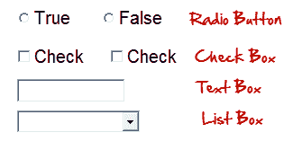
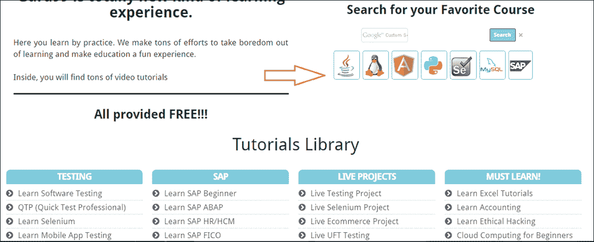
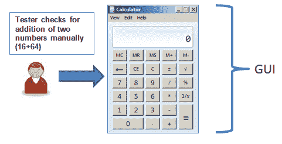
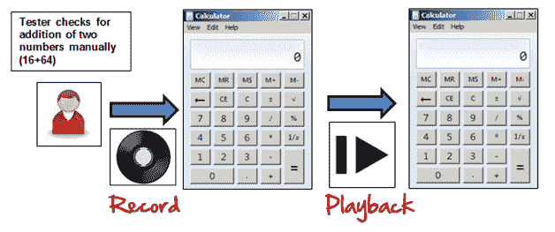
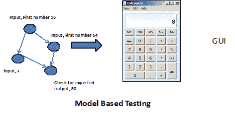
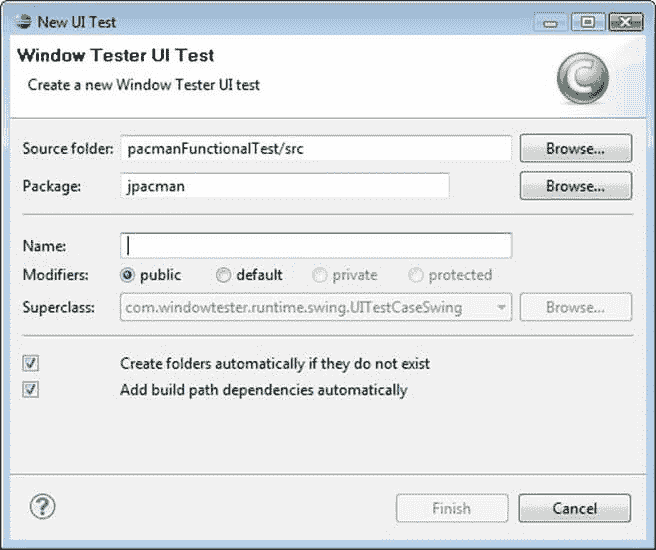

# GUI 测试教程：带有示例的用户界面（UI）测试案例

> 原文： [https://www.guru99.com/gui-testing.html](https://www.guru99.com/gui-testing.html)

要了解 GUI 测试，首先要了解-

## 什么是 GUI？

计算机应用程序有两种类型的接口。 在命令行界面中，您可以键入文本，然后计算机会对该命令做出响应。 GUI 代表图形用户界面，您可以在其中使用图像而不是文本与计算机进行交互。

以下是可用于用户和应用程序之间交互的 GUI 元素：

GUI 测试是对以上元素的验证。

## 什么是 GUI 测试？

**GUI 测试**是一种软件测试类型，用于检查被测应用程序的图形用户界面。 GUI 测试涉及使用菜单，按钮，图标以及所有类型的工具栏（工具栏，菜单栏，对话框和窗口等）进行检查，以检查屏幕。图形用户界面（GUI）测试的目的是确保 UI 功能 按照规范工作。

用户看到的是 GUI。 假设您访问 guru99.com，将会看到说首页，它是网站的 GUI（图形用户界面）。 用户看不到源代码。 该界面对用户可见。 尤其要注意的是设计结构，即图像是否正常工作。

在上面的示例中，如果必须进行 GUI 测试，则首先检查图像在不同的浏览器中应完全可见。

另外，链接可用，并且单击该按钮后应该可以使用。

同样，如果用户调整屏幕大小，则图像或内容均不应收缩，裁切或重叠。

在本教程中，您将学习-

*   [什么是 GUI 测试？](#1)
*   [需要进行 GUI 测试](#2)
*   [您需要进行哪些登机 GUI 测试？](#3)
*   [GUI 测试方法](#4)
*   [GUI 测试测试用例](#5)
*   [演示：如何进行 GUI 测试](#6)
*   [GUI 测试中的挑战](#7)

## 需要进行 GUI 测试

现在，GUI 测试的基本概念已经清楚了。 您想到的几个问题是

*   为什么要进行 GUI 测试？
*   真的需要吗？
*   应用程序的功能和逻辑测试是否还不够？ 那为什么要浪费时间在 UI 测试上呢？

获得答案，以用户而非测试者的身份思考。 用户不了解 XYZ 软件/应用程序。 应用程序的 UI 决定用户是否要进一步使用该应用程序。

普通用户首先会观察应用程序/软件的设计和外观，并容易理解 UI。 如果用户对界面不满意或发现复杂的应用程序无法理解，他将永远不会再次使用该应用程序。 因此，GUI 是一个值得关注的问题，应该进行适当的测试以确保 GUI 中没有错误。

## 您需要进行哪些签入 GUI 测试？

**以下清单将确保在软件测试中进行详细的 GUI 测试。**

*   检查所有 GUI 元素的大小，位置，宽度，长度以及是否接受字符或数字。 例如，您必须能够向输入字段提供输入。
*   检查您是否可以使用 GUI 执行应用程序的预期功能
*   检查错误消息是否正确显示
*   检查屏幕上不同部分的清晰分界
*   检查应用程序中使用的字体是否可读
*   检查文字的对齐方式是否正确
*   检查字体的颜色和警​​告消息是否美观
*   检查图像是否清晰
*   检查图像是否正确对齐
*   检查不同屏幕分辨率的 GUI 元素的位置。

## GUI 测试技术/方法

GUI 测试可以通过三种方式完成：

**手动测试**

在这种方法下，测试人员将根据业务需求文档中规定的要求手动检查图形屏幕。

**记录和重放**

GUI 测试可以使用自动化工具完成。 这分为两个部分。 在记录期间，自动化工具将捕获测试步骤。 在播放期间，记录的测试步骤在被测应用程序上执行。 此类工具的示例-QTP。

**基于模型的测试**

模型是系统行为的图形描述。 它有助于我们理解和预测系统行为。 模型有助于使用系统需求生成有效的测试用例。 对于基于模型的测试，需要考虑以下几点：

*   建立模型
*   确定模型的输入
*   计算模型的预期输出
*   运行测试
*   比较实际输出与预期输出
*   关于对该模型采取进一步行动的决定

从中可以得出测试用例的一些建模技术：

*   图表-描述系统状态，并在输入某些内容后检查状态。
*   决策表-用于确定所应用的每个输入的结果的表

基于模型的测试是一种从需求**生成测试用例的技术。 与上述两种方法相比，它的主要优点是可以确定 GUI 可能达到的不良状态。**

**以下是可用于进行自动化 UI 测试的开源工具。**

| **产品** | **根据**许可 |
| 自动热键 | GPL |
| 硒 | 阿帕奇 |
| Sikuli | 与 |
| 机器人框架 | Apache |
| 水 | BSD |
| Dojo 工具包 | BSD |

## 示例 GUI 测试测试用例

**GUI 测试主要涉及**

1.  测试元素的大小，位置，宽度，高度。
2.  测试正在显示的错误消息。
3.  测试屏幕的不同部分。
4.  测试字体是否可读。
5.  借助 640 x 480、600x800 等进行放大和缩小，以不同的分辨率测试屏幕。
6.  测试文本和其他元素（如图标，按钮等）的对齐方式是否正确。
7.  测试字体的颜色。
8.  测试错误消息，警告消息的颜色。
9.  测试图像是否具有良好的清晰度。
10.  测试图像的对齐方式。
11.  测试拼写。
12.  用户在使用系统界面时一定不要灰心。
13.  测试界面是否有吸引力。
14.  根据页面大小测试滚动条（如果有）。
15.  测试禁用字段（如果有）。
16.  测试图像大小。
17.  测试标题是否正确对齐。
18.  测试超链接的颜色。

## 演示：如何进行 GUI 测试

在这里，我们将在下面的屏幕中使用一些示例测试用例。

以下是测试用例的示例，它由 UI 和可用性测试方案组成。

TC 01-验证标签为“ **源文件夹**”的文本框是否正确对齐。

TC 02-验证带有标签“ **包**”的文本框是否正确对齐。

TC 03 –验证名称为[ **Browse** ]的标签是否位于文本框末尾的名称为[ **Source Folder** ]的按钮。

TC 04 –验证名称为[ **Browse** ]的标签是否位于文本框末尾的名称为[ **Package** ]的按钮。

TC 05 –验证标签为“ **名称**”的文本框是否正确对齐。

TC 06 –确认标签“ **修饰符**”包含 4 个单选按钮，其名称分别为 public，default，private，protected。

TC 07 –确认标签“ **修饰符**”包含 4 个单选按钮，它们已正确对齐。

TC 08 –确认标签“ **修饰符**”下的标签“ **超类**”包含一个下拉列表，必须正确对齐。

TC 09 –确认标签“ **超类**”上的按钮必须带有正确对齐的标签“ **浏览**”。

TC 10 –确认单击任何单选按钮都必须将默认鼠标指针更改为手形鼠标指针。

TC 11 –确认用户不能输入“ **Superclass** ”下拉列表。

TC 12 –验证如果错误选择了某些东西，则必须产生适当的错误。

TC 13-确认在必要时必须以红色生成错误。

TC 14 –确认错误消息中必须使用正确的标签。

TC 15 –确认每次默认都必须选择单个单选按钮。

TC 16 –在跳到上一个旁边的另一个字段时，请确认 TAB 按钮必须正常工作。

TC 17 –确认所有页面都必须包含正确的标题。

TC 18 –确认页面文本必须正确对齐。

TC 19 –确认在更新任何字段之后必须显示正确的确认消息。

TC 20-确认仅必须选择一个单选按钮，并且可以选择多个复选框。

## GUI 测试中的挑战

在软件工程中，执行[回归测试](/regression-testing.html)时最常见的问题是应用程序 GUI 经常更改。 测试和确定它是问题还是增强是非常困难的。 当您没有有关 GUI 更改的任何文档时，问题就会显现。

## GUI 测试工具

*   [Ranorex](https://bit.ly/2BFzUvq)
*   硒
*   QTP
*   黄瓜
*   丝绸测试
*   测试完成
*   Squish GUI 测试器

单击此处了解[硒](/selenium-tutorial.html)， [QTP](/quick-test-professional-qtp-tutorial.html) & [黄瓜](/cucumber-tutorials.html)。

**结论：**

软件产品的成功很大程度上取决于 GUI 与用户的交互方式以及是否易于使用其各种功能。 因此，GUI 测试非常重要。 手动 GUI 测试有时可能会重复且令人厌烦，因此容易出错。 强烈建议将自动化用于 GUI 测试。

***Swati Ghildiyal，Prateek Chandra 和 Guru99 的贡献使本文成为可能。***