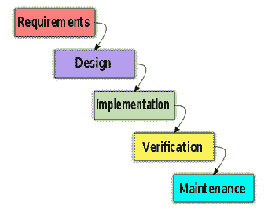
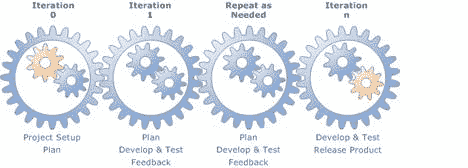
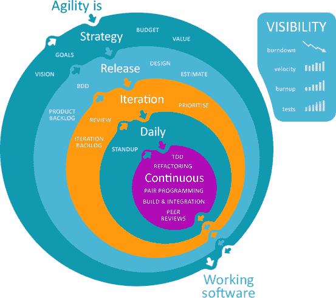
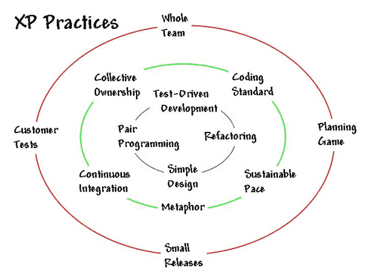

# 软件测试方法：了解质量检查模型

> 原文： [https://www.guru99.com/testing-methodology.html](https://www.guru99.com/testing-methodology.html)

### 什么是软件测试方法？

软件测试方法被定义为用于证明被测应用程序满足客户期望的策略和测试类型。 测试方法包括功能测试和非功能测试以验证 AUT。 测试方法的示例包括[单元测试](/unit-testing-guide.html)，[集成测试](/integration-testing.html)，[系统测试](/system-testing.html)，[性能测试](/performance-testing.html)等。每种测试方法都有定义的测试目标 ，测试策略和可交付成果。

**注意**：由于软件测试是任何开发方法的组成部分，因此许多公司通俗地使用术语“开发方法&测试方法”。 因此，与上述“测试方法”的定义相反，“测试方法”还可以引用“瀑布”，“敏捷”和其他 QA 模型。 对各种测试类型的讨论不会为读者增加价值。 因此，我们将讨论不同的开发模型。

在本教程中，您将学习-

*   [瀑布模型](#2)
*   [迭代开发](#3)
*   [敏捷方法](#4)
*   [极限编程](#5)
*   [选择哪种软件方法？](#6)
*   [如何设置软件测试方法？](#7)

## 瀑布模型

**这是什么？**

在[瀑布模型](/what-is-sdlc-or-waterfall-model.html)中，软件开发通过需求分析，设计等各个阶段-**依次**进行。

在此模型中，只有在前一个阶段完成后，下一个阶段才开始。

**什么是测试方法？**

瀑布模型的第一阶段是需求阶段，在此阶段，在开始测试之前，所有项目需求都已完全定义。 在此阶段，测试团队会集思广益测试范围，测试策略并草拟详细的测试计划。

仅在软件设计完成后，团队才会着手执行测试用例，以确保开发的软件按预期运行。

在这种方法中，测试团队仅在上一个阶段完成时才进入下一个阶段。

**优势**

该软件工程模型非常易于计划和管理。 因此，可以使用瀑布模型轻松测试需要明确定义和事先说明需求的项目。

**劣势**

在瀑布模型中，只有在上一个阶段完成后才能从下一个阶段开始。 因此，该模型无法容纳计划外事件和不确定性。

这种方法不适用于需求经常变化的项目。

## 迭代开发

**What is it?**

在此模型中，将一个大项目分为几个小部分，每个部分都要经历瀑布模型的多次迭代。 在迭代结束时，将开发新模块或增强现有模块。 该模块已集成到软件体系结构中，并且整个系统都经过了测试

**什么是测试方法？**

迭代完成后，整个系统将进行测试。 来自测试的反馈立即可用，并将在下一个周期中合并。 可以根据从过去的迭代中获得的经验来减少连续迭代中所需的测试时间。

**Advantages**

迭代开发的主要优点是在每个周期结束时都可以立即获得测试反馈。

**Disadvantages**

该模型显着增加了通信开销，因为在每个周期结束时，必须给出有关可交付成果，工作量等的反馈。

## 敏捷方法论

**What is it?**

传统的软件开发方法是在整个项目中保持软件需求不变的前提下工作的。 但是随着复杂性的增加，需求经历了许多变化并不断发展。 有时，客户本人不确定自己想要什么。 尽管迭代模型解决了此问题，但它仍基于瀑布模型。

在敏捷方法论中，软件是以递增，快速的周期开发的。 强调了客户，开发人员和客户之间的交互，而不是流程和工具。 敏捷方法论侧重于对变化的响应，而不是广泛的计划。

**What Is The Testing Approach?**

敏捷开发方法中使用了增量测试，因此，对项目的每个发行版都进行了彻底的测试。 这样可确保在下一个版本之前修复系统中的所有错误。

**Advantages**

可以根据需要随时在项目中进行更改。

这种增量测试将风险降到最低。

**Disadvantages**

持续的客户交互意味着对所有利益相关者（包括客户本身，软件开发和测试团队）施加时间压力。

## 极限编程

**** 

**What is it?**

极限编程是一种敏捷方法论，认为开发周期短。 一个项目分为简单的工程任务。 程序员编写一个简单的软件，然后返回给客户以获取反馈。 合并了来自客户的评论点，开发人员继续执行下一个任务。

在极限编程中，开发人员通常成对工作。

[极限编程](/agile-scrum-extreme-testing.html)用于客户需求不断变化的地方。

**What Is The Testing Approach?**

极限编程遵循测试驱动的开发，描述如下：

1.  将[测试用例](/test-case.html)添加到测试套件中，以验证尚未开发的新功能
2.  运行所有测试，显然添加的新测试用例必须失败，因为该功能尚未编码
3.  编写一些代码以实现功能
4.  再次运行测试套件。 这次，新的测试用例应该通过了，因为功能已被编码

**Advantages**

考虑软件设计模糊的客户可以使用极限编程

持续测试和持续集成小发行版，确保交付的软件代码具有高质量

**Disadvantages**

软件开发团队和客户之间的会议增加了时间要求。

## 选择哪种软件方法？

有大量方法可用于软件开发及其相应的测试。 每种测试技术和方法都是针对特定目的而设计的，各有其优缺点。

具体方法的选择取决于许多因素，例如项目的性质，客户要求，项目进度表等。

从测试的角度来看，有些方法会在开发生命周期的早期推动测试输入，而另一些方法则等到系统的工作模型准备就绪为止。

## 如何设置软件测试方法？

不应仅出于测试软件代码的目的而设置软件测试方法。 应该考虑全局，并且测试方法应满足项目的主要目标。

**安排**

切实可行的计划是成功执行测试方法的关键，计划应满足团队中每个成员的需求。

**已定义的可交付成果**

为了使团队的所有成员都在同一页上，应提供定义明确的可交付成果。 交付品应包含直接内容，没有任何歧义。

**测试方法**

一旦计划完成并提供了确定的可交付成果，测试团队就应该能够制定正确的测试方法。 定义文件和开发人员会议应向团队说明可用于项目的最佳测试方法。

**报表**

透明的报告很难实现，但是此步骤确定了项目中使用的测试方法的有效性。