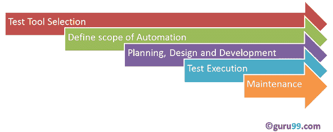

# 自动化测试教程：什么是流程，收益&工具

> 原文： [https://www.guru99.com/automation-testing.html](https://www.guru99.com/automation-testing.html)

## 什么是自动化测试？

**自动化测试**意味着使用自动化工具来执行您的测试用例套件。 相反，[手动测试](/manual-testing.html)由坐在计算机前的人仔细执行测试步骤来执行。

自动化软件还可以将测试数据输入被测系统，比较预期结果和实际结果并生成详细的测试报告。 测试自动化需要大量的金钱和资源投资。

连续的开发周期将需要重复执行相同的测试套件。 使用测试自动化工具，可以记录此测试套件并根据需要重播。 一旦测试套件自动化，就不需要人工干预。 这提高了测试自动化的投资回报率。 自动化的目标是减少手动运行的测试用例的数量，而不是完全消除手动测试。

在本教程中，您将学习-

*   [什么是自动化测试？](#1)
*   [为什么要进行自动化测试？](#2)
*   [哪些测试用例可以自动化？](#3)
*   [自动化测试流程](#4)
*   [测试工具选择](#5)
*   [定义自动化范围](#6)
*   [规划，设计和开发](#7)
*   [测试执行](#8)
*   [自动化框架](#9)
*   [自动化工具最佳做法](#10)
*   [自动化测试的好处](#11)
*   [可以自动化的不同类型的软件测试](#12)
*   [如何选择自动化工具？](#13)
*   [自动化测试工具](#14)

## 为什么要进行自动化测试？

由于以下原因，自动化软件测试非常重要：

*   手动测试所有工作流，所有字段，所有负面情况都需要花费时间和金钱
*   手动测试多语言站点很困难
*   自动化不需要人工干预。 您可以无人值守运行自动化测试（隔夜）
*   自动化提高了测试执行的速度
*   自动化有助于增加测试范围
*   手动测试可能很无聊，因此容易出错。

## 哪些测试用例可以自动化？

可以使用以下标准选择要自动化的测试用例，以提高自动化的投资回报率

*   高风险-关键业务测试案例
*   重复执行的测试用例
*   非常繁琐或难以手动执行的测试用例
*   耗时的测试用例

以下类别的测试用例不适合自动化：

*   新设计的测试用例，并且至少一次不手动执行
*   需求经常变化的测试用例
*   临时执行的测试用例。

## 自动化测试流程：

自动化过程中遵循以下步骤

## 测试工具选择

测试工具的选择很大程度上取决于被测应用程序所基于的技术。 例如[，QTP](/quick-test-professional-qtp-tutorial.html) 不支持 Informatica。 因此 QTP 不能用于测试 [Informatica](/informatica-tutorials.html) 应用程序。 **在 AUT 上进行工具概念验证是个好主意。**

## 定义自动化范围

自动化范围是将自动进行测试的应用程序领域。 以下几点有助于确定范围：

*   对业务很重要的功能
*   具有**大量数据**的方案
*   **跨应用程序的通用功能**
*   技术可行性
*   业务组件的重用程度
*   **测试用例的复杂度**
*   能够使用相同的测试用例进行跨浏览器测试

## 规划，设计和开发

在此阶段，您将创建一个自动化策略&计划，其中包含以下详细信息-

*   选择自动化工具
*   框架设计及其功能
*   范围内和范围外的自动化项目
*   自动化测试台准备
*   脚本和执行的时间表和时间表
*   自动化测试的交付物

## 测试执行

在此阶段执行自动化脚本。 脚本需要先输入测试数据，然后才能运行。 一旦执行，他们将提供详细的测试报告。

可以直接使用自动化工具或通过将调用自动化工具的测试管理工具来执行执行。

示例：质量中心是测试管理工具，它将依次调用 QTP 来执行自动化脚本。 脚本可以在一台计算机或一组计算机中执行。 可以在夜间执行，以节省时间。

### 保养

随着新功能以连续的周期被添加到被测系统中，需要为每个发行周期添加，检查和维护自动化脚本。 **维护对于提高自动化脚本的有效性变得必要。**

## 自动化框架

框架是一套自动化准则，可帮助

*   保持测试的一致性
*   改善测试结构
*   最少使用代码
*   减少代码维护
*   提高可重用性
*   非技术测试人员可以参与代码
*   可以减少使用该工具的培训时间
*   适当时涉及数据

自动化软件测试中使用四种类型的框架：

1.  数据驱动的自动化框架
2.  关键字驱动的自动化框架
3.  模块化自动化框架
4.  混合自动化框架

## 自动化工具最佳实践

为了获得最大的自动化投资回报，请注意以下几点

*   在项目开始之前，需要详细确定自动化范围。 这为自动化设定了期望。
*   选择正确的自动化工具：一定不能根据工具的流行程度来选择它，但是它适合自动化要求。
*   选择合适的框架
*   脚本标准-编写自动化脚本时必须遵循标准。 他们之中有一些是-
    *   创建统一的脚本，注释和代码缩进
    *   适当的异常处理-系统故障或应用程序异常行为时如何处理错误。
    *   用户定义的消息应进行编码或标准化，以供测试人员理解错误记录。
*   衡量指标-不能通过将手动工作与自动化工作进行比较，也无法通过捕获以下指标来确定自动化是否成功。
    *   发现缺陷的百分比
    *   每个发布周期进行自动化测试所需的时间
    *   释放时间最短
    *   顾客满意度指数
    *   生产率提高

如果遵守上述准则，则可以极大地帮助您成功实现自动化。

## 自动化测试的好处

以下是自动化测试的好处：

*   比手动测试快 70％
*   应用功能的测试范围更广
*   结果可靠
*   确保一致性
*   节省时间和成本
*   提高准确性
*   执行时不需要人工干预
*   提高效率
*   执行测试的速度更快
*   可重复使用的测试脚本
*   经常彻底测试
*   通过自动化可以实现更多的执行周期
*   提前上市

## 可以自动化的不同类型的软件测试

*   烟雾测试
*   [单元测试](/unit-testing-guide.html)
*   [集成测试](/integration-testing.html)
*   功能测试
*   关键字测试
*   [回归测试](/regression-testing.html)
*   数据驱动测试
*   黑匣子测试

## 如何选择自动化工具？

选择正确的工具可能是一项艰巨的任务。 遵循以下标准将帮助您选择最适合您需求的工具-

*   环境支援
*   使用方便
*   数据库测试
*   对象识别
*   影像测试
*   错误恢复测试
*   对象映射
*   使用的脚本语言
*   支持各种类型的测试-包括功能，测试管理，移动等。
*   支持多种测试框架
*   易于调试自动化软件脚本
*   能够在任何环境下识别物体
*   广泛的测试报告和结果
*   最大限度地减少所选工具的培训成本

选择工具是自动化之前要解决的最大挑战之一。 首先，确定需求，探索各种工具及其功能，设定对工具的期望，然后进行概念验证。

## 自动化测试工具

市场上有大量的功能和回归测试工具。 这是我们专家认证的最佳工具

1.  ### Ranorex 工作室

[Ranorex Studio](https://bit.ly/2OA7In3) 是一款用于自动化功能 UI 测试，回归测试，数据驱动测试等的多合一工具。 Ranorex Studio 包含一个易于使用的即点即用界面，可以自动执行针对 Web，桌面和移动应用程序的测试。

**功能：**

*   在台式机，Web 和移动设备上进行功能性 UI 和端到端测试
*   跨浏览器测试
*   SAP，ERP，Delphi 和旧版应用程序。
*   iOS 和 Android
*   在本地或远程，并行或在 Selenium Grid 上运行测试
*   可靠的报告

[开始免费试用](https://bit.ly/2OA7In3)

2.  ### 硒

它是用于回归测试的软件测试工具。 它是一个开源测试工具，为回归测试提供了回放和记录功能。 [Selenium](/selenium-tutorial.html) IDE 仅支持 Mozilla Firefox Web 浏览器。

*   它提供了以其他语言（例如 Java，Ruby，RSpec，Python，C＃等）导出记录的脚本的规定
*   它可以与 [JUnit](/junit-tutorial.html) 和 TestNG 等框架一起使用
*   它可以一次执行多个测试
*   常见的 Selenium 命令的自动完成
*   演练测试
*   使用 ID，名称，X 路径等标识元素。
*   将测试存储为 Ruby Script，HTML 和其他任何格式
*   它提供了一个断言每个页面标题的选项
*   它支持硒 user-extensions.js 文件
*   它允许在脚本中间插入注释，以更好地理解和调试

[下载硒](https://www.selenium.dev/downloads/)

3.  ### [21](https://bit.ly/38C80Qy)

[21](https://bit.ly/38C80Qy) 是一个适用于 iOS 和 Android 应用程序的高级自学测试自动化和分析平台。

**Features:**

*   快速智能的创作-AI 辅助创作使用户能够在几分钟内创建自动化的功能和 UI 测试。
*   您值得信赖的结果-无缝算法定位器系统可确保在所有框架中保持稳定的结果。
*   消除维护和不稳定的结果-自学维护可以自动更新测试，并确保您的团队可以在依靠测试结果的同时专注于开发新功能。
*   放心发布-生产集成可以关闭反馈循环并分析实际覆盖范围。 释放时使用数据。
*   完全 SaaS，不需要安装或设备即可创建或执行测试。 无缝访问数十种设备。

[了解更多信息](https://bit.ly/38C80Qy)

4.  ### QTP（MicroFocus UFT）

[QTP](/quick-test-professional-qtp-tutorial.html) 被广泛用于功能和回归测试，它适用于每个主要软件应用程序和环境。 为了简化测试的创建和维护，它使用关键字驱动测试的概念。 它允许测试人员直接从应用程序构建测试用例。

*   非技术人员更容易使用它来适应和创建工作测试用例
*   通过为开发人员彻底记录和复制缺陷，可以更快地修复缺陷
*   在单个站点上折叠测试创建和测试文档
*   参数化比 WinRunner 容易
*   QTP 支持.NET 开发环境
*   具有更好的物体识别机制
*   通过使用活动屏幕，它可以增强现有的 QTP 脚本，而无需使用“正在测试的应用程序”

[下载 QTP](https://software.microfocus.com/en-us/products/unified-functional-automated-testing/overview)

5.  ### Rational Functional Tester

它是一个面向对象的自动化[功能测试](/functional-testing.html)工具，能够执行自动化的功能，回归，数据驱动的测试和 GUI 测试。 该工具的主要功能是

*   它支持各种协议和应用程序，例如 Java，HTML，NET，Windows，SAP，Visual Basic 等。
*   它可以记录并重放所需的动作
*   它与诸如 Rational Clear Case 和 Rational Team Concert 集成之类的源代码管理管理工具很好地集成在一起。
*   它允许开发人员创建与关键字相关的脚本，以便可以重复使用
*   Eclipse [Java](/java-tutorial.html) Developer Toolkit 编辑器使团队能够使用 Eclipse 用 Java 编写测试脚本的代码
*   它通过代理 SDK（Java / .Net）支持自定义控件
*   它支持版本控制，以实现测试脚本的并行开发和地理分布团队的并发使用

[下载 Rational Functional Tester](http://www.ibm.com/developerworks/downloads/r/rft/)

6.  ### 水

它是用于回归测试的开源测试软件。 它使您能够编写易于阅读和维护的测试。 Watir 仅在 Windows 上支持 Internet Explorer，而 Watir Webdriver 支持 Chrome，Firefox，IE，Opera 等。

*   它支持不同平台上的多个浏览器
*   它没有使用专有的供应商脚本，而是使用功能全面的现代脚本语言 Ruby
*   它支持您的 Web 应用程序，无论它是用什么开发的

[下载恐惧](http://watir.com/)

7.  ### 丝绸测试

Silk Test 专为进行功能和回归测试而设计。 对于电子商务应用，丝绸测试是领先的功能测试产品。 它是 Borland 在 2006 年接管的 Segue Software 的产品。它是一种类似于 C ++的面向对象的语言。 它使用对象，类和继承的概念。 其主要特点包括

*   它包含所有源脚本文件
*   它将脚本命令转换为 GUI 命令。 在同一台计算机上，命令可以在远程或主机上运行
*   为了识别鼠标以及按键的移动，可以执行 Silktest。 它可以使用回放和记录方法或描述性编程方法来获取对话框
*   它将被测应用程序的所有控件和窗口标识为对象，并确定每个窗口的所有属性和属性

[下载 SilkTest](http://www.borland.com/Products/Software-Testing/Automated-Testing/Silk-Test)

### 结论

正确选择自动化工具，测试过程和团队，对于成功实现自动化至关重要。 手动和自动化方法齐头并进，以成功进行测试。