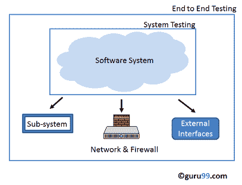
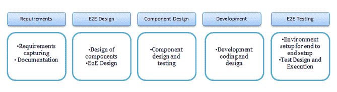
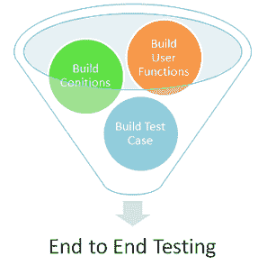

# 端到端测试教程：什么是 E2E 测试示例

> 原文： [https://www.guru99.com/end-to-end-testing.html](https://www.guru99.com/end-to-end-testing.html)

## 什么是端到端测试？

**端到端测试**是一种软件测试，可验证软件系统及其与外部接口的集成。 端到端测试的目的是练习一个完整的类似于生产的场景。

与软件系统一起，它还可以验证来自其他上游/下游系统的批处理/数据处理。 因此，名称**为“端到端”** 。 端到端测试通常在功能和[系统测试](/system-testing.html)之后执行。 它使用诸如数据和测试环境之类的实际产品来模拟实时设置。 端到端测试也称为**链测试**。

.png)

## 为什么要进行端到端测试？

现代软件系统很复杂，并且与多个子系统互连

子系统可能与当前系统不同，或者由另一个组织拥有。 **如果任何子系统出现故障，则整个软件系统可能会崩溃**。 这是一个重大风险，可以通过端到端测试来避免。 端到端测试验证了完整的系统流程。 它增加了各个子系统的[测试覆盖率](/test-coverage-in-software-testing.html)。 它有助于检测子系统问题，并增强对整个软件产品的信心。

## 端到端测试流程：

下图概述了端到端测试过程。

.png)

端到端测试涉及的主要活动是-

*   研究端到端测试需求
*   测试环境设置和硬件/软件要求
*   描述所有系统及其子系统过程。
*   所有系统的角色和职责的描述
*   测试方法和标准
*   端到端需求跟踪和测试用例设计
*   每个系统的输入和输出数据

## 如何创建端到端测试用例？

.png)

端到端测试设计框架由三部分组成

1.  建立用户功能
2.  建造条件
3.  建立测试用例

Let's look at them in detail: -

### 建立用户功能

以下活动应作为构建用户功能的一部分进行：

*   列出系统及其互连组件的功能
*   列出每个功能部件的输入数据，操作和输出数据
*   识别功能之间的关系
*   确定该功能是可重用的还是独立的

例如，请考虑以下情形：登录到银行帐户，然后将钱从其他银行转移到另一个帐户（3 rd 方子系统）

1.  登录银行系统
2.  检查帐户中的余额
3.  将部分金额从您的帐户转移到其他银行帐户（第 3 个第三方子系统）
4.  查看您的最新帐户余额
5.  注销应用程序

### 基于用户功能的构建条件

作为构建条件的一部分，执行以下活动：

*   为定义的每个用户功能建立一组条件
*   条件包括顺序，时序和数据条件

例如-检查更多条件，例如

**登录页面**

*   无效的用户名和密码
*   检查有效的用户名和密码
*   密码强度检查
*   检查错误消息

**余额**

*   24 小时后检查当前余额。 （如果转帐已发送到其他银行）
*   如果转账金额大于当前余额，请检查错误消息

### 建立测试方案

为定义的用户功能构建[测试方案](/test-scenario.html)

在这种情况下，

*   登录系统
*   支票余额
*   转帐银行余额

### 建立多个测试用例

为定义的每种方案构建一个或多个测试用例。 测试用例可以将每个条件都包含为一个测试用例。

## 端到端测试的指标：

以下是用于端到端测试的许多指标中的几个。

*   **测试用例准备状态：**给出计划中的测试用例准备进度
*   **每周测试进度-**提供每周测试完成百分比的详细信息-失败，未执行&针对计划的执行测试而执行。
*   **缺陷状态&详细信息-**它给出了每周&闭合缺陷的百分比。 此外，基于严重性和优先级的每周缺陷分布
*   **环境可用性-**每天“上电”的总小时数/每天计划进行测试的总小时数

## 端到端测试与系统测试

| **端到端测试** | **系统测试** |
| 验证软件系统以及互连的子系统 | 根据需求规范仅验证软件系统。 |
| 它检查完整的端到端处理流程。 | 它检查系统功能和特性。 |
| 所有接口，后端系统都将考虑进行测试 | 功能和非功能测试将被考虑进行测试 |
| 一旦系统测试完成，它就会执行。 | 在[集成测试](/integration-testing.html)之后执行。 |
| 端到端测试包括检查可能难以自动化的外部接口。 因此，首选[手动测试](/manual-testing.html)。 | 手动和自动化均可用于系统测试 |

**结论**

在软件工程中，端到端测试是验证软件系统及其子系统的过程。 此测试中的最大挑战是对整个系统以及互连子系统有足够的了解。