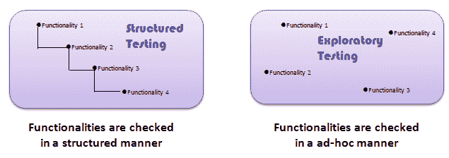
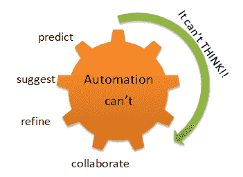

# 什么是探索性测试？ 实例技巧

> 原文： [https://www.guru99.com/exploratory-testing.html](https://www.guru99.com/exploratory-testing.html)

## 什么是探索性测试？

**探索性测试**是一种软件测试，其中不是预先创建测试用例，而是由测试人员动态检查系统。 他们可能会记下有关在执行测试之前要进行哪些测试的想法。 探索性测试的重点更多地放在作为“思考”活动的测试上。

探索性测试广泛用于敏捷模型中，并且与发现，调查和学习有关。 它强调测试人员的个人自由和责任。

在脚本化测试下，您首先设计测试用例，然后再进行测试执行。 相反，探索性测试是测试设计和测试执行同时完成的一个过程。

脚本化测试执行通常是一种非思考性的活动，测试人员执行测试步骤并将实际结果与预期结果进行比较。 这样的测试执行活动可以自动化，不需要很多认知技能。

**尽管软件测试的当前趋势是推动** **自动化**，但探索性测试是一种新的思维方式。 **自动化有其局限性**

## 脚本测试与探索性测试之间的差异

| **脚本测试** | **探索性测试** |
| 从需求指导 | 指导需求并在测试过程中进行探索 |
| 提前确定测试用例 | 测试期间确定测试用例 |
| 确认符合要求的测试 | 系统或应用程序调查 |
| 强调预测和决策 | 强调适应能力和学习能力 |
| 涉及已确认的测试 | 涉及调查 |
| 关于控制测试 | 关于测试设计的改进 |
| 就像发表演讲一样-您从草稿中阅读 | 就像谈话一样-是自发的 |
| 脚本处于控制中 | 测试人员的思想处于控制之中 |

探索性测试-

*   不是随机测试，而是旨在发现错误的临时测试
*   结构严谨
*   与脚本化测试的过程结构相比，具有认知（思维）结构。 这种结构来自宪章，时间拳击等。
*   高度可教且易于管理
*   这不是一种技术，而是一种方法。 您下一步要执行的操作取决于您当前正在执行的操作

## 如何进行探索性测试

探索性的测试准备工作将通过以下 5 个阶段详细介绍，也称为基于会话的测试管理（SBTM 周期）：

1.  **创建错误分类法（分类）**
    *   分类过去项目中常见的故障类型
    *   分析问题或故障的根本原因
    *   发现风险并提出想法以测试应用程序。
2.  **测试章程**
    *   测试章程应建议
    *   测试思路是探索测试的起点
    *   测试章程有助于确定最终用户如何使用 系统
    1.  测试什么
    2.  如何测试
    3.  需要看什么
3.  **时间框**
    *   此方法包括一对测试人员一起工作不少于 90 分钟
    *   在这 90 分钟的会话中，不应有任何中断的时间
    *   时间盒可以延长或减少 45 分钟
    *   该会议鼓励测试人员对系统的响应做出反应并为正确的结果做准备
4.  **审核结果：**
    *   缺陷评估
    *   从测试中学习
    *   覆盖范围分析
5.  **汇报：**
    *   汇编输出结果
    *   将结果与章程进行比较
    *   检查是否需要任何其他测试

例如，在探索性执行期间，需要完成以下工作：

*   测试的任务应该非常明确
*   记录需要测试的内容，为什么需要测试以及对产品质量的评估
*   跟踪探索性测试期间提出的问题
*   最好将测试人员配对以进行有效测试
*   我们测试的越多，就越有可能针对所需的方案执行正确的测试用例

记录文档并监视以下内容非常重要

*   测试范围-我们是否已记录测试用例的范围并提高软件质量
*   风险-需要涵盖哪些风险，哪些都是重要风险？
*   测试执行日志-测试执行记录
*   问题/查询-在系统上记录问题和问题

更智能的探索性测试可以在更短的时间内发现更多的错误。

## 探索性测试的优缺点

| 对于 | 用 |
| 

*   当需求文档不可用或部分可用时，此测试很有用。
*   它涉及调查过程，可以比正常测试帮助发现更多错误-
*   发现通常被忽略的错误 通过其他测试技术
*   通过执行越来越多的测试用例来扩展测试人员的想象力，最终也提高了生产率
*   此测试深入到应用程序的最小部分，涵盖了所有领域 需求
*   该测试涵盖所有类型的测试，并且涵盖各种场景和案例
*   鼓励创造力和直觉
*   在测试执行过程中产生新的想法

 | 

*   此测试完全取决于测试人员的技能
*   受测试人员领域知识的限制
*   不适合执行时间长的应用程序

 |

## 探索性测试的挑战：

探索性测试存在许多挑战，下面将对这些挑战进行说明：

*   学习使用应用程序或软件系统是一个挑战
*   复制失败很困难
*   确定是否需要使用工具可能具有挑战性
*   确定要执行的最佳测试用例可能很困难
*   报告测试结果是一个挑战，因为报告没有计划的脚本或案例来与实际结果或结果进行比较
*   执行期间所有事件的记录都很难记录
*   不知道何时停止测试，因为探索性测试有明确的测试用例可以执行。

## 什么时候使用探索性测试？

探索性测试在以下情况下可以广泛使用

*   测试团队拥有经验丰富的测试人员
*   需要早期迭代
*   有一个关键的应用
*   新测试人员加入团队

### 结论：

在软件工程中，执行探索性测试以克服脚本化测试的局限性。 它有助于改进[测试用例](/test-case.html)套件。 它重视学习和适应能力。