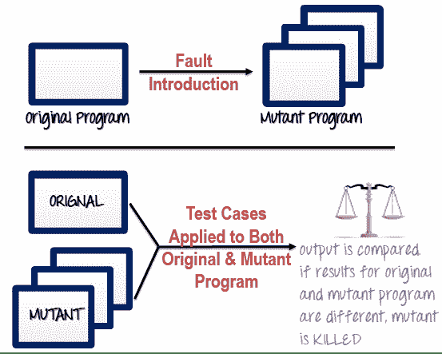

# 软件测试中的变异测试：变异分数&分析示例

> 原文： [https://www.guru99.com/mutation-testing.html](https://www.guru99.com/mutation-testing.html)

### 什么是突变测试？

变异测试是一种软件测试，其中我们变异（更改）源代码中的某些语句，并检查测试用例是否能够找到错误。 它是[白盒测试](/white-box-testing.html)的一种，主要用于[单元测试](/unit-testing-guide.html)。 变异程序中的更改保持很小，因此不会影响程序的总体目标。

突变测试的目标是评估测试案例的质量，测试案例的强度应足以使突变代码失败。 此方法也称为基于故障的测试策略，因为它涉及在程序中创建故障

突变最初是在 1971 年提出的，但由于涉及的高昂费用而丧失了热情。 现在，它再次受到青睐，并广泛用于 [Java](/java-tutorial.html) 和 XML 之类的语言。

在本教程中，您将学习-

*   [什么是变异测试？](#1)
*   [如何执行变异测试？](#2)
*   [如何创建变异程序？](#3)
*   [突变程序中要更改什么？](#4)
*   [突变测试的类型](#5)
*   [突变得分：](#6)
*   [突变测试的优势：](#7)
*   [突变测试的缺点：](#8)

## 如何执行突变测试？

**** 

以下是执行变异测试（变异分析）的步骤：

**步骤 1** ：通过创建称为变体的许多版本，将错误引入程序的源代码中。 每个突变体都应包含一个故障，目的是使突变体版本失败，从而证明测试用例的有效性。

**步骤 2** ：将测试用例应用于原始程序以及突变程序。 [测试用例](/test-case.html)应该足够，并且经过调整以检测程序中的错误。

**步骤 3** ：比较原始程序和突变程序的结果。

**步骤 4** ：如果原始程序和突变程序产生不同的输出，则该突变被测试用例杀死。 因此，测试用例足以检测原始程序和突变程序之间的变化。

**步骤 5** ：如果原始程序和突变程序生成相同的输出，则 Mutant 保持活动状态。 在这种情况下，需要创建更有效的测试用例以杀死所有突变体。

## 如何创建变异程序？

变异不过是对程序语句进行的单个语法更改。 每个突变程序应与原始程序相差一个突变。

| **原始程序** | **突变程序** |
| --- | --- |
| If（x > y）

打印“你好”

其他

打印“ Hi”

 | If（ **x < y** ）

**打印“你好”**

**其他 HTG12]打印“嗨”**

 |

## 突变程序中要更改什么？

有几种技术可用于生成突变程序。 让我们看看他们

| **操作数替换运算符** | **表达式修饰运算符** | **语句修改运算符** |
| --- | --- | --- |
| 用另一个操作数（x 表示 y 或 y 表示 x）或常数替换操作数。 | 在程序语句中替换运算符或插入新的运算符。 | 修改程序语句以创建突变程序。 |
| 示例-

If（x > y）替换 x 和 y 值

If（5 > y）用常数 5 替换 x

 | 示例-

If（x == y）

我们可以将==替换为> =，并使用突变程序作为

If（x [HT [9] ），然后在语句

If（x == ++ y）中插入++ | 示例-

删除 if-else 语句中的 else 部分

删除整个 if-else 语句以检查程序的行为

一些示例突变运算符：

*   GOTO 标签替换
*   返回语句替换
*   语句删除
*   一元运算符插入（如-和++）
*   逻辑连接器替换
*   可比较的数组名称替换
*   删除 if-else 语句中的 else 部分
*   添加或替换运算符
*   通过更改数据来替换语句
*   变量的数据修改
*   程序

中数据类型的修改 |

变异测试自动化：

变异测试非常耗时且手动执行很复杂。 为了加快该过程，建议您使用自动化工具。 自动化工具也降低了测试成本。

可用工具清单-

*   [史赛克](https://stryker-mutator.io/ "Stryker")
*   [PIT 测试](http://pitest.org/ "PIT Testing")

## 突变测试的类型

在软件工程中，突变测试可以从根本上分为三种类型：语句突变，决策突变和值突变。

1.  **语句突变**-开发人员剪切并粘贴了一部分代码，其结果可能是删除了某些行
2.  **值突变**-修改了主要参数的值
3.  **决策突变**-要更改控制语句

## 突变得分：

突变得分定义为被杀死的突变体占突变体总数的百分比。

*   变异分数=（杀死的变异体/变异总数）* 100

如果分数为 100％，则测试用例具有足够的变异性。 实验结果表明，变异测试是衡量测试用例是否充分的有效方法。 但是，主要缺点是生成突变体和针对该突变体程序执行每个测试用例的成本很高。

## 变异测试的优点：

以下是突变测试的优点：

*   这是一种强大的方法，可以使源程序获得更高的覆盖率。
*   此测试能够全面测试突变程序。
*   变异测试为软件开发人员带来了良好的错误检测水平。
*   此方法发现了源代码中的歧义，并具有检测程序中所有错误的能力。
*   通过获得最可靠，最稳定的系统，客户将从此测试中受益。

## 突变测试的缺点：

另一方面，以下是 Mutant 测试的缺点：

*   突变测试非常昂贵且耗时，因为需要生成许多突变程序。
*   由于它很耗时，可以说没有自动化工具就无法完成此测试。
*   每个变异将具有与原始程序相同数量的测试用例。 因此，可能需要针对原始测试套件测试大量的突变程序。
*   由于此方法涉及源代码更改，因此根本不适用于[黑盒测试](/black-box-testing.html)。

## 结论：

您是否要对应用程序进行详尽的测试？ 答案是变异测试。 它是测试程序的最全面的技术。 这是一种检查测试程序的有效性和准确性以检测系统中的故障或错误的方法。