# 基于风险的测试：方法，矩阵，过程&示例

> 原文： [https://www.guru99.com/risk-based-testing.html](https://www.guru99.com/risk-based-testing.html)

## 什么是基于风险的测试？

**基于风险的测试（RBT）**是基于风险概率完成的测试类型。 它涉及根据复杂性，业务关键性，使用频率，可见区域，[缺陷](/defect-management-process.html)易发区域等来评估风险。它涉及根据测试的应用程序的功能，模块和功能的测试优先级。 影响和失败的可能性。

风险是不确定事件的发生，对项目的可衡量成功标准有正面或负面的影响。 可能是过去发生的事件，也可能是当前发生的事件，或者将来可能发生的事情。 这些不确定的事件可能会影响项目的成本，业务，技术和质量目标。

风险可以是正的或负的。

*   **积极风险**被称为机遇和对业务可持续性的帮助。 例如，投资新项目，更改业务流程，开发新产品。
*   **负面风险**被称为威胁，为了使项目成功，必须实施最小化或消除它们的建议。

在本教程中，您将学习-

*   [何时实施基于风险的测试](#2)
*   [风险管理流程](#3)
*   [基于风险的测试方法](#4)
*   [基于风险的系统测试方法](#5)
*   [如何进行基于风险的测试：完整流程](#6)
*   [优先级划分和风险评估矩阵](#7)
*   [基于风险的测试的通用检查表](#8)
*   [基于风险的测试结果报告和指标](#9)
*   [固有风险与残留风险评估](#10)
*   [基于风险的测试的优势](#11)

## 何时实施基于风险的测试

基于风险的测试可以在

*   有时间，资源，预算限制等的项目
*   可以使用基于风险的分析来检测 SQL 注入攻击的漏洞的项目。
*   云计算环境中的安全性测试。
*   具有高风险因素的新项目，例如缺乏所使用技术的经验，缺乏业务领域知识。
*   增量模型和迭代模型等

## 风险管理流程

现在让我们了解风险管理流程中涉及的步骤

### 风险识别

可以通过风险研讨会，清单，集思广益，访谈，Delphi 技术，因果图，从先前项目中吸取的教训，根本原因分析，联系领域专家和主题专家来进行风险识别。

**风险记录**是一个电子表格，其中包含已标识的风险，潜在响应和根本原因的列表。 它用于监视和跟踪项目整个生命周期中的风险（威胁和机会）。 风险应对策略可用于管理正面和负面风险。

风险分解结构在风险计划中起着重要作用。 风险分解结构将有助于识别容易发生风险的区域，并有助于在项目过程中进行有效的评估和风险监控。 它有助于为风险管理活动提供足够的时间和资源。 它还有助于对可能导致项目风险的许多来源进行分类。

**风险分解结构样本**

[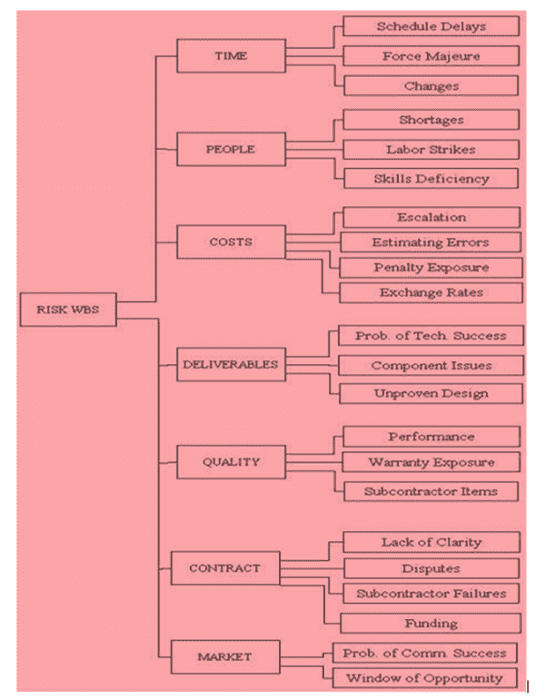 ](/images/3-2016/032316_1114_RiskBasedTe3.png) 

### 风险分析（包括定量和定性分析）

一旦确定了潜在风险列表，下一步就是对其进行分析，并根据重要性过滤风险。 定性风险分析技术之一是使用“风险矩阵”（在下一节中介绍）。 此技术用于确定风险的可能性和影响。

### 风险应对计划

根据分析，我们可以决定是否需要应对风险。 例如，某些风险将需要项目计划中的响应，而有些风险则需要项目监视中的响应，而有些则根本不需要任何响应。

风险所有者负责确定选项，以降低分配的风险的可能性和影响。

**缓解风险**是一种风险应对方法，用于减少可能威胁的不利影响。 这可以通过消除风险或将风险降低到可接受的水平来实现。

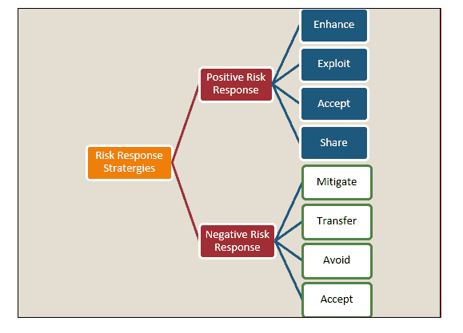

**风险应急措施**

不可预见性可以描述为不确定事件的可能性，但是影响是未知的或不可预测的。 应急计划也称为最坏情况下的行动计划/备份计划。 换句话说，它确定了发生不可预测的事件时可以采取的步骤。

### 风险监控

风险控制和监视过程用于跟踪已识别的风险，监视残留风险，识别新风险，更新风险登记册，分析更改的原因，执行风险响应计划并监视风险触发因素等。评估其降低风险的有效性 。

这可以通过风险重新评估，风险审计，方差和趋势分析，技术性能度量，状态更新会议和回顾会议来实现。

下表提供了有关

| **用于风险监视和控制的输入** | **用于风险监控的工具和技术** | **风险监视和控制**的输出 |
| 风险管理计划 | 项目风险应对审计 | 解决方案 |
| 风险应对计划 | 定期项目风险审查 | 纠正措施 |
| 项目沟通计划 | 挣值分析 | 项目变更要求 |
| 额外的风险识别和分析 | 技术绩效评估 | 更新 RiskResponse 计划和 Risk Identification 清单 |
| 范围变更 | 其他风险应对计划 | 风险数据库 |

我们需要记住，风险随着技术，项目规模，项目时间（更长的项目时限），赞助机构的数量，项目估算，工作以及缺乏适当技能的变化而增加。

## 基于风险的测试方法

1.  分析需求。
2.  审查文档（SRS，FRS，用例）。 完成此活动是为了发现并消除错误&的歧义。
3.  需求签署是减少风险的一种技术，可以避免在项目中引入最新的变更。 在将文档基准化之后，对需求的任何更改都将涉及更改控制流程和后续批准。
4.  通过计算每个需求可能对项目产生的影响以及可能产生的影响来评估风险，同时考虑定义的标准，例如成本，进度，资源，范围，技术性能安全性，可靠性，复杂性等。
5.  确定故障和高风险区域的可能性。 这可以使用风险评估矩阵来完成。
6.  使用风险记录器列出已识别的风险集。 定期更新，监视和跟踪风险。
7.  在此阶段需要进行风险分析，以了解风险能力和风险承受能力水平。
8.  根据等级对需求进行优先排序。
9.  定义了基于风险的测试流程
10.  对于缓解计划，实施，进度​​监控，可以考虑使用高度关键和中等风险。 可以在监视列表中考虑低风险。
11.  进行风险数据质量评估以分析数据质量。
12.  根据评级计划和定义测试
13.  应用适当的测试方法和测试设计技术来设计测试用例，以首先测试最高风险的项目。 具有较高领域知识经验的资源可以测试高风险项目。
14.  可以将不同的测试设计技术用于例如 对高风险测试项目使用决策表技术，对低风险测试项目使用“仅”等效划分。
15.  测试用例还旨在涵盖多种功能以及端到端业务场景。
16.  准备测试数据，测试条件和测试台。
17.  查看测试计划，测试策略，测试用例，测试报告或测试团队创建的任何其他文档。
18.  同行评审是识别缺陷和降低风险的重要步骤。
19.  对结果进行空运行和质量检查
20.  根据风险项目的优先级执行测试用例。
21.  保持风险项目之间的可追溯性，涵盖风险项目的测试，这些测试的结果以及测试期间发现的缺陷。 正确执行所有测试策略将降低质量风险。
22.  基于风险的测试可用于每个级别的测试，例如 组件，集成，系统和验收测试
23.  在系统级别，我们需要专注于应用程序中最重要的部分。 这可以通过查看功能的可见性，使用频率和可能的故障成本来确定。
24.  评估退出标准。 所有高风险区域均经过全面测试，只有少量残留风险未解决。
25.  基于风险的测试结果报告和指标分析。
26.  根据关键风险指标重新评估现有风险事件和新风险事件。
27.  风险登记册更新。
28.  应急计划-这是针对高暴露风险的后备计划/应急计划。
29.  缺陷分析和缺陷预防，以消除缺陷。
30.  Retesting and Regression testing to validate the defect fixes based on pre-calculated risk analysis and

    高风险区域应得到最密集的覆盖。

31.  基于风险的自动化测试（如果可行）
32.  剩余风险计算
33.  风险监控
34.  退出标准或完成标准可用于不同的风险级别。 所有关键风险均已通过适当的措施或应急计划解决。 风险敞口等于或低于项目可接受的水平。
35.  风险分析重新评估和客户反馈。

## 基于风险的系统测试方法

1.  **技术系统测试** –这称为环境测试和集成测试。 环境测试包括开发，测试和生产环境中的测试。
2.  **功能系统测试**-测试所有功能，功能，程序，模块。 该测试的目的是评估系统是否满足其指定要求。
3.  **非功能系统测试**-测试非功能需求性能，负载测试，压力测试，配置测试，安全性测试，备份和恢复过程以及文档（系统，操作和安装文档）。

下图清楚地概述了上述过程

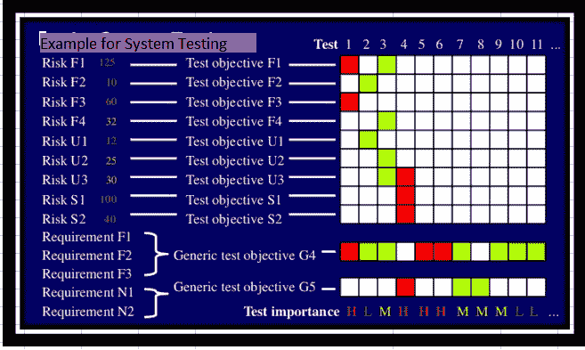

系统测试包括功能测试和非功能测试。

功能测试可确保产品/应用程序满足客户和业务需求。 另一方面，进行非功能测试以验证产品在质量，可靠性可用性，性能，兼容性等方面是否符合客户的期望。

## 如何进行基于风险的测试：完整过程

本节介绍基于风险的测试流程

1.  风险识别
2.  风险分析
3.  风险应对
4.  测试范围
5.  测试过程定义

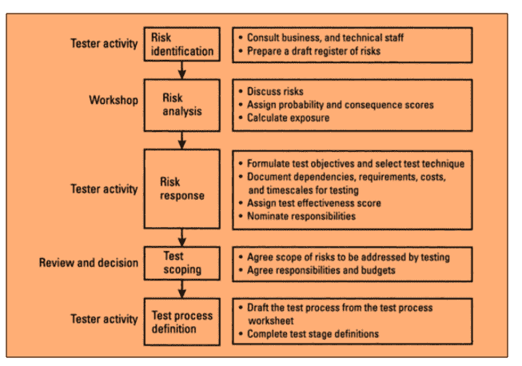

1.  在此过程中，对风险进行识别和分类，准备风险登记册草案，对风险进行分类以识别重大风险。
2.  风险应对包括根据风险制定测试目标，并选择适当的技术来证明测试活动/测试技术满足测试目标。
3.  考虑文件的依存关系，要求，成本，软件测试所需的时间等来计算测试有效性得分。
4.  测试范围界定是一项审查活动，需要所有利益相关者和技术人员的参与。 遵守商定的风险范围很重要。 这些风险需要通过测试来解决，所有成员都同意分配给他们的责任和分配给这些活动的预算。
5.  在确定了测试范围之后，必须以标准格式编译每个测试阶段的测试目标，假设和依存关系。

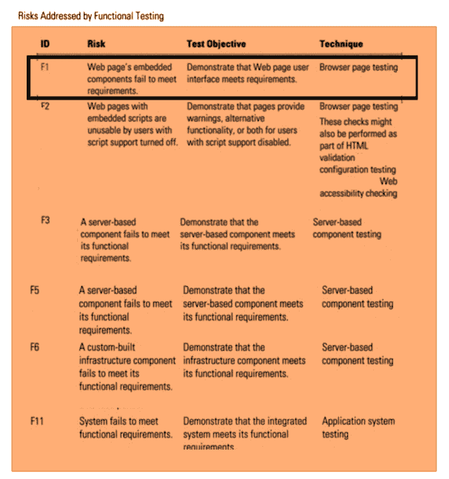

让我们考虑功能需求 F1，F2，F3 和非功能需求 N1 & N2

*   **F1 功能要求，与 F1 相关的 R1-风险**
    *   测试目标 1-使用测试证明系统的预期特性和功能可以正常运行，并且可以通过功能测试解决风险 R1
    *   **测试**-浏览器页面测试已完成，以执行重要的用户任务，并验证可以在多种情况下解决 R1（与 F1 相关的风险）。

*   **F2-功能要求，与 F2 相关的 R2-风险**
    *   测试目标 2 –使用**测试**证明系统的预期功能正常运行，并且可以通过功能测试解决 R2 风险
    *   **测试**-浏览器页面测试已完成，以执行重要的用户任务并验证可以在多种情况下解决 R2 问题
*   **F3 功能要求，与 F3 相关的 R3-风险**
    *   测试目标 3 –使用**测试**演示系统的预期特性和功能运行良好，并且可以通过功能测试解决 R3 风险
    *   **测试**-浏览器页面测试已完成，以执行重要的用户任务并验证可以在多种情况下解决 R3 问题
*   **N1-非功能要求，与 N1 相关的 NR1-风险**
    *   测试目标 N1-使用**测试**演示系统的运行特性正常，并且可以通过非功能测试解决 NR1 风险
    *   **测试**-可用性测试是一种用于评估使用用户界面的简易程度并验证可用性测试是否可以解决 NR1 的技术
*   **N2-非功能性要求，与 N2 相关的 NR2-风险**
    *   测试目标 N.2-使用测试证明系统的运行特性运行良好，并且可以通过非功能测试解决 NR2 风险
    *   测试安全性测试是一种用于检查应用程序是否安全或是否容易受到攻击，是否存在任何信息泄漏并验证是否可以通过安全性测试解决 NR2 的技术。

**特定测试目标**：列出的风险和测试目标特定于测试类型。

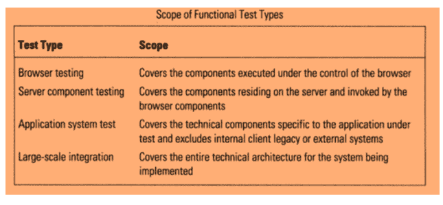

**设计基于风险的测试过程的程序**

*   准备风险登记册，记录从通用风险清单，现有检查清单，集思广益会议得出的风险。
*   包括与系统功能和非功能需求（可用性，安全性，性能）相关的风险
*   为每个风险分配一个唯一的标识符

| **编号** | **列标题** | **说明** |
| 3 | 可能性 | 系统的可能性很容易出现这种故障模式 |
| 4 | 后果 | 这种故障模式的影响 |
| 5 | 接触 | 概率与后果的乘积（第 3 列& 4） |
| 6 | 测试效果 | 测试人员对他们可以解决此风险的信心如何？ |
| 7 | 测试优先级编号 | 概率，后果和测试有效性的乘积（第 3,4 6 列） |
| 8 | 测试目标 | 什么测试目标将用于解决此风险 |
| 9 | 技术测试 | 使用什么方法或技术 |
| 10 | 依存关系 | 测试人员假定并依赖什么 |
| 11 | 努力 | 此测试需要多少精力 |
| 12 | 时间尺度 | 进行此测试需要多少时间 |
| 13 | 测试阶段 A 单元测试测试阶段 B 集成测试测试阶段 C 系统测试 | 从事此活动的个人或团体的名称 |

评估每种风险的概率（1 低-5 高）和后果（1 低-5 高）

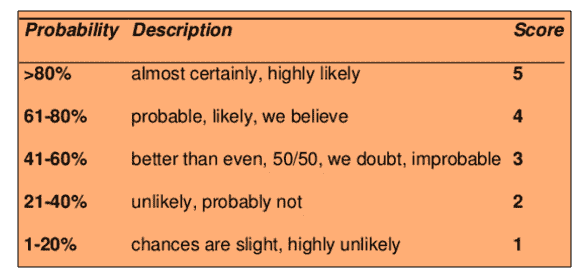 ](/images/3-2016/032316_1114_RiskBasedTe10.png) [ 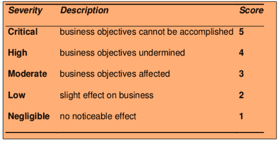

*   计算测试曝光
*   测试人员分析每种风险并评估该风险是否可测试
*   为可测试的风险定义了测试目标
*   测试人员指定应以计划的方式进行以达到测试目标的测试活动（静态检查，检查，系统测试，集成测试，验收测试，html 验证，本地化测试等）
*   这些测试活动可以分为几个阶段（组件测试/单元测试，集成测试，系统测试，验收测试）
*   有时，一个或多个测试阶段可能会解决风险
*   确定依赖关系和假设（技能，工具，测试环境，资源的可用性）
*   计算测试有效性。 测试有效性与测试人员对通过测试确定地解决风险的置信度有关。 测试有效性得分是一个介于 1 到 5 之间的数字。（5-高置信度，1-低置信度）
*   估算工作量，所需时间，准备和执行这些测试的成本。

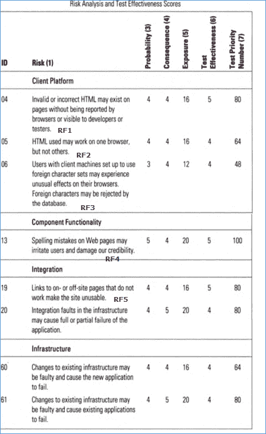

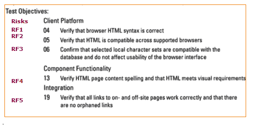

*   计算测试优先级数。 它是概率，结果和测试有效性分数的乘积。
    *   125-最大风险可以通过测试检测到非常严重的风险
    *   1-最低àA 极低的风险，测试无法检测到
*   根据测试优先级编号，测试重要性可以分为高（红色），中（黄色）&低（绿色）。 风险最高的项目将首先进行测试。
*   将测试活动分配到测试阶段。指定将在不同测试阶段（单元测试，集成测试，系统测试，验收测试）中针对每个目标执行测试的小组
*   在测试范围界定阶段决定要进行测试的范围和范围之外的内容
*   对于每个阶段的测试目标，定义了被测组件，职责，环境，进入标准，退出标准，工具，技术，可交付成果。

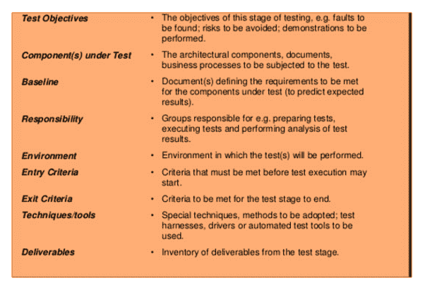

通用测试目标-这些通用目标适用于多个项目和应用程序

*   组件符合要求，可以在更大的子系统中使用
*   解决了与特定测试类型相关的风险，并实现了测试目标。
*   集成组件已正确组装。 确保组件之间的接口兼容性。
*   该系统符合指定的功能和非功能要求。
*   产品组件可在其预期的操作环境中满足最终用户的需求
*   风险管理策略用于识别，分析和缓解风险。
*   系统符合行业法规要求
*   系统履行合同义务
*   制度化和实现其他特定目标，如成本，进度和质量目标。
*   系统，流程和人员符合业务需求

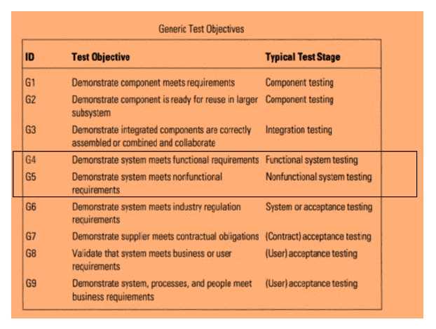

可以为不同的测试阶段定义通用的测试目标

*   组件测试
*   整合测试
*   系统测试
*   验收测试

让我们考虑系统测试阶段

1.  G4 & G5 演示的系统满足功能性（F1，F2，F3）和非功能性要求（N1，N2）。
2.  使用测试证明系统的预期特性和功能可以正常工作，并且可以通过功能测试解决与 F1，F2，F3 相关的风险
3.  使用测试证明系统的运行特性可以正常工作，并且可以通过非功能测试来解决与 N1，N2 相关的风险
4.  根据测试优先级编号，测试重要性可以分为高（红色），中（黄色）&低（绿色）。

## 优先级和风险评估矩阵

风险评估矩阵是概率影响矩阵。 它使项目团队可以快速了解风险以及应对每种风险的优先级。

```
Risk rating = Probability x Severity 
```

概率是不确定事件发生可能性的度量。 根据时间，接近度和重复性进行接触。 用百分比表示。

可以分为频繁（A），可能（B），偶尔（C），远程（D），不可能（E），消除（F）

*   频繁-预计在大多数情况下会发生几次（91-100％）
*   可能：在大多数情况下可能会发生几次（61-90％）
*   偶发：可能会在某个时间发生（41-60％）
*   远程–不太可能发生/可能在某个时间发生（11-40％）
*   不太可能-可能在罕见和特殊情况下发生（0 -10％）
*   消除-不可能发生（0％）

严重程度是由于不确定事件导致的损坏或损失的影响程度。 得分 1 到 4，可以分类为灾难性= 1，严重= 2，边际= 3，可忽略= 4

*   **灾难性** –严峻的后果，使项目完全无能为力，甚至可能导致项目停工。 在风险管理期间，这必须是头等大事。
*   **严重**-重大后果，可能导致大量损失。 项目受到严重威胁。
*   **边际** –短期损害仍可通过恢复活动来逆转。
*   **可以忽略不计**-损坏或损失很小或很小。 这可以通过常规程序进行监视和管理。

优先级分为四个类别，如下图所示，它们与风险的严重性和可能性相对应。

*   严重
*   高
*   中
*   Low

    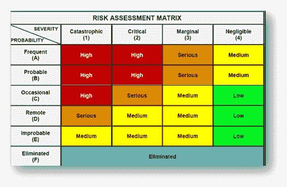

**严重：**属于此类的风险以琥珀色标记。 必须停止活动，并且必须立即采取措施以隔离风险。 必须确定并实施有效的控制措施。 此外，除非将风险降低到中低水平，否则不得进行该活动。

**高：**属于红色风险操作或风险管理策略的标记为此类风险。 必须立即采取行动以隔离，消除，替代风险并实施有效的风险控制。 如果不能立即解决这些问题，则必须定义严格的时间表来解决这些问题。

**中：**属于此类别的风险以黄色标记。 必须采取合理和实际的步骤以最大程度地降低风险。

**低：**属于此类的风险以绿色标记），可以忽略不计，因为它们通常不会带来任何重大问题。 必须定期检查以确保控制措施有效

## 基于风险的测试的通用检查表

基于风险的测试中要考虑的重要点的完整列表

*   项目中的重要功能。
*   项目中用户可见的功能
*   具有最大安全影响的功能
*   对用户产生最大财务影响的功能
*   源代码和容易出错的代码的高度复杂的区域
*   可以在开发周期的早期进行测试的特性或功能。
*   在最后一分钟将功能部件添加到产品设计中。
*   导致问题/问题的先前类似/相关项目的关键因素。
*   对运营和维护费用产生巨大影响的类似/相关项目的主要因素或问题。
*   不良的需求导致不良的设计和测试，可能会影响项目目标和可交付成果。
*   在最坏的情况下，产品的缺陷可能非常严重，以至于无法进行返工并且必须完全报废，这将严重损害公司的声誉。 确定什么样的问题对产品目标至关重要。
*   可能引起持续的客户服务投诉的情况或问题。
*   端到端测试可以轻松地关注系统的多种功能。
*   最佳测试集可以最大程度地覆盖风险
*   哪些测试具有最高的高风险覆盖率与时间要求的比率？

## 基于风险的测试结果报告和指标

1.  **Test report preparation**

    报告测试状态是关于将测试结果有效地传达给项目涉众。 并给出清晰的理解并显示测试结果与测试目标的比较。

*   计划的测试用例数与已执行的测试用例数
*   通过/失败的测试用例数
*   识别出的缺陷数量及其状态&严重性
*   缺陷数量及其状态
*   严重缺陷数量-仍未解决
*   环境停机时间-如果有的话
*   Showstoppers – if any

    测试摘要报告，测试覆盖率报告

2.  **Metrics Preparation**

    指标是用于比较软件过程，项目和产品的两个或多个度量的组合。

    *   工作量和进度变化
    *   测试用例准备生产力
    *   测试设计范围
    *   测试用例执行效率
    *   **风险识别效率％**
    *   **风险缓解效率％**
    *   测试效果％
    *   测试执行范围
    *   测试执行效率
    *   缺陷漏率％
    *   缺陷检测效率
    *   需求稳定性指数
    *   质量成本

3.  根据缺陷状态和许多测试通过/失败状态（基于它们与风险的关系），分析非功能类别（性能，可靠性和可用性）中的风险。
4.  根据功能类别的测试风险，缺陷状态和测试通过/失败状态，根据它们与风险之间的关系来分析风险。
5.  确定关键的超前和滞后指标并创建预警指标
6.  通过分析数据模式，趋势和相互依存性，监视和报告提前和滞后风险指标（关键风险指标）。

## 固有风险与残留风险评估

风险识别和分析还应包括固有风险，残留风险，次要风险和经常性风险

*   **固有风险**：在实施控制和响应之前已在系统中识别/已经存在的风险。 固有风险也称为总风险
*   **残留风险**：实施控制和响应后剩下的风险。 残留风险称为净风险
*   **次要风险：**实施风险响应计划导致的新风险
*   **经常性风险：**发生初始风险的可能性。

基于风险的测试结果度量有助于组织了解测试执行过程中质量风险的剩余水平，并做出明智的发布决策。

**风险分析和客户反馈**

风险剖析是一种在考虑所需风险，风险承受能力和风险承受能力的情况下，为客户找到最佳投资风险水平的过程。

1.  所需风险是客户为了获得满意回报所需要承担的风险等级
2.  风险承受能力是客户可以承受的财务风险水平
3.  风险承受能力是客户希望承担的风险等级

**客户反馈**

收集客户反馈和评论，以改善业务，产品，服务和体验。

## 基于风险的测试的好处

风险测试的好处如下

*   提高生产率并降低成本
*   改善了市场机会（上市时间）和准时交货。
*   改善服务绩效
*   测试了应用程序的所有关键功能，从而提高了质量。
*   提供有关测试覆盖率的明确信息。 使用这种方法，我们知道什么已经/尚未测试。
*   基于风险评估的测试工作量分配是最小化发布时残留风险的最有效方法。
*   基于风险分析的测试结果度量使组织能够确定测试执行过程中质量风险的剩余水平，并做出明智的发布决策。
*   使用高度定义的风险评估方法优化测试。
*   提高客户满意度–由于客户的参与以及良好的报告和进度跟踪。
*   尽早发现潜在问题区域。 可以采取有效的预防措施来克服这些问题
*   在项目的整个生命周期中进行连续的风险监视和评估，有助于识别和解决风险，并解决可能危害实现总体项目目标的问题。

### 摘要：

在软件工程中，基于风险的测试是基于风险指导项目的最有效方法。

有效地组织了测试工作，并评估了每个风险项目的优先级。 然后，将每种风险与适当的测试活动相关联，其中单个测试具有多个风险项目，则该测试被指定为最高风险。

根据风险优先顺序执行测试。 风险监控过程有助于跟踪已识别的风险，并减少残留风险的影响。