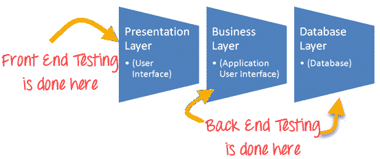

# 后端测试教程：什么是工具&示例

> 原文： [https://www.guru99.com/what-is-backend-testing.html](https://www.guru99.com/what-is-backend-testing.html)

## 什么是后端测试？

后端测试定义为一种检查服务器端或数据库的测试类型。 也称为数据库测试。 在前端输入的数据将存储在后端数据库中。 数据库可以是 [SQL](/sql.html) Server，MySQL，Oracle，DB2 等。数据将在表中作为记录进行组织，并且用于支持页面的内容。

数据库或后端测试非常重要，因为如果不这样做，它会带来一些严重的复杂问题，例如死锁，数据损坏，数据丢失等。

## 如何进行后端测试

数据库测试主要包括验证

*   架构图
*   数据库表
*   列
*   键和索引
*   储存程序
*   扳机
*   数据库服务器验证
*   验证数据重复

在后端测试中，不需要使用 GUI。 您可以使用功能所需的参数直接通过某个浏览器传递请求，并以某种默认格式获取响应。 例如，XML 或 JSON。 您还需要直接连接到数据库并使用 SQL 查询验证数据。 通过日志文件，可以完成调试。

后端测试分为多个阶段。 第一步是获取数据库服务器的设计规范。 下一步是测试规范设计，然后使用 SQL 代码在此设计中实现测试。

## 数据库测试的类型

数据库测试的类型包括

*   结构测试
*   功能测试
*   非功能测试

## 用于数据库测试的工具

用于数据库测试的一些有用工具包括

*   [数据工厂](https://sourceforge.net/projects/data-factory/ "Data Factory")
*   [数据生成器](http://www.sqledit.com/dg/download.html "Data Generator")

**后端测试的优势**

*   后端测试不像[黑盒测试](/black-box-testing.html)
*   完全控制[测试范围](/test-coverage-in-software-testing.html)和深度
*   在开发的早期阶段，可以有效地发现许多错误

为了进行后端测试，测试人员应具有数据库服务器方面的深厚背景以及结构化查询语言的知识。

进一步阅读- [https://www.guru99.com/data-testing.html](/data-testing.html)