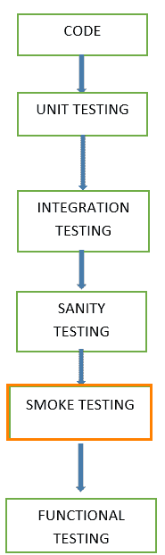
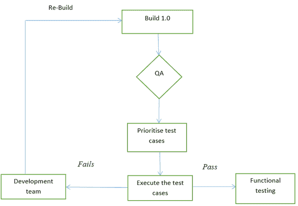

# 什么是烟雾测试？ 如何使用示例

> 原文： [https://www.guru99.com/smoke-testing.html](https://www.guru99.com/smoke-testing.html)

## 什么是烟雾测试？

**烟雾测试**是一种软件测试，它确定所部署的内部版本是否稳定。 烟雾测试的目的在于确认质量检查小组是否可以继续进行进一步的测试。 冒烟测试是对每个版本进行的最少一组测试。

冒烟测试是一个将软件构建部署到 QA 环境并经过验证以确保应用程序稳定性的过程。 也称为“构建验证测试”或“信心测试”。

简而言之，我们正在验证重要功能是否正常运行，并且正在测试的构建中不存在任何阻碍。

这是对主要功能的微型快速回归测试。 这是一个简单的测试，表明产品已准备好进行测试。 这有助于确定构建是否有缺陷，从而使任何进一步的测试都浪费时间和资源。

了解比较[烟雾与健全性测试](/smoke-sanity-testing.html)

冒烟测试使构建有资格进行进一步的正式测试。 烟雾测试的主要目的是发现早期的重大问题。 烟雾测试旨在证明系统的稳定性和对要求的符合性。

构建包括实现一个或多个产品功能所需的所有数据文件，库，可重用模块，工程组件。

在本教程中，您将学习-

*   [什么是烟雾测试？](#1)
*   [我们什么时候进行烟雾测试](#2)
*   [谁将进行烟雾测试](#3)
*   [为什么要进行烟雾测试？](#4)
*   [如何进行烟雾测试？](#5)
*   [烟雾测试的优势](#6)
*   [样本烟雾测试用例示例](#7)

## 我们什么时候做烟雾测试

只要开发了软件的新功能并将其与 QA /登台环境中部署的现有内部版本集成，便会进行烟雾测试。 它可以确保所有关键功能正常运行或不正常运行。

在这种测试方法中，开发团队在质量检查中部署构建。 抽取了测试用例的子集，然后测试人员在构建中运行测试用例。 质量检查团队针对关键功能对应用程序进行了测试。 这些测试用例系列旨在暴露构建中的错误。 如果这些测试通过，则质量检查团队将继续进行[功能测试](/functional-testing.html)。

任何故障都表明需要将系统交还给开发团队。 每当版本发生变化时，我们都会进行冒烟测试以确保稳定性。

**示例**：-在登录窗口中添加了新的注册按钮，并使用新代码部署了构建。 我们在新的建筑物上执行烟雾测试。

## 谁将进行烟雾测试

将构建发布到 QA 环境后，由 QA 工程师/ QA 负责人执行冒烟测试。 每当有新版本生成时，QA 团队都会确定应用程序中的主要功能以执行烟雾测试。 质量检查小组会检查正在测试的应用程序中是否有排行榜。

在开发环境中对代码进行的测试，以确保在将构建发布给 QA 之前确保应用程序的正确性，这称为完整性测试。 它通常是狭窄而深入的测试。 这是一个验证正在开发的应用程序是否满足其基本功能要求的过程。

健全性测试确定了开发阶段的完成，并决定是否通过软件产品以进行进一步的测试阶段。

## 为什么要进行烟雾测试？

冒烟测试在软件开发中起着重要作用，因为它可以确保系统在初始阶段的正确性。 这样，我们可以节省测试工作量。 结果，烟雾测试使系统处于良好状态。 一旦完成烟雾测试，则只有我们开始功能测试。

*   将通过执行烟雾测试来识别构建中的所有显示停止器。
*   在将构建发布到 QA 之后，将进行烟雾测试。 借助烟雾测试，可以在软件开发的初始阶段识别出大多数缺陷。
*   通过烟雾测试，我们简化了主要缺陷的检测和纠正。
*   通过烟雾测试，QA 团队可以发现新代码可能浮现的应用程序功能缺陷。
*   烟雾测试发现了严重的严重缺陷。

**示例 1：**记录窗口：单击提交按钮时，可以使用有效的用户名和密码移至下一个窗口。

**示例 2：**用户无法从网页注销。

## 如何进行烟雾测试？

烟雾测试通常是手动完成的，尽管有可能通过自动化来完成。 各个组织可能会有所不同。

**手动烟雾测试**

通常，烟雾测试是手动完成的。 它的方法因一个组织而异。 进行了烟雾测试，以确保关键路径的导航符合预期，并且不会影响功能。 将构建发布到 QA 之后，将采用高优先级功能测试用例并进行测试以发现系统中的关键缺陷。 如果测试通过，我们将继续进行功能测试。 如果测试失败，则拒绝构建并将其发送回开发团队进行更正。 质量检查人员再次使用新的构建版本开始烟雾测试。 烟雾测试在新版本上执行，并将与旧版本集成以维护系统的正确性。 在进行烟雾测试之前，质量检查团队应检查版本是否正确。

**自动化烟雾测试**

[自动化测试](/automation-testing.html)用于[回归测试](/regression-testing.html)。 但是，我们还可以使用一组自动化测试用例针对 Smoke Test 运行。 借助自动化测试，开发人员可以在有新的部署准备就绪时立即检查构建。

部署新软件版本后，无需手动重复测试，而是针对该版本执行记录的烟雾测试用例。 它验证主要功能是否仍然正常运行。 如果测试失败，则他们可以更正构建并立即重新部署。 这样，我们可以节省时间并确保质量保证环境的质量。

使用自动工具，测试工程师可以记录在软件版本中执行的所有手动步骤。

**烟雾测试周期**

下面的流程图显示了烟雾测试的执行方式。 一旦构建在 QA 中部署并且通过了冒烟测试，我们便进行功能测试。 如果冒烟测试失败，我们将退出测试，直到修复构建中的问题为止。

<figure>

 

<figcaption>烟雾测试周期</figcaption>

</figure>

## 烟雾测试的优势

这里列出了烟雾测试的一些优点。

*   易于执行测试
*   缺陷将在早期被发现。
*   提高系统质量
*   降低风险
*   进度更容易获得。
*   节省测试工作量和时间
*   易于发现关键错误并纠正错误。
*   它运行很快
*   最小化集成风险

**如果我们不进行烟雾测试会怎样？**

如果我们不在早期阶段进行烟雾测试，则可能会在后期阶段遇到缺陷，从而降低成本。 稍后阶段发现的[缺陷](/defect-management-process.html)可能是阻碍因素，可能会影响可交付成果的释放。

## 样本烟雾测试案例示例

| T.ID | 测试场景 | 描述 | 测试步骤 | 预期结果 | 实际结果 | 状态 |
| --- | --- | --- | --- | --- | --- | --- |
| 1 | 有效的登录凭证 | 测试 Web 应用程序的登录功能，以确保允许注册用户使用用户名和密码登录 | 1.启动应用程序
2.导航登录页面
3.输入有效的用户名
4.输入有效的密码
5.单击登录按钮 | 登录应该成功 | 符合预期

 | 通过 |
| 2 | 添加项目功能 | 能够将商品添加到购物车 | 1.选择类别列表
2.将商品添加到购物车 | 物品应添加到购物车 | 没有将商品添加到购物车 | 失败 |
| 3 | 登出功能 | 签出功能 | 1.选择退出按钮 | 用户应该能够退出。 | 用户无法退出 | Fail |

### 摘要：

在软件工程中，应该对每个构建都进行冒烟测试，并且要确保在早期发现缺陷，因此必须对每个构建进行失败测试。 冒烟测试活动是软件构建进入系统阶段之前的最后一步。 必须在每个要进行测试的构建上执行烟雾测试。 这适用于系统的新开发以及主要版本和次要版本。

在执行烟雾测试之前，质量保证团队必须确保被测应用程序的正确构建版本。 这是一个简单的过程，需要最少的时间来测试应用程序的稳定性。

冒烟测试可以最大程度地减少测试工作量，并可以提高应用程序的质量。 烟雾测试可以手动完成，也可以自动进行，具体取决于客户和组织。

***本文由 Pavani Itchapurapu*** 提供