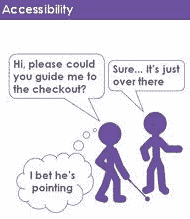
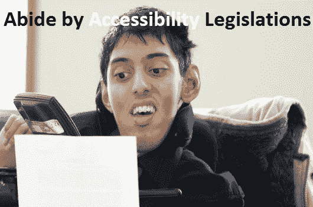
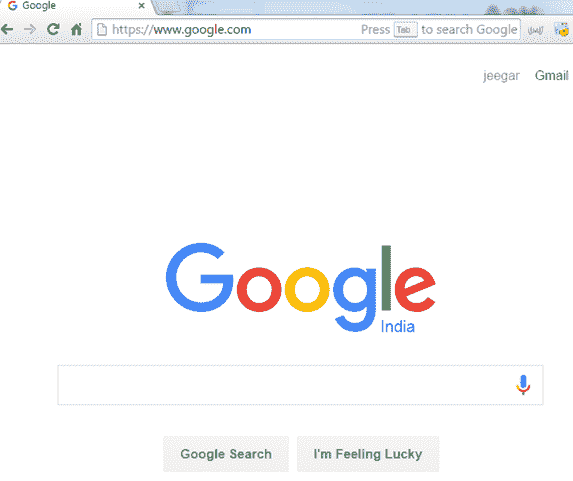
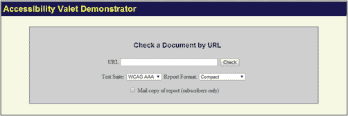
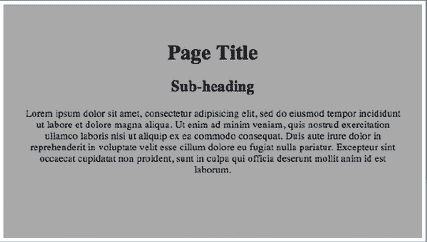

# 辅助功能测试教程：什么是工具&示例

> 原文： [https://www.guru99.com/accessibility-testing.html](https://www.guru99.com/accessibility-testing.html)

### 什么是可访问性测试？

可访问性测试被定义​​为一种软件测试，旨在确保被测应用程序可供听力，色盲，老年和其他弱势群体等残疾人使用。 它是[可用性测试](/usability-testing-tutorial.html)的子集。

残疾人使用辅助技术，可帮助他们操作软件产品。 此类软件的示例包括：

*   **语音识别软件-**它将把口语单词转换为文本，用作计算机的输入。
*   **屏幕阅读器软件**-用于读取屏幕上显示的文本
*   **屏幕放大软件**-用于扩大显示器的尺寸，并使视障用户易于阅读。
*   **特殊键盘**专为易出现运动控制困难的用户而设计



在本教程中，您将学习-

*   [什么是可访问性测试？](#1)
*   [为什么进行可访问性测试？](#2)
*   [支持哪些残疾？](#3)
*   [如何进行可访问性测试？](#4)
*   [辅助功能测试工具](#5)
*   [可访问性测试的神话](#6)

## 为什么进行辅助功能测试？

**原因 1** ：面向残疾人市场。


大约 20％的人口有残疾问题。

*   十分之一的人患有严重残疾
*   65 岁以上的人群中有 1 人的能力下降

残疾包括失明，聋哑，残障或体内任何疾病。

如果将软件产品设置为适合残障人士使用，则可以满足这个大市场的需求。 如果将辅助功能测试纳入正常软件测试生命周期的一部分，则可以解决软件中的辅助功能问题。

**原因 2** ：遵守无障碍法规

.jpg)

全世界的政府机构都提出了合法化要求，这要求残疾人可以使用 IT 产品。

以下是各国政府的法律行为-

*   美国：1990 年《美国残疾人法》
*   大不列颠及北爱尔兰联合王国：残疾歧视法-1995
*   澳大利亚：残疾歧视法-1992
*   爱尔兰：2005 年《残疾人法》

辅助功能测试对于确保法律合规性很重要。

**原因 3** ：避免潜在的法律诉讼


在过去，《财富》 500 强公司因其产品不被禁用而被起诉。 这里有一些突出的案例

*   全国盲人联盟（NFB）vs 亚马逊（2007）
*   Sexton 和 NFB vs Target（2007）
*   NFB 与 AOL 和解（1999）

最好创建支持残疾人并避免潜在诉讼的产品。

## 支持哪些残疾？

应用程序必须支持残疾人，例如-

| 

**残疾类型**

 | 

**残障说明**

 |
| **视力障碍** | 

*   完全失明或色盲或视力低下
*   视觉问题，例如频闪和闪光效果问题

 |
| **身体残疾** | 

*   无法单手使用鼠标或键盘。
*   动作技巧不佳，例如手部动作和肌肉缓慢

 |
| **认知障碍** | 

*   学习困难或记忆不足或无法理解更复杂的场景

 |
| **识字障碍** | 

*   阅读问题

 |
| **听力障碍** | 

*   听觉问题，例如耳聋和听力障碍
*   听不清或听不清

 |

## 如何进行辅助功能测试？

辅助功能测试可以通过两种方式执行，它们是：

1.  手册
2.  自动化的

以下是要检查所有用户使用的应用程序的要点。 此清单用于签署可访问性测试。

1.  应用程序是否为所有鼠标操作和窗口提供等效的键盘？
2.  是否在用户文档或手册中提供了说明？ 使用文档是否容易理解和操作应用程序？
3.  标签是否按照逻辑顺序排序以确保顺利导航？
4.  是否为菜单提供快捷键？
5.  应用程序是否支持所有操作系统？
6.  是否明确提到每个屏幕或页面的响应时间，以便最终用户知道要等待多长时间？
7.  是否所有标签都正确地写在应用程序中？
8.  应用程序的颜色是否对所有用户都灵活？
9.  是否适当使用了图像或图标，以便最终用户容易理解？
10.  应用程序是否有音频警报？
11.  用户是否能够调整音频或视频控件？
12.  用户是否可以覆盖默认字体以进行打印和文本显示？
13.  用户是否可以调整或禁用闪烁，旋转或移动显示？
14.  检查以确保从未将颜色编码用作传达信息或指示操作的唯一方法
15.  突出显示的颜色是否可以反转显示？ 通过更改对比度来测试应用程序中的颜色
16.  残障人士是否正确收听了与音频和视频相关的内容？ 测试网站中没有发言者的所有多媒体页面
17.  是否为残障用户提供了培训，使他们能够熟悉软件或应用程序？

可访问性测试对于测试人员可能是具有挑战性的，因为他们不熟悉残疾。 最好与有特定需求的残疾人合作，以了解他们的挑战。

根据残障程度，有多种测试可访问性的方法。 我们将一一学习。

### 1）视力障碍

好吧，现在让我们假设我没有视力。 我完全是盲人，我想访问 XYZ 网站。 在这种情况下，有什么选择？？？ 我无法访问 XYZ 网站吗？ 我有什么选择？ 有一个单词选项称为 **SCREENREADER。** 是的，您说对了。 屏幕阅读器。 现在，这个屏幕阅读器是什么？ 它是用于对网络内容进行叙述的软件。 基本上，您网站上的内容，内容，链接，单选按钮，图像，视频等是什么。屏幕阅读器将为我讲述所有内容。 有许多屏幕阅读器可用。 我已经下巴了。

基本上，当您启动下颚或任何屏幕阅读器，然后访问网站时，它将为您讲述完整的内容。 对于 Ex：我已经大开眼界，并启动了浏览器，JAWS 将宣布 Mozilla Firefox 的开始页面，现在，如果我转到地址栏，则 JAWS 将宣布**地址栏**，然后键入 **www.google .com** 在地址栏上，下颌将解释如下：-

```
Address Bar,w,w,w,period,g,o,o,g,l,e,period,c,o,m. Also, when the page loads completely jaws will again announce Google.Com Home page.

Now if I go to Google Search, then JAWS will announce that Google search. So it would be easy for a blind person to recognize things in an easy manner.
```



如果您在屏幕上输入内容或在**文本框中输入文字，我想在屏幕阅读器中进行解释。** 同样，如果有链接，它将发音为链接，对于 Button，它将发音为按钮。 使盲人可以轻松识别事物。

现在，如果网站的设计和开发不完善，那么可能（通常会发生）下颌骨无法叙述正确的内容，从而导致盲人无法访问。（例如，下颌骨将链接描述为 内容，那么盲人用户将永远无法知道它是一个链接，如果那对于该网站来说是至关重要的链接，那么？???）。在那种情况下，这将对网站业务造成巨大损失。

### 2）视力障碍

我想在视觉障碍中提到两类。

第一个是色盲。 色盲表示不是完全盲，但是不能正确查看某些特定的颜色。 红色和蓝色是常见的颜色，如果人们确实有色盲，他们将无法正确看到它们。 所以基本上，如果我的确有红色的色盲，并且我想使用 80％红色的网站，那我会觉得舒服吗？ 答案是不。

因此，应该设计一个网站，使有色盲的人访问该网站没有任何问题。 举一个红色按钮的简单示例。 如果用黑色概述，则使其可访问。 然后很容易访问。 通常，黑白被认为是通用的。

### 3）视力障碍

第二件事是视力差（视力不清晰）或视力问题（与视网膜有关的许多眼疾等）不同的人，无法进入任何部位。

1）在这种情况下，最好的做法是避免小文本。 因为这对于视力不好的人来说是一个巨大的优势。

2）此外，有视力障碍的人还希望缩放网站文本以使其感到舒适。 因此，网站的设计方式应使其放大后在缩放文本时不会破坏其布局。 否则，这对他们将不是一个好印象。

### 4）其他残疾

在“针对残障人士的可访问性测试”中，要考虑的一个非常重要的方面是无需使用鼠标即可访问网站。 一个人应该能够完整地访问网站的链接，按钮，单选按钮，复选框，弹出窗口，下拉菜单，所有控件都应该可以通过键盘完全访问和操作。

**例如**：如果我的惯用右手瘫痪，并且对鼠标不满意，或者说我不想使用鼠标，那该怎么办？ 在那种情况下，如果我无法通过键盘访问网站上的链接或复选框，那？ 因此，应该可以使用 Keyboard 完全访问网站。

```
Alternative Text should be there for Images, Audio, Video so that screen reader reads them and will narrate them so that a blind person can easily recognize what the  image, audio, the video is all about. In addition, to it, keyboard shortcuts should be there to easily access website and navigation should be available with the keyboard.
```

此外，焦点应完全可见。 当我们按下选项卡时，用户应该能够看到控件在哪里移动。 在可见焦点的情况下，对于视力较弱或色盲的用户来说，很容易识别站点的流量，并且易于访问。

**有听觉障碍的用户（聋哑或听不清）：**最后一个是有听觉障碍的人。 聋哑人可以访问该网站，因为他能够看到该网站上的内容。 但是，在音频和视频方面，他们面临困难。 因此，在这种情况下，对于任何视频和音频，都应该有替代文本。 替代文字表示替代文字。 假设有关于如何预订机票的视频。 在这种情况下，文本应该在此处，以便聋哑人可以阅读并了解视频的全部内容。

## 辅助功能测试工具：

为了使您的网站更易于接受和用户友好，至关重要的是要易于访问。 有多种工具可以检查网站的可访问性。 下面列出了其中一些流行的工具-

### 1）波浪


Wave 是由 WEBAIM 创建的免费网络辅助工具。 它用于手动验证网页的可访问性的各个方面。 此工具可用于检查 Intranet，受密码保护的，动态生成的或敏感的网页。 Web Accessibility Toolbar 的主要功能包括识别网页的组件，提供对页面内容的替代视图的访问权限以及促进第三方在线应用程序的使用。 它确保 100％私有和安全的可访问性报告

在此处访问[](http://wave.webaim.org/)

### 2）TAW


TAW 是用于确定网站可访问性的在线工具。 该工具根据 W3C 网站可访问性指南分析网站，并显示可访问性问题。 Web 可访问性测试问题分为优先级 1，优先级 2 和优先级 3。TAW 有趣的功能是能够生成 WCAG 1.0 的子集进行测试。 在 TAW 工具中，您可以通过“蜘蛛”站点来选择测试单页还是多页。 TAW 还使我们能够通过“用户检查”对话框定义其他检查

在此处访问[](https://www.tawdis.net/)

### 3）无障碍代客



它是一种工具，可让您检查网页是否符合 WCAG（Web 内容可访问性准则）的规定。 所有 HTML 报告选项均以规范化形式显示您的标记，突出显示已弃用，伪造和有效的标记以及放错位置的元素。 该工具提供了多种功能，例如

*   开发人员的部门内报告
*   质量保证和管理执行摘要
*   语义网和 WWW 的元数据
*   自动清除和 HTML 至 XHTML 的转换
*   脚本工具

在此处访问[](http://valet.webthing.com/access/url.html)

### 4）辅助功能开发人员工具

这是一个 Chrome 扩展程序。 它确实和可访问性审核。 审核结果显示被测页面违反的可访问性规则。 该扩展程序具有很高的评价，并经常更新

在此处访问[](https://chrome.google.com/webstore/detail/accessibility-developer-t/fpkknkljclfencbdbgkenhalefipecmb?hl=en)

### 5）快速辅助页面测试器

由于有一些出色的可访问性工具栏，因此“快速页面可访问性测试器”是一个书签，您可以单击该书签来快速分析网页。 它将找出您页面的各种问题，警告可能出现的问题，并突出显示页面上可能受益于 ARIA（可访问的 Rich Internet Applications）的区域。

在此处访问[](https://accessify.com/tools-and-wizards/accessibility-tools/favelets/quick-page-test/)

市场上提供了执行以下工具的各种工具来执行 Web 辅助功能测试：

### 6）设计者

这是 IBM 开发的工具，它可以模拟视障人士的体验，以便设计人员可以更好地了解残疾人的需求并相应地开发应用程序。

在此处访问[](http://www.eclipse.org/actf/downloads/tools/aDesigner/)

### 7）WebAnywhere

这是一个基于浏览器的工具，其功能类似于 Jaws 之类的屏幕阅读器。 它帮助读者如何阅读网页。

在此处访问[](http://webanywhere.cs.washington.edu/)

### 8）Web 辅助工具栏

WAT 是 Internet Explorer 或 Opera 的扩展，可为网页设计人员提供分析网页时的有用功能。 最好的功能之一是 GreyScale 功能，该功能有助于查找设计中的低对比度点。

在此处访问[](https://developer.paciellogroup.com/resources/wat/)

## 可访问性测试的神话：

以下是可访问性测试的神话：

**神话：**创建可访问的网站非常昂贵

**事实：**并不昂贵。 请花点时间在设计阶段本身以及基本测试中考虑可访问性问题，这样既省钱又省力。

**神话：**将无法访问的网站更改为可访问的网站既耗时又昂贵

不必一次合并所有更改。 处理残障用户最需要的基本需求。

**神话：**可访问性是简单而乏味的



**可访问性并不意味着纯文本页面**

您可以使网页具有吸引力，但是网页的设计应使所有用户都可以访问。 同样根据 W3C Web 内容可访问性指南-强烈建议不要使用纯文本页面。

**神话：**盲人和残障人士的可访问性

**事实**遵循可访问性准则可改善软件的整体可用性，从而也有助于常规用户。

## 结论

在软件工程中，可访问性测试有助于使您的应用程序禁用友好。 如果由于您的 Web 应用程序的复杂性而无法遵循可访问性准则，请为普通用户构建一个版本的网站，而为其他用户构建版本