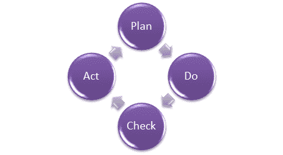
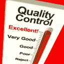
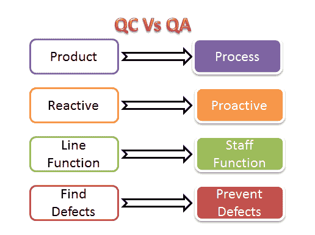

# 什么是质量保证（QA）？ 工艺，方法，实例

> 原文： [https://www.guru99.com/all-about-quality-assurance.html](https://www.guru99.com/all-about-quality-assurance.html)

在学习质量保证之前，让我们了解一下-

## 什么是质量？

质量非常难以定义，可以简单地说：“适合使用或目的”。 满足客户在功能，设计，可靠性，耐用性和产品&价格方面的需求和期望。

## 什么是保证？

保证无非是对产品或服务的肯定声明，这可以给人以信心。 可以肯定的是，产品或服务可以正常运行。 它提供了保证，该产品将按预期或要求正常工作。

## 什么是质量保证？

**质量保证（QA）**的定义是确保组织为客户提供最佳产品或服务的活动。 质量检查专注于改进流程以向客户提供优质产品。 组织必须确保按照为软件产品定义的质量标准，流程是有效的。 质量保证被普遍称为质量检查测试

在本教程中，您将学习-

*   [如何进行质量保证：完整流程](#4)
*   [什么是质量控制？](#5)
*   [质量控制和质量保证之间的区别？](#6)
*   [SQA 和软件测试](#7)之间的差异
*   [质量保证最佳做法](#8)
*   [质量保证功能](#9)
*   [质量保证认证](#10)
*   [CMMI 级别](#11)
*   [测试成熟度模型（TMM）](#12)

## 如何进行质量保证：完整流程

质量保证有一个定义的周期，称为 PDCA 周期或 Deming 周期。 此周期的阶段为：

*   计划
*   做
*   检查一下
*   法案

重复上述步骤，以确保定期评估和改进组织中遵循的流程。 让我们详细研究以上步骤-

*   计划-组织应计划并建立与过程相关的目标，并确定交付高质量最终产品所需的过程。
*   做-开发和测试流程，并“做”流程中的更改
*   检查-监视流程，修改流程并检查其是否符合预定目标
*   行动-实施必要的措施以改善流程

组织必须使用质量保证来确保按照正确的程序设计和实施产品。 这有助于减少最终产品中的问题和错误。

## 什么是质量控制？

质量控制通常缩写为 QC。 这是用于确保产品或服务质量的软件工程过程。 它不处理用于创建产品的过程； 而是检查``最终产品''的质量和最终结果。

质量控制的主要目的是检查产品是否符合客户的规格和要求。 如果发现问题或问题，则需要先解决它，然后再交付给客户。

质量控制还根据人员的质量水平评估他们，并提供培训和认证。 该评估对于基于服务的组织是必需的，并且有助于向客户提供“完美”的服务。

## 质量控制和质量保证之间的区别？

有时，质量控制与质量检查相混淆。 质量控制是检查产品或服务并检查结果。 质量保证是检查过程并对导致最终产品的过程进行更改。

QC 和 QA 活动的示例如下：

| **质量控制活动** | **质量保证活动** |
| 演练 | 质量审核 |
| 测试中 | 定义过程 |
| 检查 | 工具识别和选择 |
| 检查点审查 | 培训质量标准和过程 |

**以上活动与任何产品的质量保证和质量控制有关，而与软件**无关。 关于软件

*   QA 成为 SQA（软件质量保证）
*   QC 成为软件测试**。**

## SQA 和软件测试之间的差异

下表说明了 SQA 和软件测试之间的区别：

| 

**SQA**

 | 

**软件测试**

 |
| 软件质量保证是关于确保质量的工程流程 | 软件测试是在产品上线之前测试产品是否存在问题 |
| 涉及与过程，程序和标准的实施有关的活动。 示例-审计培训 | 涉及与产品验证有关的活动实例-审核测试 |
| 以过程为重点 | 以产品为中心 |
| 预防技术 | 纠正技术 |
| 主动措施 | 被动措施 |
| SQA 的范围适用于组织将创建的所有产品 | 软件测试的范围适用于要测试的特定产品。 |

## 质量保证最佳做法：

*   创建一个强大的测试环境
*   仔细选择发布标准
*   将自动化测试应用于高风险区域以节省成本。 它有助于加快整个过程。
*   为每个过程适当分配时间
*   根据软件使用情况对错误修复进行优先级排序很重要
*   组建专门的安全和性能测试团队
*   模拟类似于生产环境的客户帐户

## 质量保证功能：

有 5 个主要的质量保证功能：

1.  **技术转让：**此功能涉及获取产品设计文档以及试错数据及其评估。 分发，检查和批准文件
2.  **验证：**这里准备了整个系统的验证总体规划。 已设置批准产品和过程验证的测试标准。 完成了用于执行验证计划的资源计划。
3.  **文档：**此功能控制文档的分发和归档。 文件中的任何更改均采用适当的更改控制程序进行。 批准所有类型的文件。
4.  **确保产品质量**
5.  **质量改进计划**

## 质量保证认证：

行业中有多种认证可确保组织遵循标准质量流程。 客户在选择软件供应商时将其作为合格标准。

### **ISO 9000**

该标准于 1987 年首次建立，与质量管理体系有关。 这有助于组织确保其客户和其他利益相关者的质量。 希望获得 ISO 9000 认证的组织将根据其职能，产品，服务和过程进行审核。 主要目标是检查和验证组织是否按照预期的过程进行，并检查现有过程是否需要改进。

该认证有助于-

*   增加组织的利润
*   改善国内和国际贸易
*   减少浪费并提高员工的生产力
*   提供出色的客户满意度

## CMMI 级别

**综合能力成熟度模型（CMMI）**是专门针对软件过程改进而开发的过程改进方法。 它基于流程成熟度框架，并在软件行业中用作业务流程的常规帮助。 该模型在软件开发组织中得到了高度重视和广泛使用。

CMMI 有 5 个级别。 根据组织的质量保证机制的成熟度，该组织已通过 CMMI 1 级到 5 级认证。

*   级别 1-**初始值：**在此阶段，质量环境不稳定。 简而言之，没有遵循或记录任何流程
*   级别 2-**可重复：**遵循某些可重复的过程。 此级别确保在项目级别遵循流程。
*   级别 3-已定义**：**在组织级别定义并记录了一组流程。 这些定义的过程会有所改进。
*   级别 4-**托管：**该级别使用流程指标并有效地控制遵循的流程。
*   级别 5-**优化：**该级别着重于通过学习&创新来不断改进流程。

## 测试成熟度模型（TMM）：

该模型评估测试环境中流程的成熟度。 甚至这个模型也有 5 个等级，定义如下：

*   级别 1-**初始**：测试过程没有遵循质量标准，在此级别仅使用临时方法
*   级别 2-**定义：**定义的过程。 准备测试策略，计划，测试用例。
*   级别 3-**集成：**测试是在整个软件开发生命周期（SDLC）中进行的-它仅与开发活动（例如 V-Model）集成在一起。
*   级别 4-**管理和度量：**在此级别进行需求和设计的审查，并为每个测试级别设置了标准
*   级别 5-**优化：**许多预防技术用于测试过程，工具支持（自动化）用于改进测试标准和过程。

**结论：**

质量保证是要检查开发的产品是否适合使用。 为此，组织应具有要遵循的流程和标准，需要定期对其进行改进。 它主要集中于我们在软件实施期间或之后向客户提供的产品/服务的质量。