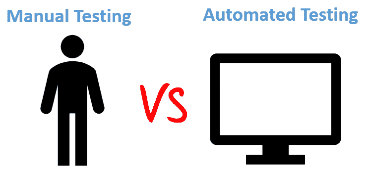

# 自动化测试与 手动测试：有什么区别？

> 原文： [https://www.guru99.com/difference-automated-vs-manual-testing.html](https://www.guru99.com/difference-automated-vs-manual-testing.html)

## 什么是手动测试？

手动测试是对软件的测试，其中测试由 QA Analyst 手动执行。 执行它是为了发现正在开发的软件中的错误。

在手动测试中，测试人员将检查给定应用程序或软件的所有基本功能。 在此过程中，软件测试人员无需任何自动化软件测试工具即可执行测试案例并生成测试报告。

它是所有测试类型的经典方法，有助于发现软件系统中的错误。 通常由经验丰富的测试人员执行，以完成软件测试过程。

## 什么是自动化测试？

在自动化软件测试中，测试人员编写代码/测试脚本以自动执行测试。 测试人员使用适当的自动化工具来开发测试脚本并验证软件。 目标是在更短的时间内完成测试执行。

自动化测试完全依赖于预先编写的测试，该测试会自动运行以将实际结果与预期结果进行比较。 这有助于测试人员确定应用程序是否按预期执行。

自动化测试允许您执行重复性任务和回归测试，而无需人工测试人员的干预。 即使所有过程都是自动执行的，自动化也需要一些人工来创建初始测试脚本。

## 关键区别

*   手动测试由质量检查分析师（人为）手动完成，而自动化测试则由测试人员使用脚本，代码和自动化工具（计算机）完成。
*   由于人为错误的可能性，手动测试过程不准确，而自动化过程则是可靠的，因为它基于代码和脚本。
*   手动测试是一个耗时的过程，而自动化测试则非常快。
*   没有编程知识就可以进行手动测试，而没有编程知识就不能进行自动化测试。
*   手动测试允许随机测试，而自动化测试则不允许随机测试。

## 手动测试和自动化测试之间的区别

| **参数** | **自动化测试** | **手动测试** |
| --- | --- | --- |
| 定义 | 自动化测试使用自动化工具来执行测试用例。 | 在手动测试中，测试用例由人工测试人员和软件执行。 |
| 处理时间 | 自动化测试比手动方法要快得多。 | 手动测试很耗时，并且占用人力资源。 |
| 探索性测试 | 自动化不允许随机测试 | 可以在手动测试中进行探索性测试 |
| 初始投资 | 自动化测试的初始投资较高。 尽管从长远来看投资回报率会更好。 | 手动测试的初始投资相对较低。 从长远来看，与自动化测试相比，ROI 较低。 |
| 可靠性 | 自动化测试是一种可靠的方法，因为它由工具和脚本执行。 没有测试疲劳。 | 由于人为错误的可能性，手动测试不太准确。 |
| 使用者介面变更 | 对于 AUT 的用户界面来说，即使是很小的改变，也需要修改自动测试脚本才能按预期工作 | 诸如按钮的 id，class 等的微小更改不会妨碍手动测试器的执行。 |
| 投资 | 测试工具和自动化工程师都需要投资 | 人力资源需要投资。 |
| 高性价比 | 低容量回归的成本效益不高 | 高容量回归的成本效益不高。 |
| 测试报告可见性 | 通过自动化测试，所有利益相关者都可以登录自动化系统并检查测试执行结果 | 手动测试通常记录在 Excel 或 Word 中，测试结果不易获得。 |
| 人类观察 | 自动化测试不涉及人为因素。 因此，它永远无法保证用户友好性和积极的客户体验。 | 手动测试方法允许人工观察，这可能对提供用户友好的系统很有用。 |
| 性能测试 | 诸如负载测试，压力测试，峰值测试等性能测试必须由自动化工具强制进行测试。 | 手动进行性能测试是不可行的 |
| 并行执行 | 可以在不同的操作平台上并行执行此测试，并减少测试执行时间。 | 手动测试可以并行执行，但需要增加人力资源，这很昂贵 |
| 批量测试 | 您可以批处理多个测试脚本以每晚执行。 | 手动测试无法批量进行。 |
| 编程知识 | 在自动化测试中，必须具备编程知识。 | 无需在手动测试中进行编程。 |
| 建立 | 自动化测试需要较少复杂的测试执行设置。 | 手动测试需求具有更直接的测试执行设置 |
| 订婚 | 由工具完成。 它的准确性和永无聊！ | 重复的手动测试执行可能很无聊且容易出错。 |
| 理想方法 | 频繁执行同一组测试用例时，自动化测试非常有用 | 当测试用例只需要运行一次或两次时，手动测试就非常有用。 |
| 建立验证测试 | 自动化测试对于构建验证测试（BVT）很有用。 | 在手动测试中，执行构建验证测试（BVT）非常困难且耗时。 |
| 截止期限 | 自动化测试错过预定测试的风险为零。 | 手动测试可能会错过预定的测试期限。 |
| 构架 | 自动化测试使用诸如 Data Drive，Keyword，Hybrid 之类的框架来加速自动化过程。 | 手动测试不使用框架，但可以使用准则，清单，严格的流程来起草某些测试用例。 |
| 文献资料 | 自动化测试充当提供培训价值的文档，特别是对于自动化单元测试用例。 新开发人员可以研究单元测试用例并快速了解代码库。 | 手动测试用例没有培训价值 |
| 测试设计 | 自动化单元测试强制/驱动测试驱动的开发设计。 | 手动单元测试不会使设计进入编码过程 |
| 开发者 | 自动化测试有助于构建验证测试，并且是 DevOps Cycle 不可或缺的一部分 | 手动测试违反了 DevOps 的自动构建原则 |
| 什么时候使用？ | 自动化测试适用于回归测试，性能测试，负载测试或高度可重复的功能测试用例。 | 手动测试适用于探索性，可用性和临时测试。 在 AUT 频繁变化的地方也应使用它。 |

## 手动测试的利弊

**手动测试的优点：**

*   获得快速准确的视觉反馈
*   由于您无需花费预算购买自动化工具和流程，因此成本更低
*   人的判断力和直觉总是有益于手工要素
*   在测试较小的更改时，自动化测试将需要编码，这可能很耗时。 虽然您可以即时进行手动测试。

**手动测试的缺点：**

*   不太可靠的测试方法，因为它是由人工执行的。 因此，总是容易出现错误&错误。
*   无法记录手动测试过程，因此无法重复使用手动测试。
*   在这种测试方法中，某些任务很难手动执行，这可能需要软件测试阶段的额外时间。

## 自动化测试的利弊

**自动测试的优点：**

*   自动化测试可帮助您找到比人工测试人员更多的错误
*   由于测试过程的大部分是自动化的，因此您可以快速高效地进行测试
*   可以记录自动化过程。 这使您可以重用和执行相同类型的测试操作
*   自动化测试是使用软件工具进行的，因此与人工测试中的人员不同，它不会疲劳和疲劳
*   它可以快速提供&准确的测试结果，因此可以轻松提高生产率
*   自动化测试支持各种应用
*   由于自动化测试工具，您永远都不会忘记检查最小的单元，因此可以增加测试范围

**自动测试的缺点：**

*   没有人为因素，就很难深入了解 UI 的视觉方面，例如颜色，字体，大小，对比度或按钮大小。
*   运行自动化测试的工具可能很昂贵，这可能会增加测试项目的成本。
*   自动化测试工具还不是万无一失的。 每个自动化工具都有其局限性，从而缩小了自动化范围。
*   调试测试脚本是自动化测试中的另一个主要问题。 测试维护成本很高。