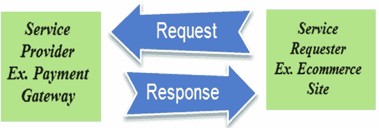
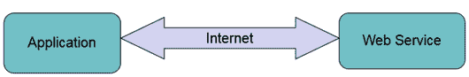
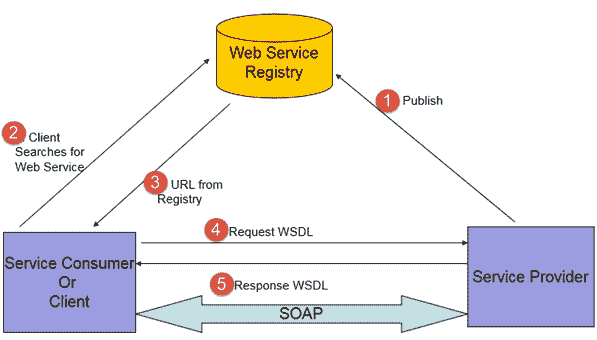
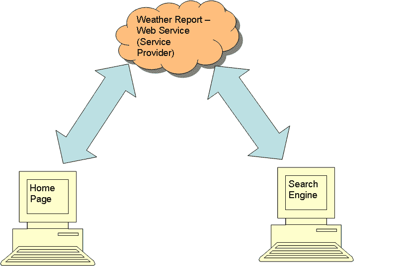
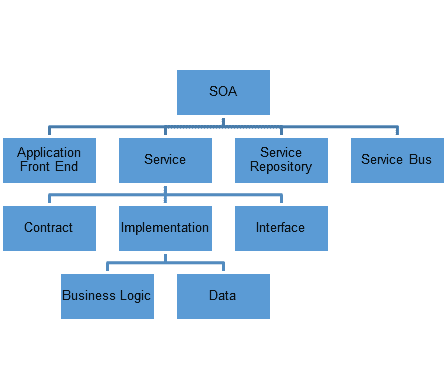
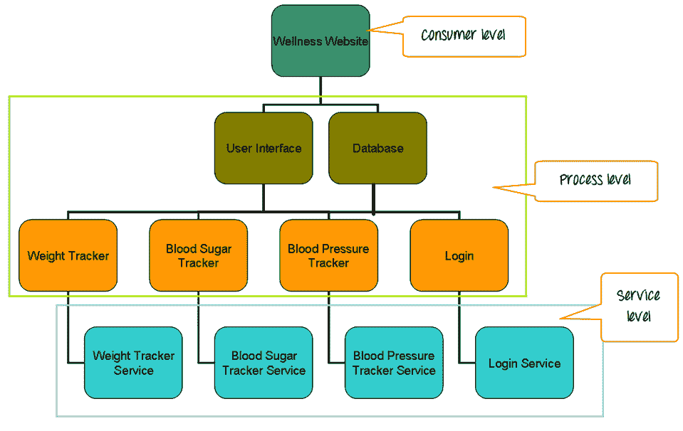
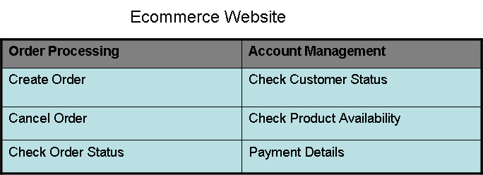

# 什么是 SOA 测试？ 实例教程

> 原文： [https://www.guru99.com/learn-soa-testing.html](https://www.guru99.com/learn-soa-testing.html)

### 什么是 SOA 测试？

SOA（面向服务的体系结构）测试是对 SOA 架构样式的测试，其中，应用程序组件设计为通常通过网络上的通信协议进行通信。

在本教程中，您将学习-

*   [什么是 SOA？](#1)
*   [什么是服务？](#2)
*   [SOA 测试](#3)
*   [SOA 测试策略](#4)
*   [SOA 测试方法](#5)
*   [SOA 测试中的挑战](#6)
*   [SOA 测试工具](#7)
*   [SOA 测试用例](#8)

## 什么是 SOA？

SOA 是一种将业务应用程序和流程集成在一起以满足业务需求的方法。

在软件工程中，SOA 为业务流程提供了敏捷性和灵活性。 可以将对过程或应用程序的更改定向到特定的组件，而不会影响整个系统。

SOA 中的软件开发人员可以开发或购买称为 **SERVICES 的程序块。**

## 什么是服务？

*   Services can be a functional unit of application or business process, which can be reused or repeated by any other application or process.

    （例如，在上图中，Payment Gateway 是可以被任何电子商务站点重用的服务。每当需要付款时，电子商务站点都会调用/请求 Payment Gateway 服务。 网关，将响应发送到电子商务网站）

*   服务易于组装且易于重新配置组件。
*   可以将服务与构建块进行比较。 他们可以构建所需的任何应用程序。 从应用程序或业务流程中添加和删除它们很容易。
*   服务更多地由它们执行的业务功能来定义，而不是作为代码块来定义。

### 网页服务

Web 服务是独立的应用程序组件，可通过 Web 获得。

它们可以被发布，找到并可以在网络上使用。 他们可以通过互联网进行交流。

1.  服务提供商将服务发布到 Internet。
2.  客户端从 Web 服务注册表中搜索特定的 Web 服务
3.  A URL and the WSDL for the required web service is returned.

    > >使用 WSDL 和 URL，服务提供者和请求者之间的通信通过 SOAP 消息进行。 < <

4.  When a consumer calls a web service, an HTTP connection will be established to the provider.

    创建 SOAP 消息以指示提供者调用所需的 Web 服务逻辑。

5.  从提供者收到的响应是 SOAP 消息，它将被嵌入到 HTTP 响应中。 此 HTTP 响应是用户应用程序可以理解的数据格式。

### 例

网站和搜索引擎的主页显示每日天气预报。 可以从供应商处购买天气报告服务并将其集成到页面中，而不是对整个天气报告部分进行编码。

## SOA 测试

SOA 包含各种技术。 使用 SOA 构建的应用程序具有松散耦合的各种服务。

SOA 测试应集中在 3 个系统层上

### 服务层

该层由服务，由业务功能派生的系统公开的服务组成。

例如 -

考虑一个健康网站，其中包括

1.  体重追踪器
2.  血糖追踪器
3.  血压追踪器

跟踪器显示各自的数据和输入日期。 服务层由服务组成，这些服务从数据库获取相应的数据，

*   体重追踪器服务
*   血糖追踪器服务
*   血压追踪器服务
*   登录服务

### 工艺层

流程层包括流程，服务集合，它们是单个功能的一部分。

这些流程可能是用户界面的一部分（例如，搜索引擎），也可能是 ETL 工具的一部分（用于从数据库获取数据）。

该层的主要重点是用户界面和流程。

体重跟踪器的用户界面及其与数据库的集成是主要重点。

以下功能将被考虑

1.  添加新数据
2.  编辑现有数据
3.  创建新的跟踪器
4.  删除资料

### 消费者层

该层主要由用户界面组成。

基于该层，SOA 应用程序的测试分为三个级别。

1.  服务等级
2.  接口级别
3.  端到端级别

*   自上而下的方法用于测试设计。
*   自下而上的方法用于测试执行。

## SOA 测试策略

**测试计划方法，**

*   SOA 测试人员应了解应用程序的完整体系结构。
*   需要将应用程序分解为独立的服务（服务，该服务具有自己的请求和响应结构，并且不依赖于任何其他服务来形成响应）。
*   需要将应用程序结构重组为三个组件–数据，服务和前端应用程序。
*   所有组件都需要仔细分析，并且应该制定业务方案。
*   业务方案应分为常见方案和特定于应用程序的方案。
*   应该准备一个[可跟踪性矩阵](/traceability-matrix.html)，并且所有测试用例都应跟踪到业务场景。

**测试执行方法**

*   每个服务组件都应进行测试。
*   应该对服务组件进行[集成测试](/integration-testing.html)，以验证通过服务的数据流和数据完整性。
*   [应该进行完整模型的系统测试](/system-testing.html)以验证前端应用程序和数据库之间的数据流。
*   [性能测试](/performance-testing.html)应进行微调和优化性能。

## SOA 测试方法

**1）业务场景驱动的基于数据的测试，**

*   应该分析与系统相关的各个业务方面。
*   方案应基于以下方面的综合发展：
    *   应用程序的各种 [Web 服务](/web-services-tutorial.html)
    *   Web 服务和应用程序。
*   数据设置应基于上述方案。
*   应进行数据设置，以涵盖端到端方案。

**2）存根**

*   虚拟接口将被创建以测试服务。
*   通过这些接口可以提供各种输入，并且可以验证输出。
*   当应用程序使用未测试的外部服务（第三方服务）的接口时，可以在集成测试期间创建存根。

**3）回归测试**

*   当存在多个版本时，应在应用程序上进行[回归测试](/regression-testing.html)，以确保系统的稳定性和可用性。
*   将创建一个全面的回归测试套件，其中涵盖了构成应用程序重要部分的服务。
*   该测试套件可以在项目的多个版本中重复使用。

**4）服务水平测试**

服务水平测试包括测试组件的功能，安全性，性能和互操作性。

每个服务都需要首先进行独立测试。

**5）功能测试**

功能测试应该在每个服务上进行

*   确保服务对每个请求做出正确的响应。
*   对于无效数据，错误数据等的请求，将接收到正确的错误。
*   检查服务必须在运行时执行的每个操作的每个请求和响应。
*   当服务器，客户端或网络级别发生错误时，请验证故障消息。
*   确认收到的回复格式正确。
*   验证响应中接收到的数据是否与请求的数据相对应。

**6）安全测试**

在 SOA 应用程序的服务级别测试期间，Web 服务的安全性测试是一个重要方面。 这样可以确保应用程序的安全性。

测试期间需要考虑以下因素：

*   Web 服务应遵守 WS-Security 测试定义的行业标准。
*   安全措施应该完美无缺。
*   加密文件上的数据和数字签名
*   认证与授权
*   SQL 注入，恶意软件，XSS，CSRF 和其他漏洞将在 XML 上进行测试。
*   拒绝服务攻击

**7）性能测试**

由于服务是可重用的，并且多个应用程序可能正在使用同一服务，因此需要对服务进行性能测试。

在测试过程中考虑以下因素：

*   8）服务的性能和功能需要在重负载下进行测试。
*   服务性能需要在单独运行以及与之耦合的应用程序中进行比较。
*   应该执行服务的负载测试
    *   验证响应时间
    *   检查瓶颈
    *   验证 CPU 和内存的利用率
    *   预测可扩展性

**9）集成级别测试**

*   服务级别测试可确保仅单个服务正常工作，而不能保证耦合组件的正常工作。
*   集成测试主要针对接口进行。
*   此阶段涵盖所有可能的业务场景。
*   在此阶段，应再进行一次应用程序的非功能测试。 安全性，合规性和性能测试可确保系统各个方面的可用性和稳定性。
*   应该测试通信和网络协议，以验证服务之间数据通信的一致性。

**10）端到端测试**

此阶段确保应用程序在功能上和非功能上都确认业务需求。

确保在端到端测试期间测试以下项目

*   集成后所有服务均按预期工作
*   异常处理
*   应用程序的用户界面
*   正确的数据流经所有组件
*   业务流程

## SOA 测试中的挑战

*   缺少服务接口
*   测试过程跨多个系统，因此产生了复杂的数据需求
*   该应用程序是各种易于更改的组件的集合。 回归测试的需求更加频繁。
*   由于多层架构，很难隔离缺陷。
*   由于该服务将在不同的接口中使用，因此很难预测负载，因此使性能测试计划变得麻烦。
*   SOA 是异构技术的集合。 测试 SOA 应用程序需要具有不同技能的人员，从而增加了计划和执行成本。
*   由于该应用程序是多个服务的集成，因此安全测试有其自身的麻烦。 验证身份验证和授权非常困难。

## SOA 测试工具

市场上有许多工具可以帮助测试人员测试 SOA 应用程序。 其中很少列出如下。

**1）SOAP UI**

“ SOAP UI”是用于服务和 [API 测试](/api-testing.html)的开源功能测试工具。

*   桌面应用
*   支持多种协议– SOAP，REST，HTTP，JMS，AMF，JDBC
*   可以开发，检查和调用 Web 服务。
*   也可以用于负载测试，[自动化测试](/automation-testing.html)和安全测试
*   存根可以由 MockServices 创建
*   Web Service 请求和测试可以通过其 Web Service 客户端自动生成。
*   具有内置的报告工具
*   由 SmartBear 开发

**2）iTKO LISA**

“ LISA”是一个产品套件，可为诸如 SOA 之类的分布式系统提供功能测试解决方案。

*   也可以用于回归，集成，负载和性能测试。
*   由 iTKO（CA Technologies）开发
*   可用于设计和执行测试。

**3）HP 服务测试**

“服务测试”是一种功能测试工具，它支持 UI 和共享服务测试

*   服务的功能和性能测试都可以通过单个脚本完成。
*   与 HP QC 集成。
*   可以管理大量的服务和数据。
*   通过模拟 JEE，AXIS 和 DotNet 客户端环境来支持互操作性测试。
*   由 HP 开发。

**4）Parasoft SOA 测试**

SOA Test 是用于 API 和 API 应用程序测试的测试和分析工具套件。

*   支持 Web 服务，REST，JSON，MQ，JMS，TIBCO，HTTP，XML 技术。
*   可以进行功能，单元，集成，回归，安全性，互操作性，合规性和性能测试。
*   可以使用 Parasoft Virtualize 创建存根，它比 SOAP UI 智能。
*   由 ParaSoft 开发

## SOA 测试用例

考虑一个电子商务网站，其中包含以下功能和子功能：

### 订单处理

#### 阶段 1

在 SOA 测试的第一阶段（即测试策略阶段），应用程序分为服务和业务功能。

让我们考虑以下是应用程序中的服务。

*   创建订单
*   检查客户状态
*   变更单状态
*   查看订单状态
*   检查库存

业务功能与网站的功能相同。

**注意：**测试策略文档将包含必须测试的服务和功能的列表。

#### 阶段 2

测试计划阶段。 为每个级别编写测试用例。

1.  End to End level. The test cases are written for each business use case and flow.

    以下是测试案例的示例

    *   与活动用户创建订单。
    *   使用非活动用户创建订单。
    *   使用具有订购数量<可用数量的可用产品创建订单。
    *   使用具有订购数量>可用数量的可用产品创建订单。
    *   创建包含多个项目的订单
    *   完全取消订单。
    *   部分取消订单。
2.  Integration level. Test cases are written for integration of database and user interface.

    以下是示例测试案例。

    *   用单个项目创建一个新订单。 验证是否在数据库上创建了订单。
    *   用单个项目创建一个新订单。 验证为订单计算的价格正确。
    *   用单个项目创建一个新订单。 验证可用产品的数量是否少于订单数量。
    *   验证 UI 上显示的订单状态是否与数据库上的状态相同。
    *   取消订单，并验证该订单的状态已在数据库上修改。
    *   对于首次付款，请验证是否将在 UI 上输入的付款详细信息保存在数据库中。
    *   对于退还付款，请验证 UI 上是否显示了数据库上的付款详细信息。
3.  服务等级。 每个服务都针对所有数据条件进行了测试。

以下是一些示例。

| 没有。 | 订单详细信息 | 订购条件 |
| 1 | 创建订单。 项目数= 1 | 订购数量<数据库中的数量 |
| 2 | 创建订单。 项目数> 1 | 订单数量<数据库中的数量。 |
| 3 | 创建物料的订单号= 1 | 订单数量>数据库数量 |
| 4 | 查看订单状态 | 数据库状态=活动 |
| 5 | Check Order status | 数据库上的状态=已发货 |
| 6 | Check Order status | 数据库状态=已取消 |
| 7 | Check Order status | 订单 ID =无效 |
| 8 | 检查产品可用性 | 产品数量> 0 |
| 9 | Check product availability | 产品数量= 0 |
| 10 | Check product availability | 产品编号=无效 |

#### 阶段 3 –测试执行

测试执行使用自下而上的方法，即先完成服务级别的测试，然后再进行集成级别的测试，最后进行端到端测试。

##### 1）服务水平

让我们考虑使用 [Soapui](/soapui-tutorial.html) 工具来测试应用程序。

WSDL 和 URL 被浏览到 SOAP 的测试窗口中。

每个服务的请求将显示在请求窗口中。

通过按照服务级别测试用例修改数据，可以为每个测试用例创建请求。

| 

**测试用例**

 | 

**请求**

 | 

**预期响应**

 |
| 创建订单。 项目数= 1 订购数量< db 上的数量 | <产品 ID > x2 < /产品 ID > <数量> 2 < /数量> | <订单 ID > o3251 < /订单 ID > <消息>成功< /消息> |
| 创建订单号 项>的数量 1 订单数量<的数量 db | <产品 ID > y1 < /产品 ID > <数量> 1 < /数量> <产品 ID > y2 < / productid > <数量> 3 < /数量> | <orderid>o3251</orderid><message>Successful</message> |
| 创建订单号 的商品数= 1 订购数量> db 上的数量 | <产品 ID > x23 < /产品 ID > <数量> 200 < /数量> | <订单 ID >空< /订单 ID > <消息>不成功< /消息> |
| 检查订单状态数据库上的状态=有效 | <订单编号> o9876 < /订单编号> | <状态>活动< /活动> <消息>成功< /消息> |
| 检查订单状态数据库上的状态=已发货 | <订单编号> o9656 < /订单编号> | <状态>已发货< /活动> <消息>成功< /消息> |
| 检查订单状态订单 ID =无效 | <订单编号> y5686 < /订单编号> | <状态>空< /有效> <消息>不成功< /消息> |
| 检查产品可用性产品数量> 0 | < productid > d34 < / productid > | <数量> 34 < /数量> <可用>是< /可用> <消息>成功< /消息> |
| 检查产品可用性产品数量= 0 | < productid > y34 < / productid > | <数量> 0 < /数量> <可用>否< /可用> <消息>成功< /消息> |
| 检查产品可用性产品 ID =无效 | < productid > sder < / productid > | <消息>不成功< /消息> |

##### 2）整合度

集成级别测试用例在用户界面和数据库上执行。

*   创建包含单个项目的订单–
*   用户打开网站。
*   去下订单。
*   选择有效的产品和数量并保存订单。
*   将显示一条消息，指示已成功下订单。
*   用户打开数据库，并检查订单的详细信息是否与网站上输入的相同。

##### 3）端到端级别

业务流程和用例在用户界面上执行。

*   创建包含多个项目的订单–
*   用户打开一个网站。
*   去下订单。
*   查询有效的产品和数量，将其添加到购物车。
*   其他有效产品将添加有效数量并保存订单。 通过新的付款方式完成付款并下订单。
*   将显示一条消息，提示“已成功下订单”。
*   测试人员应验证整个流程是否完成而不会歪曲数据。

### 结论：

通过勾勒出正确的测试策略，资源，工具和法规遵从性，以提供良好的服务，SOA 测试可以交付经过完全，完美测试的应用程序。