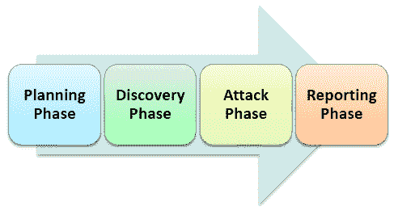

# 渗透测试教程：什么是 PenTest？

> 原文： [https://www.guru99.com/learn-penetration-testing.html](https://www.guru99.com/learn-penetration-testing.html)

## 什么是渗透测试？

**渗透测试**是[安全测试](/what-is-security-testing.html)的一种，可发现攻击者可能利用的软件应用程序，网络或 Web 应用程序中的漏洞，威胁，风险。 笔测试的目的是查找被测系统中存在的所有安全漏洞。也称为笔测试或笔测试。

漏洞是攻击者可能破坏或获得对系统或其中包含的任何数据的授权访问的风险。 漏洞通常是在软件开发和实施阶段偶然引入的。 常见漏洞包括设计错误，配置错误，软件错误等。渗透分析取决于两种机制，即漏洞评估和渗透测试（VAPT）。

## 为什么要进行渗透测试？

渗透对于企业至关重要，因为-

*   银行，投资银行，证券交易所等金融部门希望保护其数据的安全，而渗透测试对于确保安全性至关重要
*   如果软件系统已经被黑客入侵，并且组织希望确定系统中是否仍然存在任何威胁，以避免将来遭受黑客攻击。
*   主动渗透测试是抵御黑客的最佳保障

## 渗透测试的类型：

所选渗透测试的类型通常取决于范围以及组织是否要模拟员工，网络管理员（内部来源）或外部来源进行的攻击。 渗透测试分为三种类型，分别是

*   [黑匣子测试](/black-box-testing.html)
*   白盒渗透测试
*   灰盒渗透测试

在黑匣子渗透测试中，测试人员不了解要测试的系统。 他负责收集有关目标网络或系统的信息。

在白盒渗透测试中，通常会向测试人员提供有关要测试的网络或系统的完整信息，包括 IP 地址架构，源代码，OS 详细信息等。这可以被视为模拟攻击， 内部来源（组织的员工）。

在灰盒渗透测试中，测试人员会获得部分系统知识。 可以将其视为对组织的网络基础结构文档具有非法访问权的外部黑客的攻击。

## 如何进行渗透测试

以下是执行渗透测试所需执行的活动-

**步骤 1）计划阶段**

1.  确定分配范围&策略
2.  现有安全策略，标准用于定义范围

**步骤 2）发现阶段**

1.  收集有关系统的尽可能多的信息，包括系统中的数据，用户名甚至密码。 这也称为 **FINGERPRINTING**
2.  扫描并探查端口
3.  检查系统漏洞

**步骤 3）攻击阶段**

1.  查找各种漏洞的利用程序您需要必要的安全性特权才能利用系统

**步骤 4）报告阶段**

1.  报告必须包含详细的调查结果
2.  发现漏洞的风险及其对业务的影响
3.  建议和解决方案（如果有）

渗透测试的首要任务是收集系统信息。 有两种收集信息的方法-

*   关于主机的“一对一”或“一对多”模型：测试人员以线性方式针对一个目标主机或目标主机（例如子网）的逻辑分组执行技术。
*   “多对多”或“多对多”模型：测试仪利用多个主机以随机，速率受限和非线性的方式执行信息收集技术。

## 渗透测试工具示例

渗透测试中使用了各种各样的工具，重要的工具是：

1.  [NMap](https://nmap.org/) -此工具用于执行端口扫描，OS 标识，跟踪路由和漏洞扫描。
2.  [Nessus](http://www.nessus.org/) -这是传统的基于网络的漏洞工具。
3.  Pass-The-Hash-此工具主要用于密码破解。

## 渗透测试仪的作用和职责：

渗透测试人员的工作是：

*   测试人员应从组织收集所需的信息以进行渗透测试
*   查找可能使黑客攻击目标计算机的缺陷
*   笔测试人员应该从道德上考虑&就像真正的黑客一样。
*   渗透测试人员所做的工作应具有可重复性，以便开发人员轻松修复它
*   应预先定义测试执行的开始日期和结束日期。
*   测试人员应对软件测试期间系统或信息的任何损失负责
*   测试人员应对数据和信息保密

## 手动渗透与自动渗透测试：

| 手动渗透测试 | 自动化渗透测试 |
| [手动测试](/manual-testing.html)需要专业人士来运行测试 | 自动化测试工具可为经验不足的专业人士提供清晰的报告 |
| 手动测试需要 Excel 和其他工具来跟踪它 | [自动化测试](/automation-testing.html)具有集中式和标准工具 |
| 在“手动测试”中，样品结果因测试而异 | 对于自动测试，每个测试的结果不会有所不同 |
| 用户应该记住内存清理 | 自动化测试将进行全面清理。 |

## 渗透测试的缺点

渗透测试无法找到系统中的所有漏洞。 渗透测试仪的时间，预算，范围和技能受到限制

在进行渗透测试时，将产生以下副作用：

*   数据丢失和损坏
*   停机时间
*   增加成本

## 结论：

测试人员应该像真正的黑客一样，对应用程序或系统进行测试，并需要检查代码是否安全编写。 如果存在实施良好的安全策略，则渗透测试将是有效的。 渗透测试策略和方法应该是使渗透测试更有效的地方。 这是渗透测试的完整的初学者指南。

**检查我们的** [实时渗透测试项目](/live-penetration-testing-project.html)