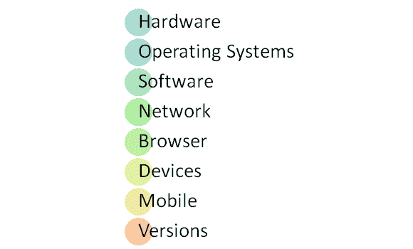
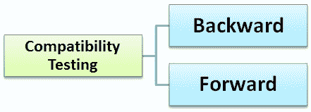

# 什么是兼容性测试？ 正向&向后测试（示例）

> 原文： [https://www.guru99.com/compatibility-testing.html](https://www.guru99.com/compatibility-testing.html)

在学习兼容性测试之前，让我们了解一下-

### 什么是兼容性？

兼容性不过是存在或共存的能力。 在正常生活中，油与水不相容，但是牛奶很容易与水结合。

### 什么是兼容性测试？

兼容性测试是一种软件测试，用于检查您的软件是否能够在不同的硬件，操作系统，应用程序，网络环境或[移动](/mobile-testing.html)设备上运行。

兼容性测试是一种非功能测试

## 兼容性测试的类型

让我们看看兼容性测试类型

*   **硬件**：它检查软件是否与不同的硬件配置兼容。
*   **操作系统**：它检查您的软件是否与 Windows，Unix，Mac OS 等不同操作系统兼容。
*   **软件**：它检查您开发的软件与其他软件兼容。 例如，MS Word 应用程序应该与 MS Outlook，MS Excel， [VBA](/vba-tutorial.html) 等其他软件兼容。
*   **网络：**评估网络中具有各种参数（例如带宽，运行速度，容量）的系统性能。 它还使用前面提到的所有参数检查不同网络中的应用程序。
*   **浏览器**：它检查您的网站与 Firefox，Google Chrome，Internet Explorer 等不同浏览器的兼容性。
*   **设备**：它检查软件与其他设备的兼容性，例如 USB 端口设备，打印机和扫描仪，其他媒体设备和蓝牙。
*   **移动**：检查您的软件是否与 Android，iOS 等移动平台兼容。
*   **软件版本：**它正在验证您的软件应用程序与该软件的不同版本兼容。 例如，检查您的 Microsoft Word 与 Windows 7，Windows 7 SP1，Windows 7 SP2，Windows 7 SP3 兼容。

有两种类型的版本检查

**向后兼容性测试**用于验证开发的硬件/软件与旧版本的**，** **版本**的行为。

**前向兼容性测试**将使用硬件/软件的**较新** **版本**来验证开发的硬件/软件的行为。

## 兼容性测试工具

1.  BrowserStack-浏览器兼容性测试：此工具可帮助软件工程师检查不同浏览器中的应用程序。
2.  虚拟桌面-操作系统兼容性：用于将多个操作系统中的应用程序作为虚拟机运行。 n 可以连接多个系统并比较结果。

## 如何进行兼容性测试

1.  兼容性测试的初始阶段是定义应用程序预期要使用的环境或平台集。
2.  测试人员应具有足够的平台/软件/硬件知识，以了解不同配置下的预期应用程序行为。
3.  需要设置环境以使用不同的平台，设备，网络进行测试，以检查您的应用程序在不同配置下是否运行良好。
4.  报告错误。 修复缺陷。 重新测试以确认[缺陷](/defect-management-process.html)固定。

**结论：**

兼容性测试最重要的用途是确保开发的软件是否在不同的配置下工作（如需求文档中所述）。 该测试对于检查应用程序是否与客户端环境兼容是必需的。