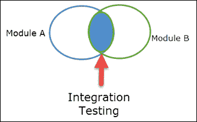
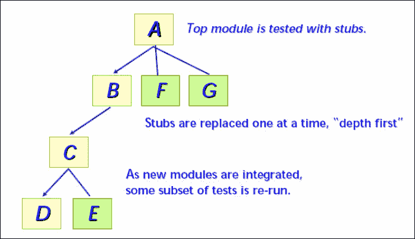
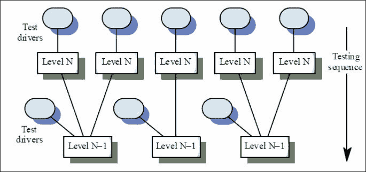

# 什么是带有示例的系统集成测试（SIT）

> 原文： [https://www.guru99.com/system-integration-testing.html](https://www.guru99.com/system-integration-testing.html)

### 什么是系统集成测试？

系统[集成测试](/integration-testing.html)定义为一种在集成的硬件和软件环境中执行的软件测试，以验证整个系统的行为。 它是在一个完整的集成系统上进行的测试，目的是评估系统是否符合其特定要求。

执行系统集成测试（SIT）以验证软件系统的模块之间的交互。 它处理对软件需求规范/数据和软件设计文档中指定的高级和低级软件需求的验证。

它还可以验证软件系统与其他系统的共存性，并测试软件应用程序模块之间的接口。 在这种类型的测试中，首先要对模块进行单独测试，然后将其组合起来以构成一个系统。

例如，将软件和/或硬件组件进行组合和逐步测试，直到集成了整个系统。

在本教程中，您将学习-

*   [什么是系统集成测试？](#1)
*   [为什么要进行系统集成测试](#2)
*   [如何进行系统集成测试](#3)
*   [集成测试的进入和退出条件](#4)
*   [硬件到软件集成测试](#5)
*   [软件到软件集成测试](#6)
*   [自上而下的方法](#7)
*   [自下而上的方法](#8)
*   [大爆炸方法](#9)

## 为什么进行系统集成测试

在软件工程中，完成系统集成测试是因为，

*   它有助于及早发现[缺陷](/defect-management-process.html)
*   将提供有关各个模块可接受性的早期反馈
*   缺陷修复程序的计划很灵活，可以与开发重叠
*   正确的数据流
*   正确的控制流程
*   正确的时机
*   正确使用内存
*   符合软件要求

## 如何进行系统集成测试

这是一种用于构造程序结构，同时进行测试以发现与接口相关的错误的系统技术。

预先集成了所有模块，并且整个程序都经过了整体测试。 但是在此过程中，可能会遇到一系列错误。

此类错误的校正非常困难，因为整个程序的大量扩展使隔离的原因变得复杂。 一旦纠正并纠正了这些错误，就会出现一个新的错误，并且该过程将以无尽循环**继续无缝进行。** 为避免这种情况，使用了另一种方法，即增量集成。 在本教程的后面，我们将看到有关增量方法的更多详细信息。

有一些增量方法，例如在基于目标处理器的系统上进行集成测试。 所使用的方法是[黑盒测试](/black-box-testing.html)。 可以使用自下而上或自上而下的集成。

测试用例仅使用高级软件要求进行定义。

也可以在主机环境中很大程度上实现软件集成，而目标环境特定的单元将继续在主机中进行仿真。 再次需要在目标环境中重复测试以进行确认。

此级别的确认测试将确定特定于环境的问题，例如内存分配和取消分配中的错误。 在主机环境中进行软件集成的实用性将取决于那里有多少目标特定功能。 对于某些嵌入式系统，与目标环境的耦合非常紧密，因此在主机环境中进行软件集成是不切实际的。

大型软件开发会将软件集成划分为多个级别。 较低级别的软件集成可能主要基于主机环境，而更高级别的软件集成则越来越依赖于目标环境。

**注意：**如果仅测试软件，则称为软件软件集成测试[SSIT]；如果同时测试硬件和软件，则称为硬件软件集成测试[HSIT]。

## 集成测试的进入和退出条件

通常，在执行集成测试时，将使用 ETVX（进入标准，任务，验证和退出标准）策略。

**进入条件：**

*   完成[单元测试](/unit-testing-guide.html)

**输入：**

*   软件需求数据
*   软件设计文件
*   软件验证计划
*   软件集成文件

**活动：**

*   根据高级和低级要求创建测试用例和过程
*   组合实现通用功能的低级模块
*   开发测试工具
*   测试构建
*   一旦通过测试，该构建将与其他构建结合并进行测试，直到将系统集成为一个整体。
*   在基于目标处理器的平台上重新执行所有测试，并获得结果

**退出条件：**

*   成功完成目标硬件上软件模块的集成
*   根据指定的要求纠正软件的性能

**输出**

*   集成测试报告
*   软件测试用例和过程[SVCP]。

## 硬件到软件集成测试

这是对在目标计算机环境中高级功能上运行的计算机软件组件（CSC）的测试。 它集中于在目标环境上开发的集成软件的行为。

**基于需求的软硬件集成测试**

基于需求的硬件/软件集成测试的目的是确保目标计算机中的软件将满足高级需求。 此测试方法揭示的典型错误包括：

*   硬件/软件接口错误
*   违反软件分区。
*   无法通过内置测试检测故障
*   对硬件故障的响应不正确
*   由于排序，瞬态输入负载和输入功率瞬变而引起的错误
*   反馈导致错误行为
*   对内存管理硬件的控制不正确或不正确
*   数据总线争用问题
*   验证现场可加载软件的兼容性和正确性的机制操作不正确

硬件软件集成处理高层需求的验证。 此级别的所有测试均在目标硬件上进行。

*   黑匣子测试是此测试级别使用的主要测试方法。
*   仅根据高级需求定义测试用例
*   测试必须在生产标准硬件上执行（在目标上）

**设计用于硬件/软件集成的测试用例时要考虑的事项**

*   通过软件正确获取所有数据
*   从硬件到软件的数据缩放和范围
*   正确将数据从软件输出到硬件
*   规格内的数据（正常范围）
*   数据超出规格（异常范围）
*   边界数据
*   中断处理
*   Timing
*   正确使用内存（寻址，重叠等）
*   状态转换

**注：**对于中断测试，所有中断将独立于最初的请求进行验证，通过全面服务直至完成。 为了充分测试中断，将专门设计测试用例。

## 软件到软件集成测试

这是对主机/目标计算机中运行的计算机软件组件的测试

环境，同时模拟整个系统（其他 CSC），并具有高级功能。

它着重于模拟主机/目标环境中 CSC 的行为。 用于软件集成的方法可以是增量方法（自上而下，自下而上或两者结合）。

## 增量式

增量测试是集成测试的一种方式。 在这种类型的测试方法中，您首先要分别测试软件的每个模块，然后再将其他模块附加到该模块，然后再依次进行测试，以继续进行测试。

增量集成与大爆炸方法形成对比。 该程序是按小部分构建和测试的，其中错误更容易隔离和纠正。 接口更有可能被完全测试，并且可以应用系统的测试方法。

增量测试有两种类型

*   自上而下的方法
*   自下而上的方法

### 自上而下的方法

在这种类型的方法中，个人首先要测试用户界面，并通过存根模拟其基础功能，然后向下移动并集成下层和下层，如下图所示。

*   从主控制模块开始，通过向下移动整个控制层次结构来集成模块
*   主控制模块的子模块以广度优先或深度优先的方式合并到结构中。
*   深度优先集成将所有模块集成在结构的主要控制路径上，如下图所示：

模块集成过程通过以下方式完成：

1.  主控制模块用作测试驱动程序，并且存根替换了直接属于主控制模块的所有模块。
2.  根据所选择的方法（从宽度优先或深度优先），一次用实际模块替换下级存根。
3.  集成了每个模块后，将执行测试。
4.  在完成每组测试后，在完成每组测试后，将另一个存根替换为真实模块
5.  为了确保没有引入新的错误[，可以执行回归测试](/regression-testing.html)。

该过程从步骤 2 继续进行，直到构建了整个程序结构。 自上而下的策略听起来并不复杂，但是在实践中会出现后勤问题。

这些问题中最常见的问题发生在需要对层次结构中的低级别进行处理以充分测试较高级别时。

在自顶向下测试开始时，存根将替换低级模块，因此，程序结构中不会有大量数据向上流动。

**测试人员可能面临的挑战：**

*   延迟许多测试，直到将存根替换为实际模块。
*   开发存根，它们执行有限的功能来模拟实际模块。
*   从层次结构的底部向上集成软件。

**注意：**第一种方法使我们失去了对特定测试与特定模块合并之间的对应关系的控制。 这可能导致确定错误原因的困难，该错误原因往往违反了自顶向下方法的高度受限的性质。

第二种方法是可行的，但随着存根变得越来越复杂，可能会导致大量开销。

### 自下而上的方法

自下而上的集成开始使用程序结构中最低级别的模块进行构建和测试。 在此过程中，模块是从下至上集成的。

在这种方法中，始终可以使用从属于给定级别的模块所需的处理，并且无需存根。

此集成测试过程分四个步骤执行

1.  低级模块被组合为执行特定软件子功能的集群。
2.  编写驱动程序以协调测试用例的输入和输出。
3.  群集或内部版本已测试。
4.  删除驱动程序，并在程序结构中向上移动合并群集。

随着集成的发展，需要单独的测试驱动程序课程。 实际上，如果自上而下集成程序结构的前两个级别，则可以大大减少驱动程序的数量，并且可以大大简化群集的集成。 集成遵循以下所示的模式。 随着集成的发展，需要单独的测试驱动程序课程。

**注意：**如果从上至下集成了程序结构的前两个级别，则可以大大减少驱动程序的数量，并且可以大大简化构建的集成。

### 大爆炸法

在这种方法中，直到所有模块都准备就绪为止，所有模块都不会集成。 准备就绪后，将集成所有模块，然后执行其操作以了解所有集成模块是否正常工作。

在这种方法中，由于一次集成所有内容，因此很难知道故障的根本原因。

另外，在生产环境中极有可能发生关键错误。

仅当必须立即进行集成测试时才采用此方法。

**摘要：**

*   执行集成以验证软件系统的模块之间的交互。 它有助于及早发现缺陷
*   可以对硬件-软件或硬件-硬件集成进行集成测试
*   集成测试通过两种方法完成
    *   增量式
    *   大爆炸法
*   在执行集成测试时，通常使用 ETVX（进入标准，任务，验证和退出标准）策略。