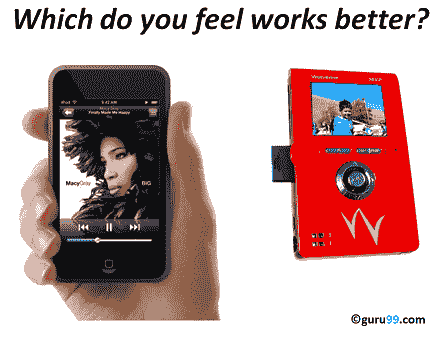
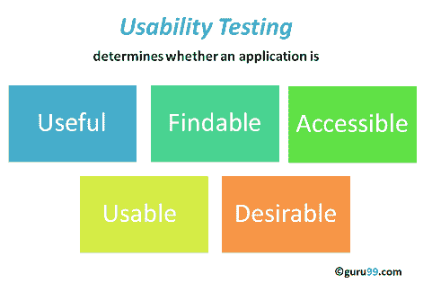
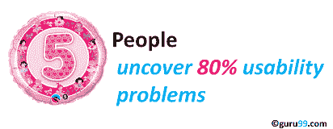

# 什么是可用性测试？ UX（用户体验）测试示例

> 原文： [https://www.guru99.com/usability-testing-tutorial.html](https://www.guru99.com/usability-testing-tutorial.html)

## 什么是可用性测试？

**可用性测试**衡量软件系统的易用性和用户友好性。 这里，一小部分目标最终用户“使用”软件系统来暴露可用性缺陷。 该测试主要关注用户对应用程序的易用性，处理控件的灵活性以及系统满足其目标的能力。 这也称为用户体验（UX）测试。

建议在 SDLC 的初始设计阶段进行此测试，这样可以更好地了解用户的期望。

在本教程中，您将学习-

*   [什么是可用性测试？](#1)
*   [为什么要进行可用性测试](#2)
*   [可用性测试测试用例示例](#3)
*   [如何进行可用性测试：完整过程](#4)
*   [可用性测试方法：2 种技术](#5)
*   [您需要多少个用户？](#6)
*   [UX 测试清单](#7)
*   [可用性测试的优势](#8)
*   [可用性测试的缺点](#9)

## 为什么要进行可用性测试

美学和设计很重要。 产品的外观通常决定产品的性能。

有许多软件应用程序/网站，一旦启动，就会由于以下原因而失败，

*   我在哪里单击下一步？
*   需要浏览哪个页面？
*   哪个图标或行话代表什么？
*   错误消息不一致或无法有效显示
*   会话时间不足。

软件工程，可用性测试可以在开发周期的早期识别出系统中的可用性错误，并可以避免产品出现故障。

## 可用性测试测试用例示例

该测试的目的是使用户满意，并且主要集中在系统的以下参数上：

**系统的有效性**

*   该系统易于学习吗？
*   该系统有用并为目标受众增加价值吗？
*   所使用的内容，颜色，图标，图像是否美观？

**效率**

*   只需很少的导航即可到达所需的屏幕或网页，并且不经常使用滚动条。
*   应用程序/网站中屏幕/页面的**格式**的一致性。
*   可以在您的软件应用程序或网站中进行搜索。

**精度**

*   不应显示过时或不正确的数据（如联系信息/地址）。
*   不应存在​​断开的链接。

**用户友好度**

*   所使用的控件应易于说明，并且无需培训即可操作
*   应该为用户提供帮助以了解应用程序/网站
*   与上述目标保持一致有助于进行有效的可用性测试

## 如何进行可用性测试：完整过程

可用性测试过程包括以下几个阶段

**规划**：-在此阶段中，确定可用性测试的目标。 让志愿者坐在您的应用程序前面并记录他们的行为不是目标。 您需要确定系统的关键功能和目标。 您需要为测试人员分配任务，这些任务将行使这些关键功能。 在此阶段，还将确定可用性测试方法，可用性测试人员的人数&，测试报告格式

**招聘**：在此阶段，您将根据可用性测试计划招聘所需数量的测试人员。 寻找与您的人口统计资料（年龄，性别等）和专业资料（教育，工作等）相匹配的测试人员可能会花费一些时间。

**可用性** **测试**：在此阶段，实际执行了可用性测试。

**数据分析**：对可用性测试中的数据进行彻底分析，以得出有意义的推论并提出可行的建议，以提高产品的整体可用性。

**报告**：与所有相关的利益相关者（包括设计师，开发人员，客户和 CEO）共享可用性测试的结果

## 可用性测试方法：2 种技术

有两种方法可以进行可用性测试-

1.  实验室可用性测试
2.  远程可用性测试

**实验室可用性测试：**。 该测试在观察员在场的单独实验室中进行。 为测试人员分配了要执行的任务。 观察者的作用是监视测试人员的行为并报告测试结果。 在测试过程中，观察者保持沉默。 在此测试中，观察者和测试者都位于相同的物理位置。

**远程可用性测试**：在此测试下，观察者和测试人员位于远程位置。 测试人员可以远程访问被测系统并执行分配的任务。 测试人员的声音，屏幕活动，测试人员的面部表情均由自动化软件记录。 观察者分析这些数据并报告测试结果。 此类软件的示例- [http://silverbackapp.com/](http://silverbackapp.com/)

## 您需要多少个用户？

研究（Virzi，1992 和 Neilsen Landauer，1993）表明 **5 个用户足以发现 80％的可用性问题**。 **一些研究人员提出了其他数字。**

事实是，所需的实际用户数量取决于给定应用程序的复杂性和您的可用性目标。 可用性参与者的增加导致成本增加，计划，参与者管理和数据分析。

但是，作为一般准则，如果您的预算**较小，**且对 DIY 可用性测试感兴趣 **5，那么从**开始就比较合适。 如果**预算不受限制**，则最好**咨询经验丰富的专业人员**以确定用户数量。

## UX 测试清单

该测试的主要目标是在产品发布之前发现关键的可用性问题。 为了使测试成功，必须考虑以下几点：

*   在设计和开发的早期阶段开始 UX 测试
*   在开始开发之前，最好在竞争对手的产品上进行可用性测试。 这将帮助您确定目标受众的可用性标准
*   选择合适的用户来测试系统（可以是专家/非专家用户/ 50-50 的专家和非专家用户）
*   使用带宽整形器。 例如，您的目标受众的网络连接较差，将可用性测试人员的网络带宽限制为 56 Kbps。
*   测试人员需要专注于系统的关键&常用功能。
*   为每个测试人员分配一个观察者。 这有助于观察者准确记录测试人员的行为。 如果将观察员分配给多个测试人员，则结果可能会受到影响
*   教育设计人员和开发人员，此测试结果不是失败的迹象，而是改进的迹象

## 可用性测试的优势

与生活中的任何事物一样，可用性测试有其优点和缺点。 让我们看看他们

*   它有助于在产品上市之前发现可用性问题。
*   它有助于提高最终用户满意度
*   它使您的系统高效高效
*   它有助于从可用性测试期间实际使用您的系统的目标受众那里收集真正的反馈。 您不需要依靠随机人的“意见”。

## 可用性测试的缺点

*   成本是可用性测试中的主要考虑因素。 建立可用性测试实验室需要大量资源。 可用性测试人员的招聘和管理也可能很昂贵

但是，这些成本以更高的客户满意度，保留率和回头客的形式来偿还。 因此，强烈建议进行可用性测试。