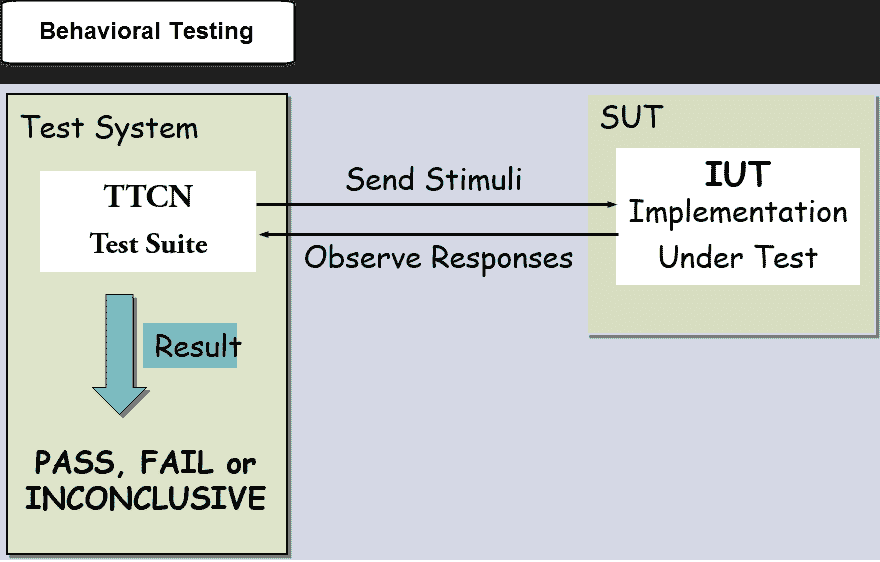

# 协议测试教程：L2 & L3

> 原文： [https://www.guru99.com/protocol-testing.html](https://www.guru99.com/protocol-testing.html)

在了解协议测试之前，让我们了解：

### 什么是协议？

当计算机彼此通信时，每台计算机必须遵循一组通用的规则和条件。 换句话说，协议确定如何在计算设备之间以及通过网络传输数据。

## 什么是协议测试？

**协议测试**检查交换，无线，VoIP，路由，交换等域中的通信协议。目标是使用协议测试工具检查通过网络发送的数据包的结构。

## 路由和路由协议

协议分为两类：**路由协议**和**路由协议**

*   **路由协议**：路由协议可用于将用户数据从一个网络发送到另一网络。 它承载用户流量，例如电子邮件，网络流量，文件传输等。路由协议为 IP，IPX 和 AppleTalk。
*   **路由协议**：路由协议是确定路由器路由的网络协议。 仅在路由器之间使用。 例如 RIP，IGRP，EIGRP 等。

简单来说，路由器就像是用于传输的总线，而路由协议就是道路上的信号。

根据通信类型，使用不同的协议。 CISCO，JUNIPER，ALCATEL 等公司生产的路由器，调制解调器，无线接入点等网络设备使用不同的协议进行通信，例如 Cisco 使用 EIGRP，OSPF 等。协议测试只不过是检查 EIGRP（增强型内部）。 网关路由协议）或 OSPF（开放式最短路径优先）或任何其他协议均按照各自的标准运行。

## 计算机协议的类型

| 

<center>协议类型</center>

 | 

<center>协议的目的</center>

 |
| TCP / IP | 它用于通过 Internet 以小包形式发送信息 |
| UDP / ICMP | 它用于通过互联网在数据包中发送少量信息 |
| POP3 和 SMTP | 用于发送和接收邮件 |
| 超文本传输​​协议 | 它用于以加密形式传输 HTML 页面，以为敏感数据提供安全性 |
| 的 FTP | 它用于通过网络将文件从一个节点传输到另一个节点 |

* **TCP / IP** -传输控制协议/ Internet 协议， **UDP / ICMP** -用户数据报协议/ Internet 控制消息协议， **POP3 / SMTP** -邮局协议 /简单邮件传输协议， **HTTP** -超文本传输​​协议， **FTP** -文件传输协议

## 不同类型的网络协议（L2 和 L3）

OSI 模型共有 7 层网络通信，其中第 2 层和第 3 层至关重要。

*   **第 2 层**：它是数据链路层。 Mac 地址，以太网，令牌环和帧中继都是数据链路层的示例。
*   **第 3 层**：这是一个网络层，它确定网络中用于通信的最佳可用路径。 IP 地址是第 3 层的示例。

## 如何进行协议测试

*   对于协议测试，您需要**协议分析器和模拟器**
*   协议分析器可确保正确的解码以及呼叫和会话分析。 模拟器模拟网络元素的各种实体
*   通常，DUT（被测设备）对其他设备（如交换机和路由器）进行协议测试，并在其中配置协议
*   之后检查设备发送的报文的报文结构
*   它使用 lxNetworks，Scapy 和 Wireshark 等工具检查设备的可伸缩性，性能，协议算法等。

## 协议测试的测试类型

协议测试包括功能，性能，协议栈，互操作性等方面的测试。在协议测试过程中，基本上要进行三项检查。

*   **正确性**：我们是否在预期的时候收到数据包 X
*   **延迟时间**：数据包传输系统需要多长时间
*   **带宽**：我们每秒可以发送多少个数据包

协议测试可以分为两类。 压力和可靠性测试以及功能测试。 压力和可靠性测试涵盖[负载测试](/load-testing-tutorial.html)，[压力测试](/stress-testing-tutorial.html)，[性能测试](/performance-testing.html)等。而[功能测试](/functional-testing.html)包括负面测试，一致性测试， 互操作性测试等

*   **一致性测试**：对产品上实现的协议进行了一致性测试，例如 IEEE，RFC 等。
*   **互操作性测试**：测试了不同供应商的互操作性。 在适当的平台上进行一致性测试后，才进行此测试
*   **网络功能测试：**参照设计文档对网络产品的功能进行了功能测试。 例如，功能可以是交换机上的端口安全性，路由器上的 ACL 等。

## 网络设备协议测试的示例测试用例

这是路由器的测试案例

| 

<center>测试名称</center>

 | 

<center>测试用例</center>

 |
| 

1.  一台交换机上的一个 VLAN

 | 

*   构建两个不同的 VLAN。 检查不同 VLAN

上的主机之间的可见性 |
| 

2.  一台交换机上的三个对称 VLAN

 | 

*   创建三个不同的非对称 VLAN。 检查主机之间的可见性

 |
| 

3.  生成树：根路径成本变动

 | 

*   测试拓扑变化后[Root Path Cost]的变化方式

 |
| 

4.  生成树：端口阻止

 | 

*   检查生成树协议如何避免在网络中也存在 VLAN 的情况下避免网络中形成循环，阻塞冗余链路

 |
| 

5.  不同的 MSTI 的不同根桥

 | 

*   显示每个 MSTI 可以具有不同的根桥

 |
| 

6.  不同 STP 区域之间的可见性

 | 

*   使用相同的 VLAN 检查不同 STP 区域之间的可见性

 |
| 

7.  电话交换机性能

 | 

*   生成 1000 个电话，并检查电话交换机是否仍在工作或性能下降

 |
| 

8.  设备

的阴性测试 | 

*   输入错误的密钥并检查用户的身份验证。 它不应允许用户访问

 |
| 

9.  线速度

 | 

*   检查设备以 10Gbps 的速度运行，利用所有可用带宽来处理传入流量

 |
| 

10.  协议会话率

 | 

*   跟踪两个设备之间的 TCP 对话，并验证每个设备是否采取了正确的行为

 |
| 

11.  会话启动的响应时间

 | 

*   测量设备对会话发起邀请请求的响应时间

 |

## 协议测试工具

让我们讨论用于验证协议的最重要的测试工具

### Scapy 制作小包

Scapy 是功能强大的交互式数据包处理程序。 它使您能够

*   创建数据包
*   解码网络上的数据包
*   捕获数据包并进行分析
*   将数据包注入网络

因此，基本上，scapy 主要做两件事：**接收答案和发送数据包**。 您定义数据包，发送数据包，接收答案，将请求与答案匹配，并返回数据包对列表和不匹配数据包列表。

它还可以处理其他事情，例如跟踪路由，单元测试，攻击或网络发现，开发新协议，探测等。

Scapy 使我们能够编写 [Python](/python-tutorials.html) 脚本，该脚本使我们能够执行诸如发送和接收数据包或嗅探数据包之类的任务。 例如，scapy 可以使用 Python 脚本嗅探数据包。 打开在编辑器中输入的 getdit 的命令

```
#gedit scapysniff.py
#!/usr/bin/env python
from scapy.all import*

a= sniff(count=10)
a.nsummary()

save, and change the mode of the file into an executable form
#chmod+x scapysniff.py
# ./scaotsbuff.py
```

它将嗅探 10 个数据包，并在嗅探 10 个数据包后立即打印摘要。 Scapy 还作为命令数组，用于同时发送和接收数据包

[下载 Scapy](http://www.secdev.org/projects/scapy/)

### Wireshark 分析工具

用于协议测试的工具-Wireshark。 它允许实时捕获数据包并以人类可读的形式显示它们。 它允许您使用颜色编码和过滤器来深入研究网络流量并检查单个数据包。

Wireshark 捕获的数据包有助于确定何时建立会话，何时启动确切的数据传输以及每次发送多少数据等。

Wireshark 具有一系列丰富的功能，其中包括

*   全面检查数百种协议，一直在增加
*   实时捕获和离线分析
*   丰富的 VoIP 分析
*   标准三窗格打包浏览器
*   在 Windows，Linux，OSX 等多平台上运行
*   捕获的网络数据可以通过 GUI 浏览
*   解密支持许多协议，例如 IPsec，ISAKMP，SSL / TLS
*   可以从以太网，ATM，蓝牙，USB，令牌等读取实时数据。
*   输出可以导出为 CSV，XML，纯文本等。

[下载 Wireshark](https://www.wireshark.org/download.html)

### TTCN

TCCN 是用于定义[测试方案](/test-scenario.html)及其协议测试实现的标准测试语言。 TCCN 测试套件包含许多用 TTCN 编程语言编写的测试用例，并且用于**测试** **反应系统或行为测试**。

例如，一台咖啡自动售货机可以在您插入一美元硬币时为您提供咖啡，但是如果插入的东西少于一美元，则不会响应。 为了对此类机器进行编程，使用了 TCCN3 语言。 为了使咖啡机在插入硬币时做出响应，我们必须编写充当咖啡机的 TCCN-3 组件。 它使我们可以在实际的咖啡机产品可用之前进行测试。 完成后，我们将 TCCN3 测试套件与外部设备连接。



测试系统发出刺激（美元硬币）并接收响应（咖啡）。 刺激适配器从测试系统获得刺激，并将其传递给被测系统。 响应适配器等待被测系统的响应，并将其传递给测试系统。

TCCN3 可用于各种领域，例如

*   移动通信（LTE，WiMAX，3G 等）
*   宽带技术（ATM，DSL）
*   中间件平台（Web 服务，CORBA 等）
*   互联网协议（SIP，IMS，IPv6）
*   智能卡
*   汽车类（AutoSAR，MOST，CAN）

在 TCCN 中，我们可以定义

*   测试套件
*   测试用例
*   测试步骤
*   声明变量
*   声明计时器
*   创建 PDU 等

TCCN 可以与其他语言的系统类型集成，例如 ASN.1，XML，C / C ++。 TCCN3 核心语言以文本格式存在，与表格，图形和表示形式等其他格式不同。