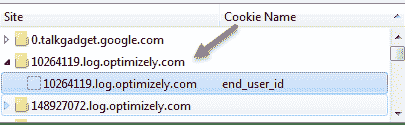
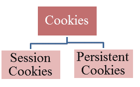
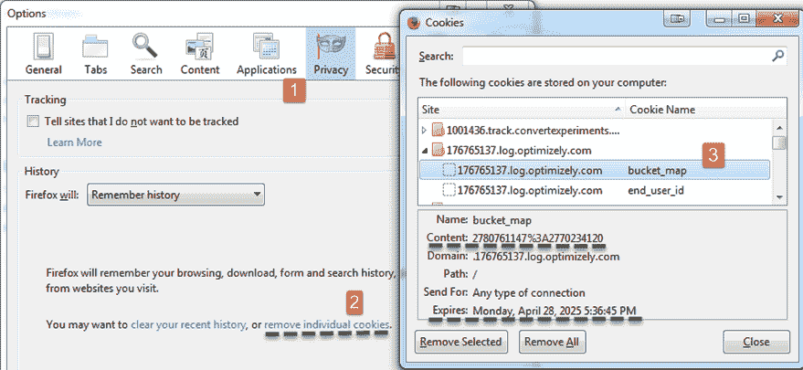
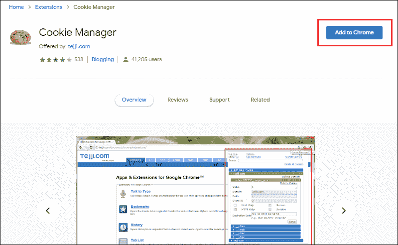
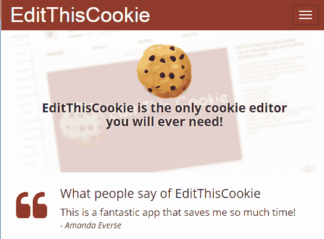
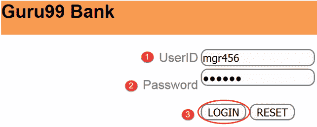
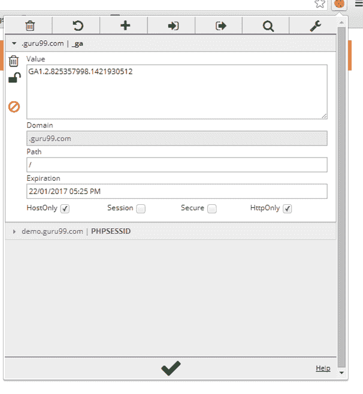
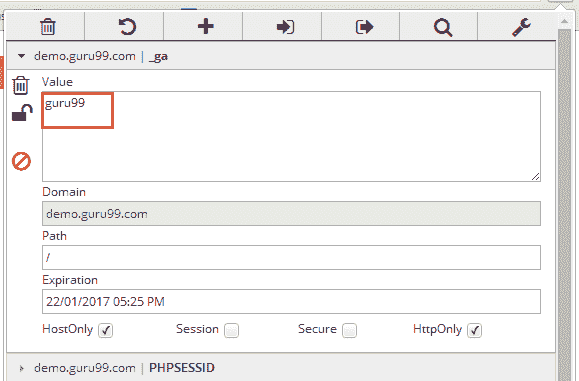

# Cookie 测试：网站的测试用例示例

> 原文： [https://www.guru99.com/cookie-testing-tutorial-with-sample-test-cases.html](https://www.guru99.com/cookie-testing-tutorial-with-sample-test-cases.html)

## 什么是 Cookie 测试？

Cookie 测试定义为一种软件测试类型，用于检查在 Web 浏览器中创建的 Cookie。 Cookie 是一小部分信息，由 Web 服务器存储在用户（客户端）硬盘上的文本文件中。 每当浏览器从服务器请求页面时，该信息便被发送回服务器。 通常，cookie 包含用于在不同网页之间进行通信的个性化用户数据或信息。 下面的屏幕截图显示了不同网站的 cookie。

换句话说，Cookie 只是用户的身份，用于跟踪用户浏览整个网站页面的位置。 Cookie 的目的是在用户和网站之间进行快速交互。 可以使用 Cookie 的应用程序将用于实现购物车，个性化的网络体验，用户跟踪，市场营销，用户会话等。

在本教程中，我们将学习

*   [Cookie 的内容是什么？](#1)
*   [Cookie 的类型](#2)
*   [Cookies 存放在哪里？](#3)
*   [如何测试 Cookie –示例测试案例](#4)
*   [用于测试 Cookie 的插件](#5)
*   [正在修改 Cookie](#6)
*   [Cookie 和会话](#7)之间的区别

## Cookie 的内容是什么？

Cookie 主要由三部分组成

1.  从中发送 Cookie 的服务器的名称
2.  饼干寿命
3.  一个值。 通常是随机生成的唯一编号

## Cookie 的类型

通常，在用户计算机上编写两种类型的 Cookie

*   **会话 cookie：**这些 cookie 一直有效，直到打开触发该 cookie 的浏览器。 当我们关闭浏览器时，该会话 Cookie 会被删除
*   **持久性 Cookie：**这些 Cookie 被永久写入用户计算机，并且持续数月或数年

## Cookie 存放在哪里？

当任何网页应用程序编写 cookie 时，它都存储在用户硬盘驱动器上的文本文件中。 Cookie 的保存路径取决于浏览器。 **不同的浏览器将 cookie 存储在不同的路径中。**

例如，在 **Mozilla Firefox** 浏览器中，您可以在浏览器选项中看到 cookie。 要查看此内容，请单击工具**->** 选项**->** 隐私，然后单击“删除单个 Cookie”。

在 **Internet Explorer** 浏览器中，它将 cookie 存储在路径**“** C：\ Documents and Settings \ Default User \ Cookies”

## 如何测试 Cookie –示例测试案例

以下是测试软件工程中 cookie 的重要清单

1.  **禁用 cookie：**禁用所有 cookie 并尝试使用网站的主要功能
2.  **Cookie 损坏：**在记事本中手动编辑 Cookie，并使用一些随机值更改参数
3.  **Cookies 加密：**敏感信息（例如密码和用户名）应先加密，然后再发送到我们的计算机
4.  **使用多个浏览器进行 Cookie 测试：**检查您的网站页面是否按预期在其他浏览器上正确编写了 Cookie
5.  **从您的 Web 应用程序页面检查删除：**
6.  **有选择地拒绝 cookie：**删除网站的所有 cookie，并查看网站对此的反应
7.  **访问 cookie：**一个网站编写的 cookie 不应由其他网站访问
8.  **不会过度使用 Cookie：**如果被测应用程序是公共网站，则不应过度使用 Cookie
9.  **使用不同的设置进行测试：**应该正确进行测试，以检查网站在使用不同的 Cookie 设置时是否运行良好
10.  **分别对 Cookie 进行分类：** Cookie 不应与病毒，垃圾邮件或间谍软件归为同一类

## Cookie 测试插件

现代浏览器允许在浏览器本身中查看/编辑 Cookie。 Mozilla 和 Google Chrome 中都有 cookie 测试器插件。

1.  **[Chrome Cookie 管理器](https://chrome.google.com/webstore/detail/cookie-manager/bjdaiadcbbcomhnlhpnbmnnfcnhkiibj?hl=en)**

2.  **对于 Google Chrome 浏览器：[修改此 Cookie](http://www.editthiscookie.com/)**

## 修改 Cookie

我们将使用针对 Chrome 浏览器的 Cookie 插件进行编辑。

**步骤 1）**

输入用户 ID &密码登录 [Guru99 库。](http://demo.guru99.com/V4/)

**步骤 2）**

单击插件图标  ，它将打开另一个窗口，如下所示

**步骤 3）**

将 cookie 的值更改为**“ guru99”** ，然后单击  保存更改

## Cookie 和会话之间的区别

| 

Cookie

 | 

会话

 |
| 

*   Cookies 是包含用户信息

的客户端文件 | 

*   会话是服务器端文件，其中包含用户信息

 |
| 

*   Cookie 的结束取决于您为其设置的生存时间

 | 

*   当用户关闭浏览器时，会话结束

 |
| 

*   您无需启动 Cookie，因为它存储在本地计算机中

 | 

*   在 PHP 中，使用$ _SESSION 之前，必须编写 session_start（）;。 同样适用于其他语言

 |
| 

*   官方最大 Cookie 大小为 4KB

 | 

*   在会话中，您可以存储任意数量的数据。 您可以达到的唯一限制是脚本一次可以消耗的最大内存，默认情况下为 128MB

 |
| 

*   Cookie 不依赖于会话

 | 

*   会话取决于 Cookie

 |
| 

*   没有名为 unsetcookie（）的函数

 | 

*   Session_destroy（）; 用于销毁所有注册数据或取消设置某些

 |