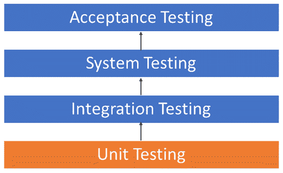
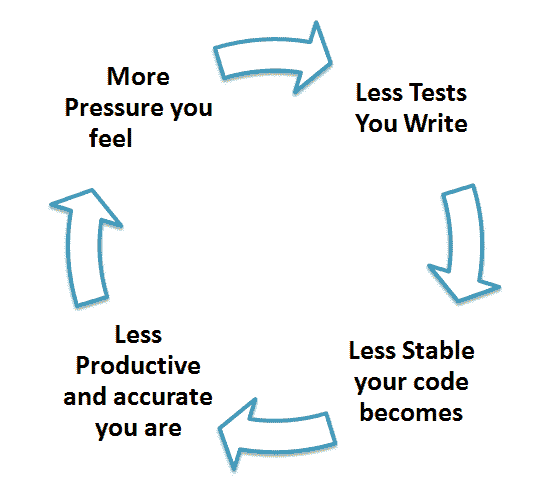
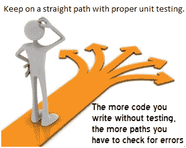

# 单元测试教程：什么是类型，工具，示例

> 原文： [https://www.guru99.com/unit-testing-guide.html](https://www.guru99.com/unit-testing-guide.html)

## 什么是单元测试？

**单元测试**是一种软件测试，其中测试软件的各个单元或组件。 目的是验证软件代码的每个单元是否按预期执行。 单元测试由开发人员在应用程序的开发（编码阶段）中完成。 单元测试隔离一段代码并验证其正确性。 单元可以是单独的功能，方法，过程，模块或对象。

在 SDLC，STLC，V 模型中，单元测试是集成测试之前完成的第一级测试。 单元测试是 WhiteBox 测试技术，通常由开发人员执行。 不过，在现实世界中，由于时间紧迫或开发人员不愿进行测试，质量检查工程师还会进行单元测试。

在本教程中，您将学习-

*   [为什么要进行单元测试？](#2)
*   [如何进行单元测试](#3)
*   [单元测试技术](#4)
*   [单元测试工具](#5)
*   [测试驱动开发（TDD）&单元测试](#6)
*   [单元测试神话](#7)
*   [单元测试优势](#8)
*   [单元测试的缺点](#9)
*   [单元测试最佳做法](#10)

## 为什么要进行单元测试？

有时，软件开发人员会尝试通过进行最少的单元测试来节省时间。 这是一个神话，因为跳过单元测试会导致在应用程序完成后，在[系统测试](/system-testing.html)，[集成测试](/integration-testing.html)甚至 Beta 测试期间，出现更高的[缺陷](/defect-management-process.html)修复成本。 在开发阶段进行正确的单元测试可以最终节省时间和金钱。 这是执行单元测试的关键原因。

<figure>

<figcaption style="display: table;">Unit Testing Levels</figcaption>

</figure>

1.  单元测试有助于在开发周期的早期修复错误并节省成本。
2.  它有助于开发人员了解代码库，并使他们能够快速进行更改
3.  好的单元测试可以作为项目文档
4.  单元测试有助于代码重用。 将您的代码**和**都迁移到新项目中。 调整代码，直到测试再次运行。

## 如何进行单元测试

单元测试有两种类型

*   手册
*   自动化的

单元测试通常是自动化的，但仍然可以手动执行。 软件工程不偏向于另一方，但自动化是首选。 手动进行单元测试的方法可以使用分步指导文档。

在自动方法下-

*   开发人员在应用程序中编写一段代码只是为了测试功能。 他们稍后将注释掉，并最终在部署应用程序时删除测试代码。
*   开发人员还可以隔离功能以对其进行更严格的测试。 这是一种更彻底的单元测试实践，其中涉及将代码复制和粘贴到其自身的测试环境中，而不是自然环境中。 **隔离代码有助于揭示被测试代码与产品中其他单元或数据空间**之间的不必要依赖关系。 然后可以消除这些依赖性。
*   编码人员通常使用 UnitTest Framework 来开发自动化测试用例。 开发人员使用自动化框架将标准编码到测试中，以验证代码的正确性。 在执行测试用例期间，框架记录失败的测试用例。 许多框架还将自动标记并报告这些失败的测试案例。 根据故障的严重程度，框架可能会停止后续测试。
*   单元测试的工作流程是 1）创建测试用例 2）复查/返工 3）基线 4）执行测试用例。

## 单元测试技术

联合测试中使用的代码覆盖率技术如下：

*   声明范围
*   决策范围
*   分行覆盖
*   条件覆盖
*   有限状态机覆盖率

有关更多信息，请参见 [https://www.guru99.com/code-coverage.html](/code-coverage.html)

## 单元测试示例：模拟对象

单元测试依赖于创建的模拟对象来测试尚不属于完整应用程序的代码部分。 模拟对象将填补程序缺少的部分。

例如，您可能具有一个需要尚未创建的变量或对象的函数。 在单元测试中，这些将以模拟对象的形式解决，这些对象仅出于在该部分代码上进行单元测试的目的而创建。

## 单元测试工具

有几种自动化工具可用于协助单元测试。 我们将在下面提供一些示例：

1.  [Junit](/junit-tutorial.html) ：Junit 是可免费使用的 Java 编程语言测试工具。 它提供断言以标识测试方法。 该工具首先测试数据，然后将其插入代码段。
2.  [NUnit](https://nunit.org/) ：NUnit 被广泛用于所有.net 语言的单元测试框架。 它是一个开放源代码工具，允许手动编写脚本。 它支持可以并行运行的数据驱动测试。
3.  [JMockit](http://jmockit.github.io/index.html) ：JMockit 是开源的单元测试工具。 它是具有行和路径指标的代码覆盖工具。 它允许带有记录和验证语法的模拟 API。 该工具提供线覆盖率，路径覆盖率和数据覆盖率。
4.  [EMMA](http://emma.sourceforge.net/) ：EMMA 是一个开源工具包，用于分析和报告用 Java 语言编写的代码。 Emma 支持覆盖类型，例如方法，行，基本块。 它基于 Java，因此它没有外部库依赖关系，并且可以访问源代码。
5.  [PHPUnit](https://phpunit.de/) ：PHPUnit 是 PHP 程序员的单元测试工具。 它只占用一小部分称为单元的代码，并分别测试每个单元。 该工具还允许开发人员使用预定义断言方法来断言系统以某种方式运行。

这些只是一些可用的单元测试工具。 还有很多，尤其是对于 C 语言和 Java，但是无论使用哪种语言，您都一定会找到满足您的编程需求的单元测试工具。

## 测试驱动开发（TDD）&单元测试

TDD 中的单元测试涉及测试框架的广泛使用。 为了创建自动化的单元测试，使用了单元测试框架。 单元测试框架不是 TDD 独有的，但对于它来说是必不可少的。 下面我们看一下 TDD 带给单元测试领域的一些内容：

*   在代码之前编写测试
*   高度依赖测试框架
*   应用程序中的所有类均经过测试
*   快速简便的集成成为可能

## 单元测试神话

**误区：**这需要时间，而且我总是安排得太久了。 我不需要单元测试。

就其本质而言，神话是错误的假设。 这些假设导致如下恶性循环：

事实是，单元测试可以提高开发速度。

程序员认为集成测试将捕获所有错误，并且不执行单元测试。 单元集成后，很容易找到并修复的非常简单的错误将花费很长时间来跟踪和修复。

## 单元测试优势

*   希望了解单元提供什么功能以及如何使用它的开发人员可以查看单元测试，以基本了解单元 API。
*   单元测试允许程序员稍后重构代码，并确保模块仍然正常工作（即回归测试）。 该过程是为所有功能和方法编写测试用例，以便每当更改导致故障时，都可以快速识别并修复它。
*   由于单元测试的模块化性质，我们可以测试项目的各个部分，而无需等待其他部分完成。

## 单元测试的缺点

*   不能期望单元测试捕获程序中的每个错误。 即使在最简单的程序中，也无法评估所有执行路径
*   本质上，单元测试集中于代码单元。 因此，它无法捕获集成错误或广泛的系统级错误。

建议将单元测试与其他测试活动结合使用。

## 单元测试最佳做法

*   单元测试用例应独立。 如果需求有任何增强或变化，则单元测试用例不应受到影响。
*   一次仅测试一个代码。
*   遵循清晰一致的命名约定，以进行单元测试
*   如果任何模块中的代码发生更改，请确保该模块具有相应的单元[测试用例](/test-case.html)，并且该模块在更改实现之前通过测试
*   在进行 SDLC 的下一阶段之前，必须修复在单元测试期间发现的错误。
*   采用“测试作为您的代码”方法。 未经测试而编写的代码越多，检查错误的路径就越多。

**摘要**

*   单元测试定义为一种软件测试，其中测试软件的各个单元或组件。
*   如您所见，单元测试可能涉及很多内容。 根据被测试的应用程序以及所使用的测试策略，工具和理念，它可能很复杂，也可能很简单。 在某种程度上，始终必须进行单元测试。 可以肯定的。