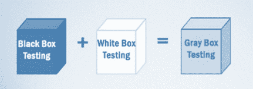

# 什么是灰盒测试？ 技术实例

> 原文： [https://www.guru99.com/grey-box-testing.html](https://www.guru99.com/grey-box-testing.html)

## 什么是灰盒测试？

**灰盒测试**是一种在部分了解应用程序内部工作的情况下测试软件产品或应用程序的技术。 该测试的目的是查找由于代码结构不正确或应用程序的功能使用不当而导致的缺陷。

在此过程中，通常会确定与 Web 系统相关的特定于上下文的错误。 通过专注于任何复杂系统的所有层，可以增加测试范围。

灰盒测试是一种软件测试方法，是[白盒测试](/white-box-testing.html)和黑盒测试方法的结合。

*   在白盒测试中，内部结构（代码）是已知的
*   在黑匣子测试中，内部结构（代码）未知
*   在 Gray Box Testing 中，内部结构（代码）是部分已知的

在软件工程中，Gray Box Testing 能够测试应用程序的两面，表示层以及代码部分。 它主要用于[集成测试](/integration-testing.html)和[渗透测试](/learn-penetration-testing.html)。

**灰盒测试示例：**在测试网站功能（如链接或孤立链接）时，如果测试人员遇到这些链接的任何问题，则他可以直接在 HTML 代码中进行更改并可以进行实时检查。

## 为什么进行灰箱测试

执行灰箱测试的原因如下：

*   它提供了黑盒测试和白盒测试两者的综合优势
*   它结合了开发人员和测试人员的意见，并提高了整体产品质量
*   它减少了测试功能和非功能类型的长期过程的开销
*   它为开发人员提供了足够的空闲时间来修复缺陷
*   从用户的角度而不是从设计者的角度进行测试

## 灰箱测试策略

要执行灰盒测试，测试人员不必访问源代码。 基于算法，​​体系结构，内部状态或程序行为的其他高级描述的知识来设计测试。

要执行灰盒测试-

*   它采用了一种简单的黑匣子测试技术
*   它基于需求测试用例的生成，因此，它在通过断言方法测试程序之前预设了所有条件。

##### 用于灰箱测试的技术是-

*   **矩阵测试：**此测试技术涉及定义其程序中存在的所有变量。
*   **回归测试**：检查先前版本中的更改是否已使新版本中的程序的其他方面退化。 这将通过测试策略来完成，例如重新测试全部，重新测试有风险的用例，在防火墙内重新测试。
*   **正交阵列测试或 OAT** ：它以最少的测试用例提供最大的代码覆盖率。
*   **模式测试：**此测试是对先前系统缺陷的历史数据执行的。 与黑盒测试不同，灰盒测试在代码中挖掘并确定失败发生的原因

通常，灰盒方法使用自动化软件测试工具来进行测试。 创建存根和模块驱动程序以减轻测试人员手动生成代码的麻烦。

##### 执行灰盒测试的步骤是：

*   **步骤 1** ：识别输入
*   **步骤 2** ：确定输出
*   **步骤 3** ：确定主要路径
*   **步骤 4** ：确定子功能
*   **步骤 5** ：为子功能开发输入
*   **步骤 6** ：为子功能开发输出
*   **步骤 7** ：执行子功能的测试用例
*   **步骤 8** ：验证子功能的正确结果
*   **步骤 9** ：对其他子功能重复步骤 4 & 8
*   **步骤 10** ：对其他子功能重复步骤 7 & 8

灰盒测试的测试用例可能包括 GUI 相关，安全相关，数据库相关，浏览器相关，操作系统相关等。

## 灰盒测试挑战

*   当被测组件遇到某种故障时，可能会导致正在进行的操作中止
*   当测试完全执行但结果的内容不正确时。

**摘要：**

*   灰盒测试可以降低系统缺陷的总体成本，并防止其进一步通过
*   灰盒测试更适合 GUI，[功能测试](/functional-testing.html)，安全评估，Web 应用程序，Web 服务等。
*   灰盒测试所使用的技术
    *   矩阵测试
    *   [回归测试](/regression-testing.html)
    *   OAT 或正交阵列测试
    *   模式测试