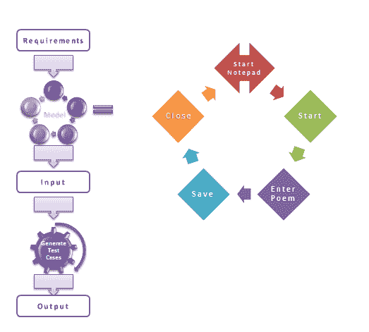
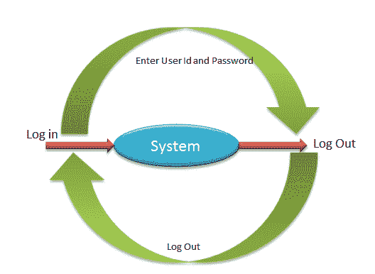
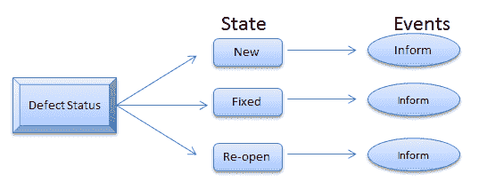
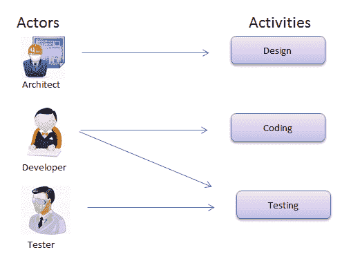
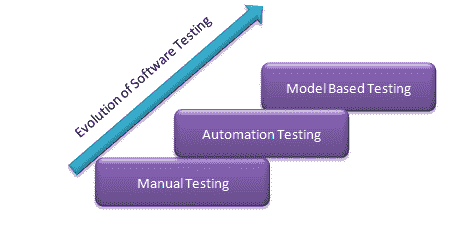

# 基于模型的测试教程：工具&示例

> 原文： [https://www.guru99.com/model-based-testing-tutorial.html](https://www.guru99.com/model-based-testing-tutorial.html)

## 什么是基于模型的测试？

基于模型的测试是一种软件测试技术，其中根据模型做出的预测来检查被测软件的运行时行为。 模型是对系统行为的描述。 行为可以用输入序列，动作，条件，输出以及从输入到输出的数据流来描述。 它在实践上应该是可以理解的并且可以重用； 可共享必须对被测系统有准确的描述。

有许多可用的模型，它描述了系统行为的不同方面。 该模型的示例为：

*   数据流
*   控制流
*   依赖图
*   决策表
*   状态转换机

基于模型的测试描述了系统如何响应动作（由模型确定）。 提供行动，并查看系统是否按照预期做出响应。

它是验证系统的轻量级形式方法。 此测试可以应用于硬件和软件测试。

在本教程中，您将学习

*   [什么是基于模型的测试？](#1)
*   [基于模型的测试示例](#2)
*   [有限状态机](#3)
*   [状态图](#4)
*   [统一建模语言（UML）](#5)
*   [基于模型的测试的挑战](#6)
*   [模型测试的优势](#8)

## 基于模型的测试示例

上面的模型解释了在记事本中写诗的简化方法以及与每个步骤有关的可能动作。 对于每个动作（例如开始，输入诗词，保存），可以生成[测试用例](/test-case.html)，并可以验证输出。

## MBT 的类型：

有两种类型的基于模型的测试框架。

1.  脱机/先验：执行之前生成测试套件。 测试套件不过是测试用例的集合。
2.  在线/即时：在测试执行期间生成测试套件

## 测试中的不同模型：

为了理解 MBT，有必要理解下面解释的一些模型。 让我们一一讲解：

### 有限状态机

该模型可帮助测试人员根据所选输入评估结果。 输入可以有各种组合，从而导致系统处于相应状态。

系统将具有特定状态和当前状态，该状态和当前状态由测试人员提供的一组输入控制。

考虑示例-

有一个系统允许员工登录该应用程序。 现在，员工的当前状态为“出”，一旦登录系统，该状态即为“进入”。 在“处于”状态下，员工可以查看，打印，扫描系统中的文档。

### 状态图

它是有限状态机的扩展，可用于复杂的实时系统。 状态图用于描述系统的各种行为。 它具有一定数量的状态。 系统的行为被分析并以每种状态的事件形式表示。

例如 -

在缺陷管理工具中以“新建”状态引发缺陷。 一旦开发人员对其进行了修复，则必须将其更改为“已修复”状态。 如果未修复缺陷，则将状态更改为“重新打开”。 状态图的设计应使每个状态都需要一个事件。

### 统一建模语言（UML）

**统一建模语言**（[ **UML** ）是一种标准化的通用建模语言。 UML 包含一组图形标记技术来创建可视化模型，这些可视化模型可以描述系统的非常复杂的行为。

UML 具有以下符号：

*   活动项目
*   演员们
*   业务流程
*   组件
*   程式语言

## 基于模型的测试的挑战：

在每个组织中部署 MBT 显然需要大量的投资和精力。 以下是 MBT 在软件工程中的缺点。

*   测试人员必需的技能
*   学习曲线时间会更多
*   难以理解模型本身

## 模型测试的优点：

以下是 MBT 的优点：

*   简单的测试用例/套件维护
*   降低成本
*   改善测试范围
*   可以在 n 台机器上运行不同的测试
*   早期缺陷检测
*   缺陷数量增加
*   节省时间
*   提高测试人员的工作满意度

### 结论

测试人员在测试过程中始终会构建心理模型。 这些心理模型可以转化为纸上模型。 这有助于测试人员获得可读性和可重用性。

基于模型的测试是软件测试的一种新方法。 下面显示了软件测试的演变-

****