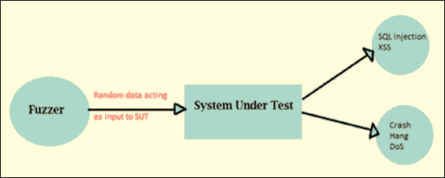

# 模糊测试（模糊）教程：什么是类型，工具&示例

> 原文： [https://www.guru99.com/fuzz-testing.html](https://www.guru99.com/fuzz-testing.html)

## 什么是模糊测试？

**模糊测试（模糊）**是一种软件测试技术，可以将称为 **FUZZ** 的无效或随机数据输入到软件系统中，以发现编码错误和安全漏洞。 使用自动或半自动测试技术输入数据，然后监视系统中的各种异常情况，例如系统崩溃或内置代码失败等。

模糊测试最初是由威斯康星大学的 Barton Miller 于 1989 年开发的。模糊测试或模糊测试是一种软件测试技术，它是**安全测试**的一种。

## 为什么要进行模糊测试？

*   通常，模糊测试会发现最严重的安全性故障或缺陷。
*   与[黑盒测试](/black-box-testing.html)，Beta 测试和其他调试方法结合使用时，模糊测试可提供更有效的结果。
*   模糊测试用于检查软件的漏洞。 这是非常经济高效的测试技术。
*   模糊测试是黑盒测试技术之一。 模糊检测是黑客用来发现系统漏洞的最常用方法之一。

## 如何进行模糊测试

模糊测试的步骤包括基本测试步骤-

**步骤 1）**识别目标系统

**步骤 2）**识别输入

**步骤 3）**生成模糊数据

**步骤 4）**使用模糊数据执行测试

**步骤 5）**监视系统行为

**步骤 6）**日志缺陷

## 模糊器示例

*   **基于变异的模糊器**更改现有数据样本以创建新的测试数据。 这是一种非常简单明了的方法，从有效的协议样本开始，并不断处理每个字节或文件。

*   **基于生成的模糊器**根据模型的输入定义新数据。 它开始根据规范从头开始生成输入。

*   **基于协议的模糊器**，最成功的模糊器是要详细了解要测试的协议格式。 理解取决于规格。 它涉及将规范的数组写入工具，然后使用基于模型的测试生成技术遍历该规范，并在数据内容，序列等中添加不规则性。这也称为语法测试，语法测试，鲁棒性测试， Fuzzer 可以从现有的测试用例中生成测试用例，也可以使用有效或无效的输入。

基于协议的模糊测试有两个限制：

1.  在规范成熟之前，无法进行测试。
2.  许多有用的协议是已发布协议的扩展。 如果模糊测试基于已发布的规范，则新协议的[测试范围](/test-coverage-in-software-testing.html)将受到限制。

模糊化技术的最简单形式是将随机输入作为协议包或事件发送到软件。 这种传递随机输入的技术非常强大，可以发现许多应用程序和服务中的错误。 还可以使用其他技术，并且很容易实现。 为了实现这些技术，我们只需要更改现有输入即可。 我们可以通过交换输入的位来更改输入。

## 模糊测试检测到的错误类型

*   **断言失败和内存泄漏**此方法广泛用于漏洞影响内存安全的大型应用程序，这是一个严重的漏洞。

*   **Invalid input**

    在模糊测试中，模糊器用于生成无效输入，该无效输入用于测试错误处理例程，这对于不控制其输入的软件很重要。 简单的模糊测试可以称为自动执行否定测试的方法。

*   **Correctness bugs**

    模糊测试还可以用于检测某些类型的“正确性”错误。 例如数据库损坏，搜索结果不佳等。

    ## 模糊测试工具

    网络安全中使用的工具可以广泛用于模糊测试中，例如 Burp Suite，Peach Fuzzer 等。

*   [Peach Fuzzer](https://www.peach.tech/products/peach-fuzzer/)

    Peach Fuzzer 比扫描仪具有更强大的功能和安全性。 其他测试工具只能搜索已知线程，而 Peach Fuzzer 使用户可以查找已知和未知线程。

*   **Spike Proxy**

    它是一种专业级的工具，用于查找 Web 应用程序中的应用程序级漏洞。 SPIKE Proxy 涵盖了 [SQL](/sql.html) 注入和跨站点脚本等基础知识，但它是完全开放的 [Python](/python-tutorials.html) 基础结构。 SPIKE 代理可用于 [Linux](/unix-linux-tutorial.html) 和 Windows。

*   [Webscarab](https://www.owasp.org/index.php/Category:OWASP_WebScarab_Project)

    Webscarab 用 [Java](/java-tutorial.html) 编写，因此可移植到许多平台。 为了分析应用程序，使用了 Webscarab 框架，该框架使用 HTTP 和 HTTPS 协议进行通信。

    **例如：** Webscarab 充当拦截代理，它允许操作员在服务器接收到浏览器创建的请求之前对其进行查看和修改。 并允许在浏览器收到之前检查和更新服务器生成的响应。 这样，如果网络圣甲虫发现任何漏洞，它将列出报告的问题。

*   [OWASP WSFuzzer](https://www.owasp.org/index.php/Category:OWASP_WSFuzzer_Project)

    WSFuzzer 是用 Python 编写的 GPL 程序。 GPL 目前已针对 Web 服务开发了一个程序。 在 OWASPWSFuzzer 的当前版本中，基于 HTTP 的 SOAP 服务是主要目标。

## 模糊测试的优点

*   模糊测试改进了软件[安全测试](/what-is-security-testing.html)。
*   在模糊测试中发现的错误有时很严重，并且大多数时候黑客都在使用它，包括崩溃，内存泄漏，未处理的异常等。
*   如果由于时间和资源的限制而导致测试人员无法发现任何错误，那么这些错误也可以在 Fuzz 测试中找到。

## 模糊测试的缺点

*   单独的模糊测试无法提供整体安全威胁或错误的完整描述。
*   模糊测试在处理不会导致程序崩溃的安全威胁（例如某些病毒，蠕虫，特洛伊木马程序等）时效率较低。
*   模糊测试只能检测简单的故障或威胁。
*   要有效执行，将需要大量时间。
*   用随机输入设置边界值条件非常成问题，但现在使用基于用户输入的确定性算法，大多数测试人员都可以解决此问题。

**摘要：**

在软件工程中，模糊测试显示应用程序中是否存在错误。 模糊测试不能保证在应用程序中完全检测到错误。 但是，通过使用 Fuzz 技术，它可以确保应用程序健壮且安全，因为该技术有助于暴露大多数常见漏洞。

***本文由 Priyanka Kothe 提供***