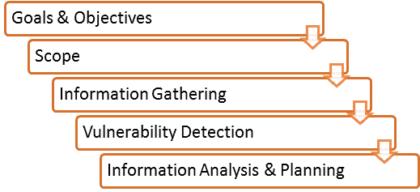

# 什么是漏洞评估？ 测试过程，VAPT 扫描工具

> 原文： [https://www.guru99.com/vulnerability-assessment-testing-analysis.html](https://www.guru99.com/vulnerability-assessment-testing-analysis.html)

## 什么是漏洞评估？

**漏洞评估**是评估软件系统中的安全风险以减少威胁可能性的过程。 也称为漏洞测试。

漏洞是指系统安全性程序，设计，实施或任何内部控制中的任何错误或弱点，可能导致违反系统安全性策略的行为。 漏洞评估的**目的**是为了减少入侵者（黑客）获得未经授权的访问的可能性。 漏洞分析取决于两个机制，即漏洞评估和渗透测试（VAPT）。

在本教程中，您将学习-

*   [什么是漏洞评估](#1)
*   [为什么进行漏洞评估](#10)
*   [漏洞评估和渗透测试（VAPT）流程](#2)
*   [如何进行漏洞测试](#3)
*   [漏洞扫描程序的类型](#4)
*   [漏洞扫描工具](#5)
*   [漏洞评估的优势](#6)
*   [漏洞评估的缺点](#7)
*   [漏洞评估和渗透测试的比较](#8)
*   [漏洞测试方法](#9)

## 为什么进行漏洞评估

*   这对于组织的安全很重要。
*   查找和报告漏洞的过程，该方法提供了一种方法，可以通过在某人或某人可以利用它们之前对漏洞进行排名来检测和解决安全问题。
*   在此过程中，将对操作系统，应用程序软件和网络进行扫描，以识别漏洞的发生，其中包括不适当的软件设计，不安全的身份验证等。

## 漏洞评估和渗透测试（VAPT）流程

1\. **目标&目标：-**定义漏洞分析的目的和目标

2\. **范围**：-在执行评估和测试时，需要明确定义分配范围。

以下是存在的三个可能的范围：

*   [黑盒测试](/black-box-testing.html)：-从外部网络进行测试，而无需事先了解内部网络和系统。
*   灰盒测试：-在了解内部网络和系统的情况下，从外部或内部网络进行测试。 它是黑盒测试和白盒测试的结合。
*   [白盒测试](/white-box-testing.html)：-使用内部网络和系统的知识在内部网络中进行测试。 也称为内部测试。

3\. **信息收集**：-获得有关 IT 环境的尽可能多的信息，例如网络，IP 地址，操作系统版本等。它适用于所有三种类型的范围，例如黑盒测试，灰盒测试 和白盒测试

4\. **漏洞检测**：-在此过程中，使用了漏洞扫描程序，它将扫描 IT 环境并识别漏洞。

5\. **信息分析和计划**：-将分析已发现的漏洞，以制定渗透到网络和系统的计划。

## 如何进行漏洞测试

以下是逐步进行的漏洞评估方法/技术

**步骤 1）设置：**

*   开始文档
*   安全权限
*   更新工具
*   配置工具

**步骤 2）测试执行：**

*   运行工具
*   运行捕获的数据包（数据包是在起点和目的地之间路由的数据单位。当发送任何文件，例如电子邮件，HTML 文件，统一资源定位符（URL）请求等时 从 Internet 上的一个地方到另一个地方，TCP / IP 的 TCP 层将文件划分为多个“块”以进行有效的路由，并且这些块中的每一个都将进行唯一编号，并将包含目标的 Internet 地址。 块称为数据包，当它们全部到达时，它们将在接收端由 TCP 层重新组装到原始文件中，同时运行评估工具。

**步骤 3）漏洞分析：**

*   定义和分类网络或系统资源。
*   为资源分配优先级（例如：-高，中，低）
*   识别对每种资源的潜在威胁。
*   首先制定应对最优先问题的策略。
*   定义和实施方法，以使发生攻击时的后果最小化。

**步骤 4）报告**

**步骤 5）补救措施：**

*   修复漏洞的过程。
*   对于每个漏洞

## 漏洞扫描程序的类型

1.  **基于主机的**

*   识别主机或系统中的问题。
*   该过程是通过使用基于主机的扫描程序进行的，并诊断漏洞。
*   基于主机的工具会将中介程序软件加载到目标系统上。 它将跟踪事件并将其报告给安全分析师。

2.  **基于网络的**

*   它将检测打开的端口，并识别在这些端口上运行的未知服务。 然后它将公开与这些服务相关的可能漏洞。
*   通过使用基于网络的扫描仪可以完成此过程。

3.  **基于数据库的**

*   它将使用防止 SQL 注入的工具和技术识别数据库系统中的安全隐患。 （SQL 注入：-恶意用户将 SQL 语句注入数据库，这可以从数据库中读取敏感数据并可以更新数据库中的数据。）

## 漏洞扫描工具

| **类别** | **工具** | **说明** |
| 基于主机 | 州 | 扫描网络中的多个系统。 |
|   | 塔拉 | 老虎分析研究助理。 |
|   | 该隐&亚伯 | 通过嗅探网络，破解 HTTP 密码来恢复密码。 |
|   | Metasploit | 用于开发，测试和利用代码的开源平台。 |
| 基于网络 | 思科安全扫描仪 | 诊断和修复安全问题。 |
|   | Wireshark | 适用于 Linux 和 Windows 的开源网络协议分析器。 |
|   | 地图 | 免费的开源实用程序，用于安全审核。 |
|   | Nessus | 无代理审核，报告和补丁管理集成。 |
| 基于数据库 | SQL 节食 | 用于 SQL Server 的 Dictionary Attack 工具门。 |
|   | 安全审核员 | 使用户能够在 OS 上进行枚举，扫描，审核和渗透测试以及取证。 |
|   | 数据库扫描 | 检测数据库木马，通过基线扫描检测隐藏的木马。 |

## 漏洞评估的优势

*   提供了开源工具。
*   识别几乎所有漏洞
*   自动进行扫描。
*   易于定期运行。

## 漏洞评估的缺点

*   假阳性率高
*   可以通过入侵检测系统防火墙轻松检测。
*   通常不会注意到最新的漏洞。

### 漏洞评估和渗透测试的比较

|   | **漏洞评估** | **渗透测试** |
| **工作中** | 发现漏洞 | 识别和利用漏洞 |
| **机制** | 发现&扫描 | 模拟 |
| **焦点** | 深度广度 | 深度超过广度 |
| **完整范围** | 高 | 低 |
| **费用** | 中低 | High |
| **由**执行 | 内部员工 | 攻击者或笔测试器 |
| **测试员知识** | High | Low |
| **多久运行一次** | 装入每个设备之后 | 一年一次 |
| **结果** | 提供有关漏洞的部分详细信息 | 提供漏洞的完整详细信息 |

## 漏洞测试方法

**主动测试**

*   非活动测试，测试人员介绍新的测试数据并分析结果。

*   在测试过程中，测试人员会创建一个过程的思维模型，并且在与被测软件进行交互时，它将进一步发展。
*   在进行测试时，测试人员将积极参与发现新测试用例和新想法的过程。 这就是为什么它被称为主动测试。

**被动测试**

*   被动测试，在不引入新测试用例或数据的情况下监视正在测试的软件的结果

**网络测试**

*   网络测试是测量和记录一段时间内网络运行状态的过程。
*   测试主要是为了预测网络在负载下的运行情况或发现由新服务造成的问题。
*   我们需要测试以下网络特征：

*   利用率水平
*   用户数
*   应用利用

**分布式测试**

*   分布式测试适用于测试分布式应用程序，即同时与多个客户端一起使用的应用程序。 基本上，测试分布式应用程序意味着分别测试其客户端和服务器部分，但是通过使用分布式测试方法，我们可以一起测试它们。
*   在测试运行期间，测试部件将相互影响。 这使它们以适当的方式同步。 同步是分布式测试中最关键的点之一。

**结论**

在软件工程中，漏洞测试取决于两种机制，即漏洞评估和渗透测试。 这两种测试在强度和执行的任务上彼此不同。 但是，为了获得有关漏洞测试的全面报告，建议将这两个过程结合起来使用。

***本文由 Syamini Sreedharan*** 贡献