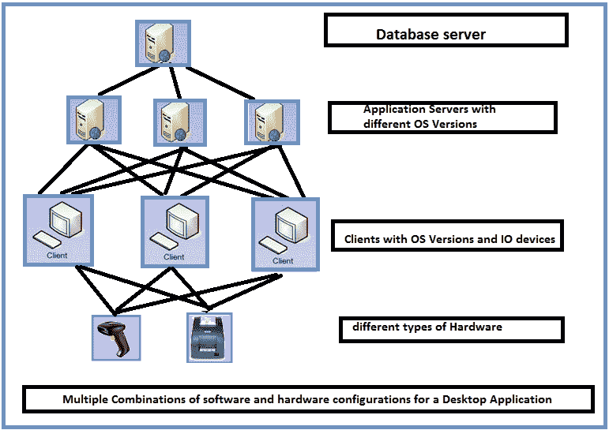
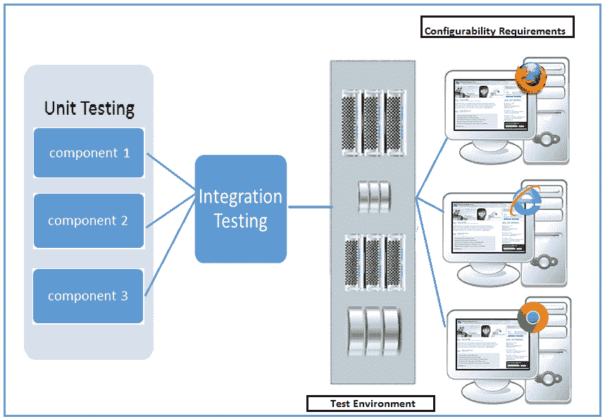

# 什么是配置测试？ 示例测试用例

> 原文： [https://www.guru99.com/configuration-testing.html](https://www.guru99.com/configuration-testing.html)

### 什么是配置测试？

配置测试被定义​​为一种软件测试类型，它通过软件和硬件的多种组合来检查应用程序，以找出系统可以正常运行的最佳配置，而不会出现任何缺陷或错误。

如上所述，配置测试是一种软件测试，其中必须使用软件和硬件的多种组合来测试被测应用程序。

在本教程中，您将学习-

*   [什么是配置测试？](#1)
*   [配置测试示例](#2)
*   [配置测试的先决条件](#3)
*   [配置测试的目标](#4)
*   [如何进行配置测试](#5)
*   [示例测试用例](#6)

## 配置测试示例

让我们通过一个桌面应用程序的例子来理解这一点：

通常，桌面应用程序将是 2 层或 3 层，这里我们将考虑使用 [Asp.Net](/asp-net-tutorial.html) 开发的 3 层桌面应用程序，它由客户端，业务逻辑服务器和数据库服务器组成，每个组件均支持 下面提到的平台。

*   客户端平台-Windows XP，Window7 OS，Windows 8 OS 等
*   服务器平台-Windows Server 2008 R2，Windows Server 2008 R2，Windows Server 2012R2
*   数据库–SQL Sever 2008， [SQL](/sql.html) Server 2008R2，SQL Server 2012 等。

测试人员必须使用上述平台和数据库版本的组合来测试客户端，服务器和数据库的组合，以确保应用程序正常运行且不会失败。

配置测试不仅限于软件，还适用于硬件，这就是为什么它也称为硬件配置测试，在这里我们测试支持支持被测应用程序的不同硬件设备，例如打印机，扫描仪，网络摄像头等。

## 配置测试的先决条件

对于任何配置测试开始之前的项目，我们必须遵循一些先决条件

*   创建由软件和硬件配置的各种组合组成的矩阵
*   优先配置，因为很难测试所有配置
*   根据优先级测试每个配置。

## 配置测试的目标

配置测试的目标是

*   验证应用程序以确定它是否满足可配置性要求
*   手动导致故障，有助于识别在测试过程中未有效发现的缺陷（例如：更改系统的区域设置，例如时区，语言，日期时间格式等）
*   确定被测应用程序的最佳配置。
*   通过添加或修改硬件资源（例如负载均衡器），增加或减少内存大小，连接各种打印机型号等来分析系统性能。
*   根据优先级分析系统效率，以可用资源实现最佳系统配置的测试效率如何。
*   Verification of the system in a geographically distributed Environment to verify how effectively the system performs.

    对于位于不同位置的 Ex：服务器和不同位置的客户端，无论系统设置如何，系统都可以正常运行。

*   验证与配置更改无关的 bug 的再现性。
*   通过适当地记录和维护易于识别的版本，确保应用程序项目的可追溯性。
*   验证整个软件开发生命周期中应用程序项目的可管理性。

## 如何进行配置测试

在本节中，我们将讨论配置测试类型需要遵循的策略，并且有两种类型的配置测试，如下所述

*   软件配置测试
*   硬件配置测试

**软件配置测试**

软件配置测试正在使用多个操作系统，不同的软件更新等来测试被测应用程序。软件配置测试非常耗时，因为安装和卸载用于测试的不同软件会花费一些时间。

测试软件配置的方法之一是在虚拟机上进行测试。 虚拟机是一种安装在软件上的环境，其作用类似于物理硬件，用户将拥有与物理机相同的感觉。 虚拟机模拟实时配置。

与其在多个物理机上安装和卸载该软件比较费时，不如在虚拟机上安装应用程序/软件并继续进行测试，总是更好。 可以通过拥有多个虚拟机来执行此过程，从而简化了测试人员的工作

软件配置测试通常可以在以下时间开始

*   指定了要测试的可配置性要求
*   测试环境已准备就绪
*   测试团队在配置测试方面训练有素
*   已发布的内部版本已通过单元和集成测试

用于测试软件配置测试的典型[测试策略](/how-to-create-test-strategy-document.html)是跨多个软件配置运行功能测试套件，以验证被测应用程序是否按预期运行，没有任何缺陷或错误。

另一种策略是通过手动使测试用例失败并验证效率来确保系统正常运行。

**示例：**

假设有一个银行应用程序，当该应用程序托管在存在所有前提条件的环境中时，必须对它在多个浏览器之间的兼容性进行测试，它可能会通过该单元，并且在测试实验室中通过了[集成测试](/integration-testing.html) 。

但是，如果在客户端安装了相同的应用程序，并且计算机缺少某些软件的更新或应用程序直接或间接依赖的版本，则该应用程序可能会失败。 为了避免这种情况，总是建议通过删除一些可配置性要求来手动使测试失败，然后继续进行测试。

**硬件配置测试**

硬件配置测试通常在实验室中进行，我们在实验室中找到连接了不同硬件的物理机。

每当发布内部版本时，都必须在连接硬件的所有物理计算机上安装软件，并且必须在每台计算机上运行测试套件，以确保应用程序正常运行。

为了执行上述任务，需要大量的工作来在每台机器上安装软件，连接硬件并手动运行，或者甚至自动化上述过程并运行测试套件。

另外，在执行硬件配置测试时，我们指定了要测试的硬件类型，并且有很多计算机硬件和外围设备使其完全无法运行。 因此，分析用户最常使用的硬件并尝试根据优先级进行测试成为测试人员的责任。

## 样本测试用例

考虑一个银行业务场景来测试硬件兼容性。 连接到点钞机的银行应用程序必须使用不同的模型进行测试，例如劳力士，斯特罗布，麦克赛尔，斯托克等。

让我们以一些示例测试用例来测试点钞机

*   未安装前提条件时验证应用程序与 Rolex 模型的连接
*   安装必备组件后，验证应用程序与 Rolex 模型的连接
*   验证系统是否正确计数钞票
*   验证系统是否正确计数了钞票
*   验证被篡改的笔记
*   验证响应时间
*   验证是否检测到伪钞等

以上测试用例仅适用于一个模型，必须通过在测试实验室中设置它们来对市场上所有可用模型进行测试，而这很困难。 因此，建议将硬件配置测试外包给专业的组织。

**摘要：**

在软件工程中，应该像其他测试类型一样，给予配置测试同等的重视。 如果不执行配置测试，将难以分析最佳系统性能，并且软件可能会遇到应该在其上运行的兼容性问题。