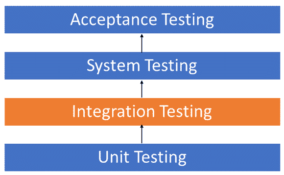
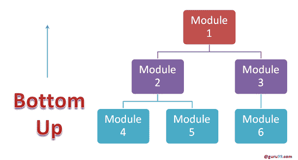
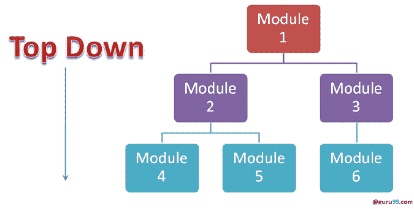
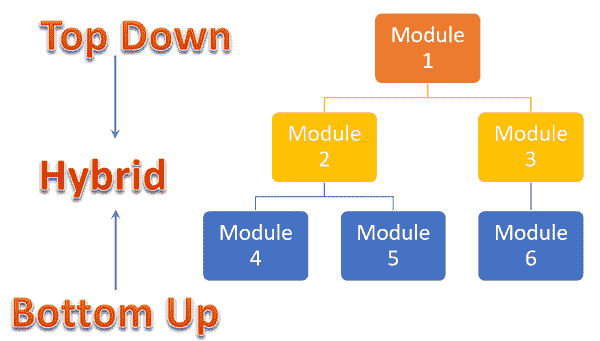

# 集成测试：什么是类型，自上而下&自下而上的示例

> 原文： [https://www.guru99.com/integration-testing.html](https://www.guru99.com/integration-testing.html)

## 什么是集成测试？

**集成测试**被定义为一种测试类型，其中软件模块被逻辑集成并作为一组进行测试。 一个典型的软件项目由多个软件模块组成，并由不同的程序员进行编码。 此测试级别的目的是在集成这些软件模块时揭示它们之间交互中的缺陷。

集成测试专注于检查这些模块之间的数据通信。 因此，它也被称为**'I & T'**（集成和测试），**'字符串测试'**，有时也称为**'线程测试'**。

*   [什么是集成测试？](#1)
*   [为什么要进行集成测试？](#2)
*   [集成测试用例](#3)的示例
*   [集成测试的方法，策略和方法](#4)
*   [大爆炸方法：](#5)
*   [增量方法](#6)
*   [什么是存根和驱动程序？](#7)
*   [自下而上的集成](#8)
*   [自上而下的集成：](#9)
*   [混合/三明治集成](#10)
*   [如何进行集成测试？](#11)
*   [集成测试计划的简要说明：](#12)
*   [集成测试的进入和退出条件](#13)
*   [集成测试的最佳做法/准则](#14)

## 为什么要进行集成测试？

尽管每个软件模块都经过了单元测试，但是由于各种原因，缺陷仍然存在，例如

*   通常，模块是由单个软件开发人员设计的，他们的理解和编程逻辑可能与其他程序员不同。 必须进行集成测试，以验证软件模块可以统一工作
*   在模块开发时，客户有很大的机会改变需求。 这些新要求可能未经过单元测试，因此有必要进行系统集成测试。
*   软件模块与数据库的接口可能是错误的
*   外部硬件接口（如果有）可能是错误的
*   异常处理不充分可能会导致问题。

## 集成测试用例的示例

集成[测试用例](/test-case.html)与其他测试用例的不同之处在于**主要关注模块**之间数据/信息的接口&。 在此，将优先考虑**集成链接**，而不是已测试的单元功能。

以下场景的集成测试案例示例：应用程序具有 3 个模块，分别是“登录页面”，“邮箱”和“删除电子邮件”，并且每个模块都在逻辑上进行了集成。

这里不必过多地关注登录页面测试，因为它已经在[单元测试](/unit-testing-guide.html)中完成。 但是，请检查它如何链接到“邮箱页面”。

同样的邮箱：检查其与“删除邮件”模块的集成。

| **测试用例 ID** | **测试用例目标** | **测试用例描述** | **预期结果** |
| --- | --- | --- | --- |
| **1** | 检查“登录”和“邮箱”模块之间的接口链接 | 输入登录凭据，然后单击“登录”按钮 | 定向到邮箱 |
| **2** | 检查邮箱和删除邮件模块之间的接口链接 | 从邮箱中选择电子邮件，然后单击删除按钮 | 所选电子邮件应显示在“已删除/已删除邮件”文件夹中 |

## 集成测试的方法，策略，方法论

软件工程定义了执行集成测试的各种策略。

*   大爆炸法：
*   增量方法：进一步分为以下几种
    *   自上而下的方法
    *   自下而上的方法
    *   三明治方法-自上而下和自下而上的组合

以下是不同的策略，执行方式以及其局限性和优势。

## 大爆炸法：

在这里，所有组件一次都在集成到**，然后进行测试。**

**优势：**

*   适用于小型系统。

**缺点：**

*   故障定位很困难。
*   考虑到采用这种方法需要测试的接口数量众多，很容易会漏掉一些要测试的接口链接。
*   由于集成测试只能在设计完“所有”模块之后才能开始，因此测试团队在测试阶段的执行时间将减少。
*   由于所有模块都必须立即进行测试，因此高风险关键模块不会被隔离并优先进行测试。 处理用户界面的外围模块也不是隔离的，并且不会进行优先级测试。

## 增量方法

在这种方法中，通过将逻辑上相关的 ***和*** 的两个或多个模块结合在一起来进行测试。 然后添加其他相关模块并测试其功能是否正常。 该过程一直持续到所有模块都已成功加入并测试为止。

增量方法又通过两种不同的方法执行：

*   自下而上
*   自顶向下

## 什么是存根和驱动程序？

增量方法是通过使用称为**存根和驱动程序**的伪程序执行的。 存根和驱动程序不实现软件模块的整个编程逻辑，而只是模拟与调用模块的数据通信。

**存根**：由被测模块调用。

**驱动程序**：调用要测试的模块。

## 自下而上的整合

在自下而上的策略中，使用较高的模块测试较低级别的每个模块，直到测试完所有模块。 它需要驱动程序的帮助进行测试

**图示**：

**Advantages:**

*   故障定位更容易。
*   不像 Big-bang 方法那样浪费时间等待所有模块的开发

**Disadvantages:**

*   控制应用程序流程的关键模块（在软件体系结构的最高级别）最后经过测试，可能容易出现缺陷。
*   早期的原型是不可能的

## 自顶向下集成：

在从上到下的方法中，测试是按照软件系统的控制流程从上到下进行的。

借助存根进行测试。

**图示：**

**Advantages:**

*   故障定位更容易。
*   有可能获得早期原型。
*   关键模块按优先级进行测试； 可以发现并修复主要的设计缺陷。

**Disadvantages:**

*   需要许多存根。
*   较低级别的模块未充分测试。

## 混合/三明治集成

在三明治/混合策略中，是“自上而下”和“自下而上”方法的组合。 在这里，顶部模块与下部模块一起进行测试，同时下部模块与顶部模块进行集成并进行测试。 此策略利用存根和驱动程序。

## 如何进行集成测试？

集成测试过程，与软件测试策略无关（如上所述）：

1.  准备整合测试计划
2.  设计测试方案，案例和脚本。
3.  执行测试用例，然后报告缺陷。
4.  跟踪&重新测试缺陷。
5.  重复步骤 3 和 4，直到成功完成集成。

## 集成测试计划的简要说明：

它包括以下属性：

*   测试方法/方法（如上所述）。
*   集成测试的范围和超出范围的项目。
*   角色和职责。
*   集成测试的先决条件。
*   测试环境。
*   风险和缓解计划。

## 集成测试的进入和退出条件

任何软件开发模型中集成测试阶段的进入和退出条件

**进入条件：**

*   单元测试的组件/模块
*   修复并关闭了所有高优先级的错误
*   所有要编码的模块都已成功完成并集成。
*   集成测试计划，测试用例，要签署和记录的方案。
*   为集成测试设置必需的[测试环境](/test-environment-software-testing.html)

**退出条件：**

*   成功测试了集成应用程序。
*   已记录的已执行测试用例
*   修复并关闭了所有高优先级的错误
*   要提交的技术文件，然后是发行说明。

## 集成测试的最佳做法/准则

*   首先，确定可以采用的集成[测试策略](/how-to-create-test-strategy-document.html)，然后准备相应的测试用例和测试数据。
*   研究应用程序的体系结构设计，并确定关键模块。 这些需要优先测试。
*   向建筑团队获取接口设计并创建测试用例以详细验证所有接口。 与数据库/外部硬件/软件应用程序的接口必须经过详细测试。
*   在测试用例之后，至关重要的是测试数据。
*   在执行之前，始终准备好模拟数据。 执行测试用例时不要选择测试数据。