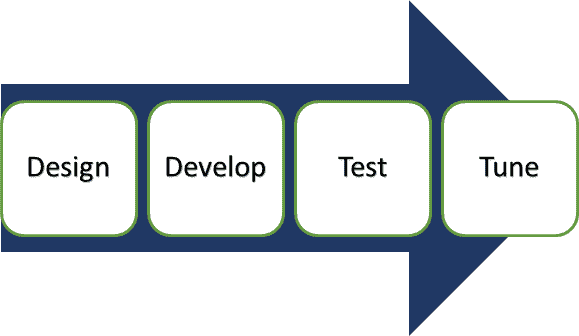

# 应用程序测试教程：什么是工具，如何使用

> 原文： [https://www.guru99.com/application-testing.html](https://www.guru99.com/application-testing.html)

## 什么是应用程序测试？

应用程序测试被定义​​为一种软件测试类型，通过脚本执行，目的是发现软件中的错误。 它处理整个应用程序的测试。

它有助于提高应用程序的质量，同时降低成本，最大化 ROI 和节省开发时间。

在软件工程中，可以按各种类别进行应用程序测试，例如 GUI，功能，数据库（后端），负载测试等。

对于应用程序测试，测试生命周期涉及多个阶段，包括需求分析，测试计划，测试分析，测试设计，测试执行&错误报告等。

在本教程中，您将学习-

*   [应用测试方法](#2)
*   [应用测试的测试计划](#3)
*   [应用测试工具](#4)
*   [测试应用程序测试的最佳做法](#5)
*   [应用测试挑战](#6)
*   [移动应用测试](#7)
*   [用于移动应用程序测试的示例测试用例](#8)
*   [移动测试挑战](#9)

## 如何测试应用程序？

软件应用程序和产品在支持的功能和实现的过程方面有多种变体。 因此，应用程序测试可确保特定程序或应用程序正常运行。

应用程序测试的生命周期涉及四个阶段。

1.  根据应用需求设计测试计划
2.  开发手动测试用例和自动测试脚本
3.  执行功能测试以验证应用程序需求
4.  执行负载测试并调整应用程序性能

应用程序测试分为两个部分。

*   Web 应用测试
*   桌面应用程序测试

| **应用测试** | **测试类型** |
| 

*   Web 应用程序测试

 | 

*   功能和 [性能测试](/performance-testing.html)
*   跨浏览器测试
*   负载和压力测试
*   回归和一致性测试
*   [用户接受度测试](/user-acceptance-testing.html)
*   Beta 测试
*   探索性和烟雾测试
*   多语言支持和兼容性测试

 |
| 

*   桌面应用程序测试

 | 

*   UI 测试
*   可用性测试
*   性能测试
*   兼容性测试 （软件/硬件）
*   功能测试
*   安全测试

 |
| 

*   移动应用测试

 | 

*   UI 测试
*   基于规则的测试
*   [回归测试](/regression-testing.html)
*   功能测试
*   安全测试

 |

## 应用测试方法

测试方法是确保软件应用程序经过完整测试的另一种方法。 杂乱无章的测试方法会导致产品不稳定。

有三种执行测试的方法。

*   黑匣子测试
*   白盒测试
*   灰箱测试

**黑匣子测试**

[黑盒测试](/black-box-testing.html)技术通常用于测试**功能测试，非功能测试，**和回归测试。 在黑匣子测试中，使用的策略是

*   等效类测试
*   边值测试
*   决策表测试
*   状态转换表

**白盒测试**

[白盒测试](/white-box-testing.html)通常用于测试软件代码，以检查内部安全漏洞，断开的或结构不良的路径，条件循环的功能等。在白盒测试中，使用的策略是

*   代码覆盖率分析
*   路径覆盖

**灰盒测试**

此测试技术是黑盒测试和白盒测试的结合。 根据不适当的结构或应用程序使用来确定[缺陷](/defect-management-process.html)。

## 应用测试的测试计划

[测试计划](/what-everybody-ought-to-know-about-test-planing.html)文档是从产品说明，软件需求规范 SRS 或用例文档衍生而来的。 测试的重点是要测试什么，如何测试，何时进行测试以及将由谁进行测试。 测试计划文档用作测试团队和测试经理之间的沟通媒介。

应用程序测试的标准测试计划应定义以下功能；

*   定义测试范围
*   定义测试目标
*   测试活动的方法
*   测试时间表
*   错误跟踪和报告

## 应用测试工具

有多种用于应用程序测试的测试工具。 工具的选择取决于您要执行的测试类型。 对于不同的平台，建议使用不同的工具。 应用程序测试工具可确保各种设备上应用程序的性能，可用性和功能。

这里有几个。

*   [硒](/selenium-tutorial.html)
*   IBM Rational 机器人
*   RFT（理性功能测试仪）
*   [负载运行程序](/loadrunner-v12-tutorials.html)（HP Performance Tester）
*   [Apache Jmeter](/jmeter-tutorials.html)

## 测试应用程序测试的最佳实践

为应用程序测试选择正确的策略是检测应用程序中缺陷的保证方法。 因此，质量检查团队遵循一套标准流程来检测更多的错误并且用更少的时间变得非常重要。

对于应用程序测试，一些最佳实践包括

*   定义功能规格
*   审查与检查
*   正式出入境标准
*   功能测试变体
*   多平台测试
*   自动化测试执行

## 应用测试挑战

在测试应用程序时，测试人员可能会遇到许多挑战

*   仅在用户致电时发现问题
*   无法预期变化的影响
*   无法查看应用程序和操作错误
*   耗时的

## 移动应用测试

与 Web 应用程序测试一样，[移动](/mobile-testing.html)应用程序测试也基于相同的测试策略和方法。 区别可能在于用于测试的工具，一些用于移动应用程序测试的常用工具是 Sikuli，TestComplete，FoneMonkey，Robotium 等。

移动应用程序类型分为三部分

*   Web 应用程序-用户可以通过 Internet 或 Intranet 等网络进行访问
*   本机应用程序-针对特定平台开发，并安装在计算设备上
*   混合应用程序-它结合了 Web 和本地元素。 例如 Facebook。

对于大多数移动平台，您可以使用简单的 CSS，HTML，JS 等。

## 用于移动应用程序测试的示例测试用例

完整的移动测试应用程序策略包括设备和网络基础结构，目标设备的选择以及手动和自动测试工具的有效组合，以涵盖非功能和功能测试。

对于移动应用程序，要测试的是

*   安装
    *   OTA
    *   无线上网
    *   数据线
    *   蓝牙
*   解除安装
*   应用徽标
*   溅
*   记忆不足
*   视觉反馈
*   退出申请
*   启动/重启应用

## 移动测试挑战

随着移动用户和设备数量的增加，测试移动应用程序变得越来越复杂。 测试移动应用程序与基于桌面的 Web 应用程序有很大不同。 移动测试期间面临的常见挑战是

*   全面的测试范围
*   管理碎片（不同的操作系统版本，处理器，内存）
*   缺乏测试计划
*   时间压力
*   缺乏物理设备
*   平台和操作系统的多样性

**结论**

在应用程序测试中，将测试整个应用程序，因为使用了不同的方法，工具和方法。 在上线之前执行应用程序测试对于软件产品的成功至关重要。