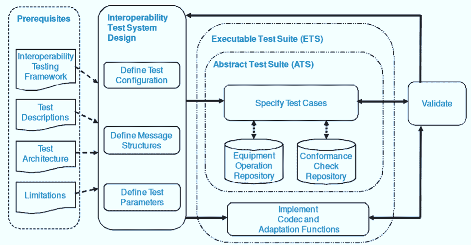

# 什么是软件测试中的互操作性测试？ （带有示例）

> 原文： [https://www.guru99.com/interoperability-testing.html](https://www.guru99.com/interoperability-testing.html)

## 什么是互操作性测试？

**互操作性测试**是一种软件测试类型，用于检查软件是否可以与其他软件组件和系统进行交互。 互操作性测试的目的是确保软件产品能够与其他组件或设备通信而不会出现任何兼容性问题。

换句话说，互操作性测试意味着证明两个通信系统之间的端到端功能符合要求。 例如，在智能手机和平板电脑之间进行了互操作性测试，以检查通过蓝牙进行的数据传输。

在本教程中，您将学习-

*   [什么是互操作性测试？](#1)
*   [不同级别的软件互操作性](#3)
*   [为什么要进行互操作性测试](#4)
*   [如何进行互操作性测试](#5)
*   [互操作性测试的示例测试用例](#6)
*   [互操作性测试的缺点](#7)
*   [互操作性测试与一致性测试](#8)之间的区别

## 不同级别的软件互操作性

有不同级别的互操作性测试，它们是

*   物理互操作性
*   数据类型的互操作性
*   规范级别的互操作性
*   语义互操作性

## 为什么要进行互操作性测试

进行互操作性测试是因为，

*   它确保跨不同供应商的两个或更多产品提供端到端服务
*   该软件产品应该能够与其他组件或设备通信，而不会出现任何兼容性问题

由于缺乏互操作性测试而带来的风险是

*   资料遗失
*   性能不可靠
*   操作不可靠
*   操作错误
*   可维护性低

## 如何进行互操作性测试

互操作性测试的测试过程包括以下步骤

**步骤 1** ：启动项目。

*   定义正式的工作说明书并建立项目管理基础架构。

**步骤 2** ：设置测试实验室

*   确保为测试活动设置了所有必需的技能和自动化工具
*   使用自动化工具最大程度地减少测试用例和重用测试用例
*   维护配置文件数据库
*   记录和分析项目指标
*   记录失败测试中的配置，以供参考和分析

**步骤 3** ：制定测试计划

*   编写[测试计划](/what-everybody-ought-to-know-about-test-planing.html)
*   定义测试用例和程序
*   设置必要的监视设备以维护测试日志。

**步骤 4：**执行测试计划

*   执行测试用例
*   与测试团队合作分析故障的根本原因

**步骤 5** ：文档结果

*   使用测试日志记录实施说明

**步骤 6** ：释放资源并评估项目的性能，

*   借助自动化工具分析测试结果

## 互操作性测试的测试用例示例

互操作性测试的测试策略包括

*   连接来自不同供应商的两个或更多设备
*   检查设备之间的连接
*   检查设备是否可以互相发送/接收数据包或帧
*   检查网络和设施层中的数据处理是否正确
*   检查已实现的算法是否正常工作
*   结果正常：检查下一个结果
*   结果不正确：使用监视工具检测错误源
*   在测试报告工具中报告结果。

## 互操作性测试的缺点

互操作性测试的缺点是

*   确定缺陷的根本原因
*   准确的测量
*   测试的可扩展性
*   网络复杂度
*   测试测试设备
*   记录测试结果和学习
*   要求不足

## 互操作性测试与一致性测试

| 

Interoperability Testing

 | 

Conformance Testing

 |
| 

*   它确保产品或软件可以与其他认证产品互操作，没有任何问题。

 | 

*   确保产品符合要求的标准和规范

 |

**摘要：**

*   软件工程互操作性测试仅是检查软件是否可以与另一个软件组件互操作。
*   它确保软件产品应该能够与其他组件或设备通信而不会出现任何兼容性问题。