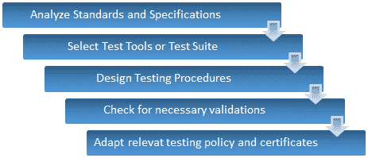
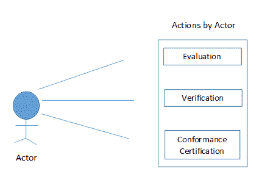
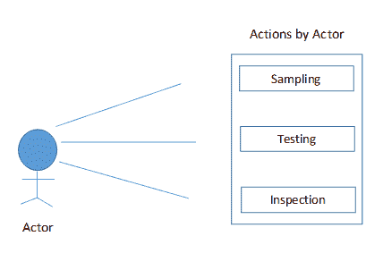
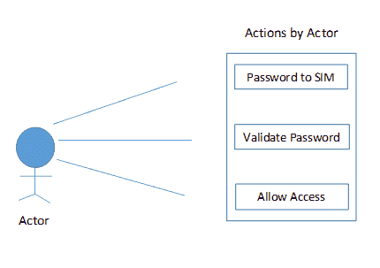
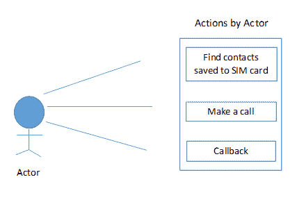

# 一致性测试（一致性测试）-完整指南

> 原文： [https://www.guru99.com/conformance-testing.html](https://www.guru99.com/conformance-testing.html)

## 什么是一致性测试？

**一致性测试**是一种软件测试类型，用于证明软件系统符合 IEEE，W3C 或 ETSI 定义的标准和法规。 一致性测试的目的是确定特定标准的单个实施在多大程度上符合该标准的各个要求。

也称为合规性测试。 它可能涉及某些技术方面，但有意地包括：

*   性能
*   功能
*   坚固性
*   互通性
*   系统行为

在本教程中，您将学习-

*   [什么是一致性测试？](#1)
*   [一致性测试的类型](#2)
*   [为什么我们需要进行一致性测试？](#3)
*   [我们需要测试什么？](#4)
*   [何时以及如何执行一致性测试？](#5)
*   [一致性测试过程/程序：](#6)
*   [一致性测试的优点：](#8)
*   [一致性测试的缺点：](#7)
*   [移动系统一致性测试：](#9)

## 一致性测试的类型

一致性测试可以是逻辑的也可以是物理的，它包括以下类型的测试；

*   符合性测试
*   [负载测试](/load-testing-tutorial.html)
*   [压力测试](/stress-testing-tutorial.html)
*   容量测试

## 为什么需要进行一致性测试？

*   检查系统要求是否满足
*   检查系统文档是否完整有需要
*   根据规格检查开发，设计和评估

## **我们需要测试什么？**

*   实施所依据的标准
*   将要开发的系统的调用
*   规格范围
*   规格目标

符合性测试是由管理层发起的，要完全保证团队及其对标准，规范和程序的理解。

为了构建高效的应用程序，应明确提及标准和规范，以避免产生歧义。 如果不是这样，则一致性测试本身对采取必要步骤使其具有相关性和可靠性非常有用。

## 何时以及如何执行一致性测试？

*   当我们需要检查系统的整体一致性，完整性和正确性时，就要求规格进行一致性测试
*   有几种方法可以执行它，与我们的开发生命周期阶段没有什么不同，例如；
    *   分析需求规格
    *   准备测试计划
    *   准备测试用例及其目的
    *   为准备好的测试设计创建文档
*   我们需要关注规范的其他一些方面，例如子集，这些子集通常是三种类型，例如“配置文件”，“级别”和“模块”。
    *   **配置文件**是规范的子集，其中包括满足要求的系统功能，并且专用于特定的用户组
    *   **级别**是规格的嵌套子集，其中**级别 1** 表示基本规格，**级别 2** 表示级别 1 +其他/新功能
    *   **模块**是显着相关的标准和规格的集合

## **一致性测试流程/程序：**

一致性测试过程与我们经历过的常规测试过程或之前的测试教程非常相似。

让我们快速了解一下其一致性，而不是对一致性测试过程进行理论描述；

借助用例，该过程将更易于理解；

 

上面提到，一致性测试有时称为一致性测试，但仍有一些基本事实使一致性测试不同于一致性测试。

我们将审查两者之间的比较和对比；

| 符合性测试 | 符合性测试 |
| 

*   一致性测试是测试标准

的正式而精确的方法 | 

*   一致性测试是非正式且不太精确的标准测试方法

 |
| 

*   符合性证书仅适用于拥有官方认证机构

的操作系统 | 

*   提供 POSIX（可移植操作系统接口）的单个 API 的操作系统被称为

 |
| 

*   一致性测试用于测试为特定标准

提供全面支持的系统 | 

*   一致性测试用于测试支持某些给定标准

的系统 |

## 一致性测试的优点：

1.  确保规范的正确实施
2.  确保可移植性和互操作性
3.  提供适当的标准利用
4.  确保接口和功能按预期工作
5.  帮助识别与不符合的区域，例如语法和语义。

## 一致性测试的缺点：

与其他类型的测试一样，一致性测试也具有一些很难执行的任务，并且可能会成为一项挑战。 其中一些列在下面；

1.  为了有效地执行一致性测试，它需要确定需要测试的系统类别以及适当的方法
2.  将规范分类为配置文件，级别和模块
3.  预定义值
4.  设计扩展，选项和方法以成功运行测试过程。

**一致性测试：关键视图：**

一致性测试的某些领域需要额外的关注和知识才能成功实施；

1.  最适合的测试方法
2.  选择将自动执行测试过程的测试工具
3.  清楚了解合格测试，该测试仅显示不合格而不是合格
4.  设计和实施一致性测试程序
5.  定义应该如何正式执行
6.  政策法规

## 移动系统一致性测试：

与其他类型的软件测试一样，也可以对[移动](/mobile-testing.html)系统进行一致性测试。 系统组装完成后，将在通过一致性测试部署之前检查其使用情况。

根据诸如 GSM 或 CDMA 的网络类型，进行测试以实现一致性和互操作性。

这些测试可能包括；

*   协议测试
*   安全/ [安全测试](/what-is-security-testing.html)
*   SIM 卡测试
*   射频测试
*   音频测试
*   特定吸收测试

### 示例用例图

以下用例图显示了如何对已部署的移动系统执行一致性测试；

此外，可以通过以下方式分两个阶段对 SIM 卡测试进行详细说明：

1.  **密码验证**

2.  **拨打电话**

系统可能有两种情况，例如

1.呼叫成功

2.呼叫失败

同样，对于协议测试，请考虑以下用例；

遵循**测试用例模板**将帮助您了解我们如何编写用于[协议测试](/protocol-testing.html)的测试用例

| **测试 ID** | **测试场景** | **测试步骤** | **测试数据** | **预期结果** | **实际结果** | **状态** | **备注** |
| PT001 | 协议没有死锁 | 从沟通过程开始 | _ | 应该成功建立沟通 | 通讯建立成功 | 通过 | _ |
| PT002 | “ Ping”命令为超时正确运行 | 在命令提示符下将 Ping 命令输入为“ Ping -w” | Ping 1000 | 应该显示消息“传输成功”。 | 该消息显示“发送成功”。 | Pass | _ |
| PT003 | 数数 “回声”请求 | 在命令提示符下将 Ping 命令输入为“ Ping -n” | Ping 4 | 应该使用 32 个字节的数据开始 ping 0.0.0.4，并且应该显示消息“发送成功”。 | 使用 32 字节数据开始 ping 0.0.0.4，但显示消息“发送失败”。 | 失败 | 语义/功能错误 |
| PT004 | 可以从任何状态到达任何状态 | 从状态退出并返回上一个或下一个 | _ | 应该成功改变状态 | 成功更改状态 | Pass | _ |

这些术语表明，一致性测试对于测试技术标准的实施也很有用。

为了使测试过程具有一致性，正在定义测试用例。 取决于网络的类型，可以定义并执行数百个测试用例，以确保按照需求规格说明移动系统的工作。

**摘要：**

*   一致性测试也称为类型测试，它是一种正式的测试方法
*   用于确定系统是否符合要求规范
*   它包括外观测试，负载测试，体积测试和一致性测试
*   它也被认为是合规性测试，但两者之间存在基本差异
*   一致性测试程序，测试方法和测试工具是一致性测试的一些最关键领域
*   通过软件工程中的一致性测试，可以确保标准利用率和互操作性。
*   一致性测试也针对移动系统执行。

***本文由 Dhanashri Salvi 提供***