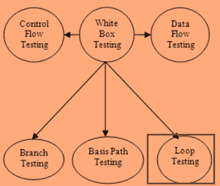
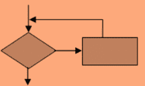
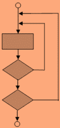
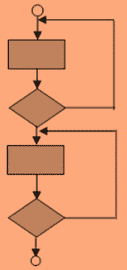
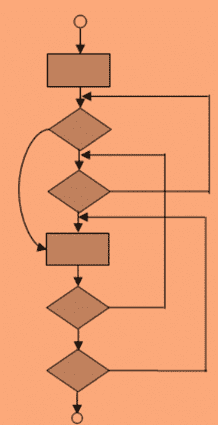

# 什么是循环测试？ 方法论，例子

> 原文： [https://www.guru99.com/loop-testing.html](https://www.guru99.com/loop-testing.html)

### 什么是循环测试？

循环测试定义为一种软件测试类型，它完全专注于循环结构的有效性。 它是控制结构测试（路径测试，数据验证测试，条件测试）的一部分。

循环测试是[白盒测试](/white-box-testing.html)。 此技术用于测试程序中的循环。

## 测试的循环类型

测试的循环类型的示例包括：

*   简单循环
*   嵌套循环
*   级联循环
*   非结构化循环

## 为什么要进行循环测试？

进行循环测试的原因如下：

*   测试可以解决循环重复问题
*   循环测试可以揭示性能/容量瓶颈
*   通过测试循环，可以确定循环中的未初始化变量
*   它有助于识别循环初始化问题。

## 如何进行循环测试：完整的方法

在测试循环时，必须在三个不同级别进行检查：

*   进入循环时
*   在执行过程中
*   离开循环时

所有这些循环的测试策略如下

**简单循环**

通过以下方式测试一个简单的循环：

1.  跳过整个循环
2.  使 1 通过循环
3.  使 2 通过循环
4.  通过循环，其中< b，n 是通过循环的最大次数
5.  设 b，b-1; b + 1 通过循环，其中“ b”是允许通过循环的最大次数。

**嵌套循环**

对于嵌套循环，您需要执行以下步骤。

1.  将所有其他循环设置为最小值，然后从最里面的循环开始
2.  对于最内部的循环，执行简单的循环测试，并将外部循环保持在其最小迭代参数值
3.  对下一个循环执行测试并向外工作。
4.  继续直到测试了最外面的循环。

**级联循环**

在级联循环中，如果两个循环彼此独立，则使用简单循环对其进行测试，或者将其作为嵌套循环进行测试。

但是，如果将一个循环的循环计数器用作其他循环的初始值，则不会将其视为独立循环。

**非结构化循环**

对于非结构化循环，它需要重新设计以反映结构化程序结构的使用。

## 循环测试的局限性

*   循环错误主要出现在底层软件中
*   循环测试期间发现的错误不是很细微
*   操作系统可能会检测到许多错误，因此它们将导致内存边界冲突，可检测的指针错误等。

**摘要**：

*   在软件工程中，循环测试是[白盒测试](/white-box-testing.html)。 此技术用于测试程序中的循环。
*   循环测试可以揭示性能/容量瓶颈
*   循环错误主要出现在底层软件中