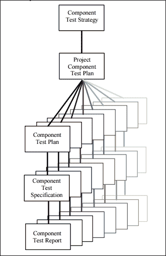
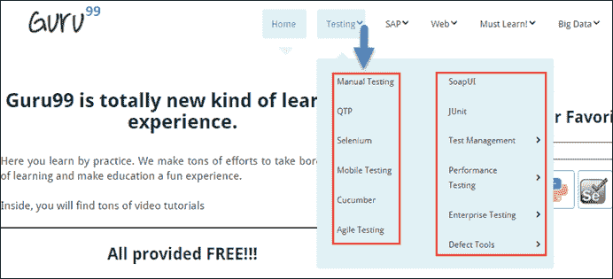
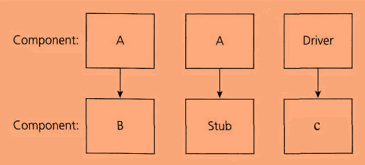
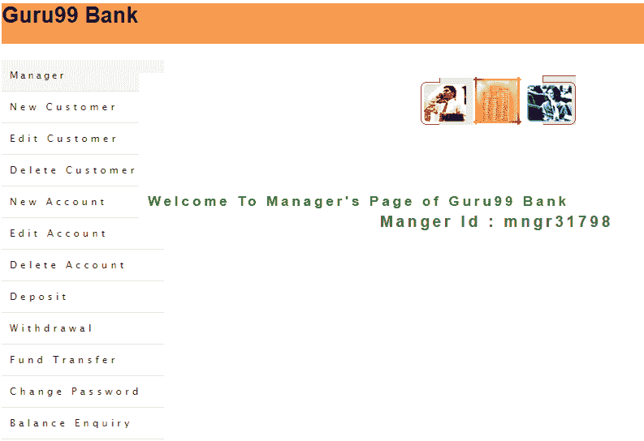

# 什么是组件测试？ 技术，示例测试用例

> 原文： [https://www.guru99.com/component-testing.html](https://www.guru99.com/component-testing.html)

### 什么是组件测试？

组件测试被定义​​为一种软件测试类型，其中在不与其他组件集成的情况下分别对每个单独的组件执行测试。 从体系结构的角度来看，它也称为模块测试。 组件测试也称为单元测试，程序测试或模块测试。

通常，任何软件作为一个整体都由几个组件组成。 组件级测试涉及单独测试这些组件。

这是质量检查小组执行的最常见的黑匣子测试类型之一。

如下图所示，将有一个用于组件测试的测试策略和测试计划。 分别考虑软件或应用程序的每个部分。 对于每个组件，都将定义一个[测试场景](/test-scenario.html)，该场景将进一步分解为一个高级测试用例->具有前提条件的详细测试用例。

术语“ **组件测试**”的用法因域和组织而异。

对组件测试有不同看法的最常见原因是

1.  选择的开发生命周期模型的类型
2.  被测软件或应用程序的复杂性
3.  与软件或应用程序中其他组件是否隔离的测试。

众所周知，软件测试生命周期体系结构包含许多测试工件（在测试活动期间使用的文档）。 在许多测试（工件）中，测试策略&测试策略定义了测试的类型，在给定项目中要执行的测试的深度。

## 谁进行组件测试

组件测试由测试人员执行。 “单元测试”由开发人员执行，他们在其中对单个功能或过程进行测试。 在执行[单元测试](/unit-testing-guide.html)之后，下一个测试是组件测试。 组件测试由测试人员完成。

## 何时执行组件测试

在开发人员完成单元测试并为测试团队发布了内部版本之后不久，便进行了组件测试。 此构建称为 UT 构建（单元测试构建）。 在此阶段测试所有组件的主要功能，

组件测试的输入标准

*   应制定经过测试的&单元中包含的组件的最小数量。

组件测试的退出标准

*   所有组件的功能都应该正常工作。
*   不应存在​​任何“严重”或“高”或“中”严重性级别的&优先级缺陷[缺陷](/defect-management-process.html)日志。

## 组件测试技术

根据测试级别的深度，可以将组件测试分类为

1.  **CTIS-小型组件测试**
2.  **CTIL-大型组件测试**

**CTIS –小型**中的组件测试

组件测试可以在隔离或不隔离被测软件或应用程序中其他组件的情况下进行。 如果是在隔离其他组件的情况下执行的，则将其称为 Small 中的组件测试。

**示例 1：**假设一个网站有 5 个不同的网页，然后分别测试每个网页&并隔离其他组件，这在 Small 中称为组件测试。

**示例 2：**考虑 guru99.com 网站的主页，其中包含许多组件，例如

主页，测试，SAP，Web，必须学习！，大数据，实时项目，博客等。

同样，任何软件都由许多组件组成，并且每个组件都有自己的子组件。 在不考虑与其他组件集成的情况下，分别测试示例 2 中提到的每个模块称为**小组件测试。**

<figure>

 

<figcaption>如何进行组件测试</figcaption>

</figure>

根据下面的快照显示，单击“测试”下拉菜单，然后查看“测试”组件的各种**“子组件”** 。 因此，显示的子组件为[手动测试](/manual-testing.html)，SOAPUI，QTP，JUnit，Selenium，测试管理，Selenium，[移动](/mobile-testing.html)测试等。

**注意：**在下面的快照中以红色突出显示了该子组件。

<figure>

 

<figcaption>如何进行组件测试</figcaption>

</figure>

**CTIS – Component Testing in Small**

在不隔离被测软件或应用程序中其他组件的情况下进行的组件测试称为大型组件测试。

让我们举个例子来更好地理解它。 假设有一个包含三个组件的应用程序，它们分别是**组件 A** ，**组件 B，**和**组件 C** 。

开发人员已经开发了组件 B 并希望对其进行测试。 但是为了**完全**测试组件 B，其功能很少依赖于组件 A，很少依赖于组件 C。

功能流程： **A** -> B-> **C** ，这意味着从两个& C 到 B 都存在依赖关系，根据图表存根**调用函数**，驱动程序是**调用函数**。

但是组件 A 和 C 尚未开发。 在那种情况下，要完全测试组件 B，我们可以根据需要用存根和驱动程序替换组件 A 和组件 C。 因此，基本上，组件 A & C 被存根&驱动程序代替，该存根驱动程序充当虚拟对象，直到它们被实际开发为止。

*   **存根：**从要测试的软件组件中调用存根，如下图所示，组件 A 调用了“存根”。
*   **驱动程序：**驱动程序调用要测试的组件，如下图所示。“组件 B”由驱动程序调用。

## 组件测试的示例测试案例

根据下面提到的图表考虑 2 个网页，在功能上，这两个网页相互关联。

1.  **网页 1 是 demo.guru99.com 的登录页面**

当用户在文本字段中输入有效的用户名和密码并单击“提交”按钮时，该网页将导航到 guru99 演示银行网站的主页。

2.  **网页 2 是 Guru99.com 的主页**

因此，这里的登录页面是一个组件，而主页是另一个组件。 现在，分别测试各个页面的功能称为**组件测试**。

网页 1 上的组件测试方案–

*   输入无效的用户 ID，并验证是否向最终用户显示任何用户友好的警告弹出窗口。
*   输入无效的用户名和密码，然后单击“重置”，并验证是否清除了在文本字段中的用户名和密码中输入的数据。
*   输入有效的用户名和密码，然后单击“登录”按钮。

网页 2 上的组件测试方案–

*   确认主页上是否显示“欢迎使用 guru99 银行的管理员页面”消息。
*   验证网页左侧的所有链接是否都可单击。
*   验证是否在主页中央显示经理 ID。
*   根据图表验证主页上是否存在 3 张不同的图像。

## 单元测试与组件测试

| 

单元测试

 | 

组件测试

 |
| 

*   测试单个程序，以证明程序按照规范执行的模块称为 **单元测试**

 | 

*   分别测试软件的每个对象或部分，或不隔离其他对象称为 **组件测试**

 |
| 

*   已针对设计文件

进行了验证 | 

*   已针对测试要求和用例进行了验证

 |
| 

*   单元测试由开发人员

完成 | 

*   组件测试由测试人员

完成 |
| 

*   首先完成单元测试

 | 

*   在开发人员完成单元测试之后，就完成了组件测试。

 |

**摘要：**

在软件工程中，组件测试在发现错误中起着至关重要的作用。 在我们开始使用[集成测试](/integration-testing.html)之前，始终建议执行组件测试，以确保应用程序的每个组件都有效地工作。

集成测试之后是组件测试。 在某些参考资料中，组件测试也称为模块测试。