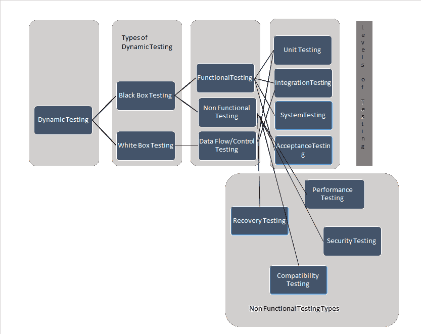
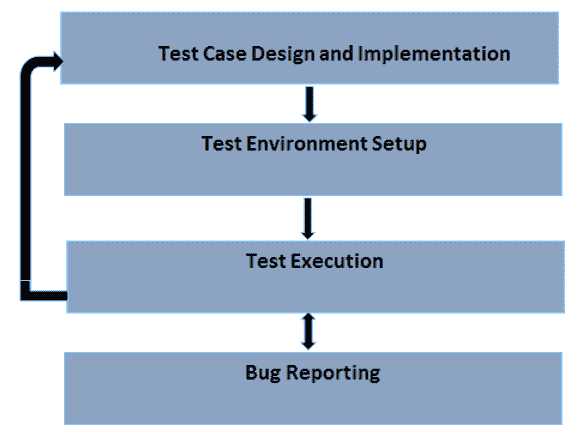

# 什么是动态测试？ 类型，技术&示例

> 原文： [https://www.guru99.com/dynamic-testing.html](https://www.guru99.com/dynamic-testing.html)

## 什么是动态测试？

**动态测试**是一种软件测试类型，用于检查代码的动态行为。 为了检查动态行为，必须执行代码。

我们都知道测试是**验证和确认**，它需要 2 Vs 才能完成测试。 在 2 个 Vs 中，验证称为**静态测试**，另一个称为“ V”，验证称为**动态测试。**

## 动态测试示例

让我们通过一个例子来了解如何进行动态测试：

假设我们正在测试一个登录页面，其中有两个字段，分别是“用户名”和“密码”，并且该用户名仅限字母数字。

当用户输入“ Guru99”作为用户名时，系统接受该名称。 当用户以 Guru99 @ 123 的身份输入时，应用程序将引发错误消息。 此结果表明，代码根据用户输入正在动态运行**。**

动态测试是指通过提供输入并将应用程序的实际行为与预期行为进行比较来使用实际系统时。 换句话说，使用系统来发现错误。

因此，基于以上陈述，我们可以说或得出结论，动态测试是在不同环境下以最终用户身份验证软件应用程序以构建正确软件的过程。

## 动态测试有什么作用？

动态测试的主要目的是确保软件在安装期间和之后都能正常运行，从而确保稳定的应用程序没有任何重大缺陷（之所以声明，是因为没有软件没有错误，测试只能表明存在缺陷，并且 不缺席）

动态测试的主要目的是确保软件的一致性。 让我们用一个例子来讨论。

在银行应用程序中，我们找到不同的屏幕，例如“我的帐户”部分，“资金转账”，“账单支付”等。所有这些屏幕都包含接受某些字符的金额字段。

假设“我的帐户”字段将金额显示为 **25,000** ，将资金转帐显示为 **$ 25,000** ，并将帐单支付屏幕显示为 **$ 25000** ，尽管金额相同，但显示方式 是不一样的，因此使软件不一致。

一致性不仅限于功能，还涉及不同的标准，例如性能，可用性，兼容性等，因此执行动态测试变得非常重要。

## 动态测试的类型

动态测试分为两类

*   白盒测试
*   黑匣子测试

下面的图片表示使我们对动态测试的类型，测试级别等有了一个了解。

**让我们简要讨论每种类型的测试及其预期目的**

**白盒测试**-白盒测试是一种软件测试方法，其中测试人员可以了解其内部结构/设计。 白盒测试的主要目的是根据代码检查系统的性能。 它主要由具有编程知识的开发人员或白盒测试人员执行。

**黑盒测试-**黑盒测试是一种测试方法，其中内部结构/代码/设计不是测试人员已知的**。 该测试的主要目的是验证被测系统的功能，并且这种类型的测试需要执行完整的测试套件，并且主要由测试人员执行，并且不需要任何编程知识。**

**黑匣子**测试再次分为两种类型。

他们是

*   功能测试
*   非功能测试

**功能测试：**

执行功能测试以验证开发的所有功能均符合功能规范，并通过执行 QA 团队编写的功能测试用例执行功能测试。在功能测试阶段，通过提供输入，验证输出和输出来测试系统 比较实际结果与预期结果。

有不同级别的功能测试，其中最重要的是

*   **单元测试** –通常，单元是一小段可测试的代码，[单元测试](/unit-testing-guide.html)在软件的单个单元上执行，并且由开发人员执行
*   **集成测试**-[集成测试](/integration-testing.html)是在单元测试之后执行的测试，通过将所有可测试的单个单元组合在一起来执行，并由开发人员或测试人员执行
*   **系统测试**-[系统测试](/system-testing.html)的执行是为了确保系统是否按照要求执行，并且通常在整个系统就绪时执行，在构建或构建时由测试人员执行 代码已发布给质量检查小组
*   **验收测试**-执行验收测试以验证系统是否满足业务需求，是否可以使用或准备进行部署，并且通常由最终用户执行。

**非功能测试**：非功能测试是一种不专注于功能方面的测试技术，主要集中于系统的非功能属性，例如内存泄漏，系统的性能或稳定性。 非功能测试在所有测试级别上执行。

有许多非功能测试技术，其中最重要的是

*   **性能测试** – [性能测试](/performance-testing.html)用于根据所需网络负载下的要求检查系统的响应时间是否正常。
*   **恢复测试**-恢复测试是一种验证系统从崩溃和硬件故障中恢复的能力的方法。
*   **兼容性测试** – 进行兼容性测试是为了验证系统在不同环境中的行为。
*   **安全测试** – 执行安全测试以验证应用程序的健壮性，即，确保仅授权用户/角色正在访问系统
*   **可用性测试** – 可用性测试是一种验证最终用户对系统的可用性以验证用户对系统的舒适度的方法。

## 动态测试技术

我们都知道 [STLC](/software-testing-life-cycle.html) 是一个包含不同任务的过程，例如需求分析，测试计划，测试用例设计，环境设置，测试执行和测试关闭。

在 STLC 中，我们可以说动态测试过程从测试用例设计开始，让我们详细讨论每个活动。

在进入过程之前，让我们讨论动态测试需要遵循的策略。

测试策略应主要关注可用资源和时间表。 基于这些因素，必须记录测试的目的，测试的范围，测试的阶段或周期，环境的类型，可能面临的假设或挑战，风险等。

一旦定义了策略并为管理层所接受，则开始进行实际的流程测试用例设计

**什么是测试设计和实现**

在这一阶段，我们确定

*   要测试的功能
*   得出测试条件
*   推导承保范围
*   导出测试用例

测试环境设置

我们必须确保测试环境应始终与生产环境相似，在这一阶段，我们必须安装构建并管理测试机器。

**测试执行**

在此阶段，测试用例实际上已执行。

**已捕获错误报告**

根据执行情况，如果预期结果与实际结果不相同，则必须将测试用例标记为失败，并记录错误。

## 动态测试的优势

*   动态测试可以发现发现的缺陷，这些缺陷被认为太难或太复杂，并且无法通过静态分析来覆盖
*   在动态测试中，我们端到端地执行该软件，以确保无错误的软件，从而提高了产品和项目的质量。
*   动态测试成为检测任何安全威胁的重要工具

## 动态测试的缺点

*   动态测试是耗时的，因为它执行需要大量资源的应用程序/软件或代码
*   动态测试增加了项目/产品的成本，因为它不能在软件生命周期的早期开始，因此在后期解决的任何问题都可能导致成本增加。

**结论：**

在软件工程中，验证和确认是用于检查软件产品是否符合要求规格的两种措施。 静态测试涉及验证，而动态测试涉及验证。 他们共同帮助交付了具有成本效益的质量软件。

***本文由 Radhika Renamala 提供***