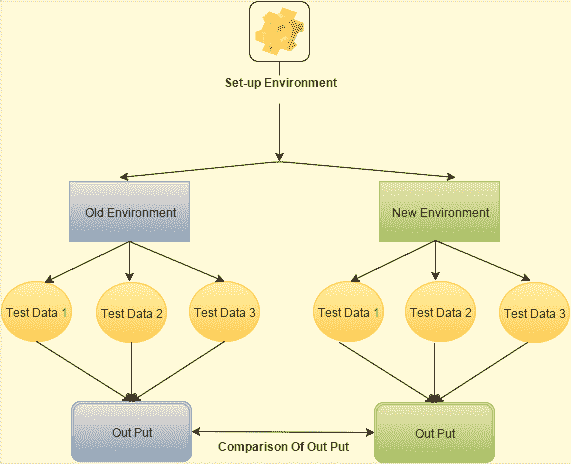
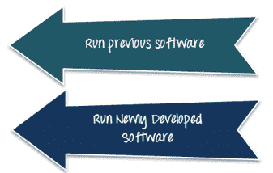

# 什么是并行测试？ 定义，方法，实例

> 原文： [https://www.guru99.com/parallel-testing.html](https://www.guru99.com/parallel-testing.html)

## 什么是并行测试？

**并行测试**是一种软件测试类型，可以同时检查多个应用程序或一个应用程序的子组件，以减少测试执行时间。

在并行测试中，测试人员使用相同的输入同时运行两个不同版本的软件。 目的是找出旧系统和新系统是相同还是不同。 它确保新系统具有足够的能力来有效运行软件。

下图演示了并行测试。

### 并行测试示例

当任何组织从旧系统迁移到新系统时，旧数据都是重要的部分。 传输此数据是一个复杂的过程。

在软件测试中，通过“并行测试”来验证新开发的系统与旧系统的兼容性。

## 为什么要进行并行测试

出于以下原因进行了并行测试，

*   确保新版本的应用程序正常运行
*   确保新版本和旧版本之间的一致性相同
*   检查两个版本之间的数据格式是否已更改
*   检查新应用程序的完整性

例如，当前用户正在使用应用程序的 1.0 版本，从三月份开始，用户将使用应用程序的另一个版本，例如 1.1 版本。

在这种情况下，测试人员需要进行并行测试，以评估数据迁移是否成功完成。 还要检查新版本中的更改是否不影响系统功能。 测试人员必须验证更改是否正确执行，并且用户已根据要求获得所需的输出。

## 何时进行并行测试

并行测试可以在以下情况下广泛使用

*   公司从旧系统迁移到新系统
*   在两个系统上执行同步时
*   从一个系统导入到另一个系统的旧数据
*   所有结果都应该更精确地定义。 例如，金融领域或保险领域，其中计算是系统的主要功能。

## 如何进行并行测试：完整方法

为了执行并行测试，您可以简单地创建几个将测试应用程序不同部分的项目（从项目）和一个将运行这些项目的项目（主项目）。

并行测试有两个级别的标准。

1.  **Parallel test entry Criteria**

    并行测试输入标准定义了可以有效执行并行测试之前必须满足的任务。

2.  **Parallel test exit Criteria**

    并行测试退出标准定义了并行测试阶段的成功结论。

在执行并行测试之前，需要满足的前提条件很少。

*   在完成环境设置之前，无法开始并行测试。
*   应先定义所有前提条件和方案
*   旧版数据和新数据必须成功迁移
*   在满足所有退出标准之前，并行测试不会完成

要执行并行测试，应遵循以下步骤

**步骤 1** ：针对新开发的系统运行旧系统

**步骤 2** ：了解两个系统之间的差异

**步骤 3** ：使用相同的输入进行完整的掷掷周期

**步骤 4** ：与旧系统比较，测量新开发系统的输出

**步骤 5** ：报告发现错误的原因

## 并行测试的良好实践

要执行并行测试，这里有一些技巧和窍门，可能有用。

*   **并行测试**中发现的典型错误

内部逻辑已更改

产品流量变更

主要功能主义者被修改

*   **应该需要多少个周期**

测试周期数取决于模块的复杂程度。

使用来自先前系统的预定义测试数据运行多个方案周期

*   **Categorizing Difference**

    在运行并行测试周期时，应逐行测量新系统和旧系统的结果，并突出显示差异。 我们捕获的每个差异都应根据错误类型进行定义。

*   **Type of error occurred during cycles**

    对于错误，测试人员应在执行并行测试时记下以下内容。

    *   输入错误
    *   由于旧系统而导致错误
    *   可解释或可接受的差异
    *   意外的错误

## 什么不是并行测试

| 

It is Parallel Testing

 | 

It is not Parallel Testing

 |
| 

*   针对先前的应用程序测试更新的应用程序。

*   使用具有保留输入条件的新软件运行旧方案。

*   目的是根据先前的系统找出结果。
*   应该具有新旧系统的知识。

 | 

*   仅测试一种软件。

*   跨程序或跨平台测试。

*   目的是找出设计问题。

*   知道不需要区别。

 |

## 并行测试的挑战

*   需要完整的产品知识。
*   每个结果都应进行测试
*   需要专注于数据输入和产品流程

**摘要：**

*   在软件工程中，并行测试是同时测试多个应用程序或一个应用程序的子组件，以减少测试时间。
*   它确保新系统具有足够的能力来有效运行软件。

***本文由 Dinesh Kadachha 发表***