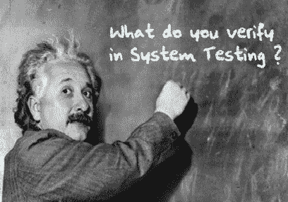
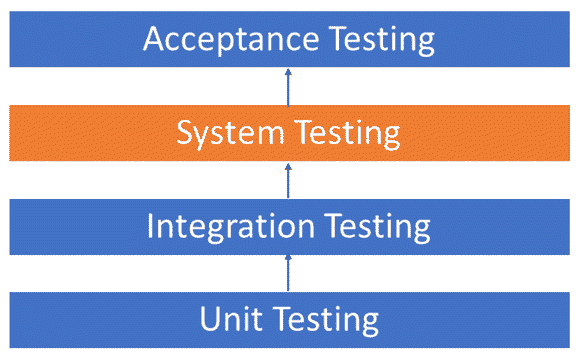

# 什么是系统测试？ 类型&的定义和示例

> 原文： [https://www.guru99.com/system-testing.html](https://www.guru99.com/system-testing.html)

## 什么是系统测试？

**SYSTEM TESTING** is a level of testing that validates the complete and fully integrated software product. The purpose of a system test is to evaluate the end-to-end system specifications. Usually, the software is only one element of a larger computer-based system. Ultimately, the software is interfaced with other software/hardware systems. System Testing is actually a series of different tests whose sole purpose is to exercise the full computer-based system.

在本教程中，我们将学习

*   [系统测试是黑盒](#1)
*   [您在系统测试中验证什么？](#2)
*   [软件测试层次结构](#3)
*   [不同类型的系统测试](#4)
*   [测试人员应该使用哪种类型的系统测试？](#5)

## 系统测试是黑盒

两类软件测试

*   黑匣子测试
*   白盒测试

系统测试属于软件测试的**黑盒测试**类别。

**白盒测试**是对软件应用程序内部工作或代码的测试。 相反，黑匣子或系统测试则相反。 从用户的角度来看，系统测试涉及软件的外部工作。

## 您在系统测试中验证什么？

系统测试涉及测试软件代码，以便进行以下操作

*   测试包括外部外围设备在内的完全集成的应用程序，以检查组件之间以及与整个系统之间如何交互。 这也称为端到端测试方案。
*   验证应用程序中每个输入的全面测试以检查所需的输出。
*   测试应用程序的用户体验。

这是系统测试所涉及内容的非常基本的描述。 您需要构建详细的测试用例和测试套件，以从外部查看测试应用程序各个方面的内容，而无需查看实际的源代码。

## 软件测试层次结构

与几乎所有软件工程过程一样，软件测试具有规定的执行顺序。 以下是按时间顺序排列的软件测试类别的列表。 这些是对新软件进行全面测试以准备进行营销的步骤：

*   在开发过程中，对每个模块或代码块执行单元测试。 [单元测试](/unit-testing-guide.html)通常由编写代码的程序员完成。

*   在将新模块集成到主软件包之前，之中和之后进行的集成测试。 这涉及测试每个单独的代码模块。 一件软件可以包含多个模块，这些模块通常由几个不同的程序员创建。 测试每个模块对整个程序模型的影响至关重要。

*   在将完整的软件产品推向市场之前，由专业的测试代理对系统进行测试。

*   验收测试-实际最终用户对产品进行的 Beta 测试。

## 不同类型的系统测试

有超过 50 种类型的系统测试。 有关软件测试类型的详尽列表，请单击此处的[。 下面我们列出了大型软件开发公司通常使用的系统测试类型](/types-of-software-testing.html)

1.  [可用性测试](/usability-testing-tutorial.html)-主要关注用户对应用程序的易用性，处理控件的灵活性以及系统满足其目标的能力

3.  [负载测试](/load-testing-tutorial.html)-必须知道软件解决方案将在实际负载下执行。

5.  [回归测试](/regression-testing.html)-进行测试以确保在开发过程中进行的所有更改均未引起新的错误。 它还可以确保随着时间的推移添加新软件模块不会出现旧错误。

7.  恢复测试-已完成以证明软件解决方案可靠，可信赖并且可以成功地从可能的崩溃中恢复过来。

9.  进行了迁移测试-以确保可以将软件从较早的系统基础结构迁移到当前的系统基础结构，而不会出现任何问题。

11.  功能测试-也称为功能完整性测试，[功能测试](/functional-testing.html)涉及尝试考虑任何可能缺少的功能。 测试人员可能会列出产品在功能测试期间可能需要改进的其他功能。

13.  硬件/软件测试-IBM 将硬件/软件测试称为“硬件/软件测试”。 这是测试人员在系统测试期间将注意力集中在硬件和软件之间的交互上的时候。

## 测试人员应该使用哪些类型的系统测试？

有超过 50 种不同类型的系统测试。 测试人员使用的特定类型取决于几个变量。 这些变量包括：

*   测试人员的工作对象-这是确定测试人员将使用的系统测试类型的主要因素。 大型公司使用的方法与中小型公司使用的方法不同。
*   可用于测试的时间-最终，可以使用所有 50 种测试类型。 时间通常是限制我们只能使用与软件项目最相关的类型的原因。
*   测试人员可用的资源-当然，某些测试人员将没有进行测试类型所需的资源。 例如，如果您是为大型软件开发公司工作的测试人员，则您可能会拥有昂贵的自动测试软件，而其他人则无法使用。
*   软件测试员的教育-对于每种可用的软件测试，都有一定的学习曲线。 要使用其中涉及的某些软件，测试人员必须学习如何使用它。
*   测试预算-金钱不仅成为小型公司和单个软件开发人员的因素，而且也成为大型公司的一个因素。