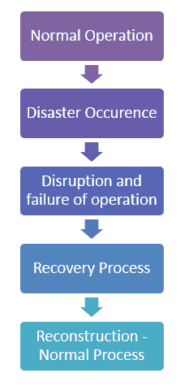

# 什么是恢复测试？ 与例子

> 原文： [https://www.guru99.com/recovery-testing.html](https://www.guru99.com/recovery-testing.html)

## 什么是恢复测试？

**恢复测试**验证系统从故障点（例如软件/硬件崩溃，网络故障等）中恢复的能力。恢复测试的目的是确定灾难之后还是在灾难恢复之后可以继续操作？ 系统已丢失。 它涉及还原到已知系统完整性的位置，然后重新处理事务直到出现故障为止。

## 恢复测试示例

当应用程序从网络接收数据时，请拔下连接电缆。

*   一段时间后，重新插入电缆，并分析应用程序从网络连接断开处继续接收数据的能力。
*   在浏览器打开一定数量的会话的同时重新启动系统，并检查浏览器是否能够恢复所有会话

在软件工程中，可恢复性测试是一种非[功能测试](/functional-testing.html)。 （非功能测试是指软件的某些方面可能与特定功能或用户操作（例如可伸缩性或安全性）无关。）

恢复所需的时间取决于：

*   重新启动点数
*   大量的应用程序
*   进行恢复活动的人员的培训和技能以及可用于恢复的工具。

如果存在许多故障，则应该以结构化的方式进行恢复测试，而不是解决所有故障，这意味着应该对一个段然后对另一个段进行恢复测试。

由专业测试人员完成。 在进行恢复测试之前，应将足够的备份数据保存在安全的位置。 这样做是为了确保即使在灾难之后也可以继续操作。

## 恢复过程的生命周期

恢复过程的生命周期可以分为以下五个步骤：

1.  普通手术
2.  灾难发生
3.  操作中断和失败
4.  通过恢复过程进行灾难清除
5.  重构所有流程和信息，使整个系统正常运行

让我们详细讨论这 5 个步骤-

1.  使由硬件，软件和固件组成的系统集成在一起以实现一个共同的目标，该系统可以运行以实现明确定义的目标。 调用该系统以执行正常操作以执行设计的工作，并且在规定的时间内没有任何中断。

2.  由于各种原因（例如输入引发的故障，由于硬件故障导致的软件崩溃，由于火灾，盗窃和罢工而造成的损坏），软件故障可能会导致中断。

3.  中断阶段是最痛苦的阶段，会导致业务损失，关系中断，机会损失，工时损失以及不可避免的财务和商誉损失。 每个明智的机构都应制定灾难恢复计划，以最大程度地减少中断阶段。

4.  如果在遭受灾难和破坏之前将备份计划和风险缓解流程放在正确的位置，则可以进行恢复而不会浪费大量时间，精力和精力。 应该定义一个指定的人及其团队，并为每个人指定角色，以确定责任并帮助组织从长期中断中解脱出来。

5.  重建可能涉及多个操作会话，以重建所有文件夹以及配置文件。 应该有适当的文档和重建过程，以便正确恢复。

## 恢复策略

恢复团队应该有其独特的策略来检索重要的代码和数据，以使该机构的运营恢复正常。

根据每个组织所处理系统的重要性，该策略对于每个组织可以是唯一的。

关键系统的可能策略可以如下所示：

1.  拥有一个或多个备份
2.  在一个地方或不同地方进行多个备份
3.  进行在线备份或脱机备份
4.  可以根据策略自动完成备份还是手动备份？
5.  拥有一个独立的修复团队或开发团队本身可以用于工作

这些策略中的每一个都有与之相关的成本因素，并且多次备份所需的多种资源可能会消耗更多的物理资源，或者可能需要独立的团队。

许多公司可能会因为其数据和代码对有关开发人员机构的依赖而受到影响。 例如，如果 Amazon [AWS](/aws-tutorial.html) 宕机，则会关闭 25 个互联网。 在这种情况下，独立还原至关重要。

## 如何进行恢复测试

在执行恢复测试时，应考虑以下事项。

*   我们必须创建一个尽可能接近实际部署条件的测试平台。 如果接口，协议，固件，硬件和软件的更改不尽相同，则应尽可能接近实际情况。
*   通过详尽的测试可能会很耗时，而且成本高昂，必须执行相同的配置并进行完整的检查。
*   如果可能，应该在我们最终将要还原的硬件上执行测试。 如果要还原到与创建备份的计算机不同的计算机，则尤其如此。
*   一些备份系统期望硬盘驱动器的大小与备份源的大小完全相同。
*   随着驱动器技术的快速发展，应管理过时的设备，并且旧驱动器可能与新驱动器不兼容。 解决该问题的一种方法是还原到虚拟机。 像 VMware Inc.这样的虚拟化软件供应商可以配置虚拟机以模仿现有硬件，包括磁盘大小和其他配置。
*   在线备份系统也不是测试的例外。 大多数在线备份服务提供商通过使用容错存储系统来保护我们，使其免受直接暴露于媒体问题的影响。
*   尽管在线备份系统非常可靠，但我们必须测试系统的还原端，以确保检索功能，安全性或加密没有问题。

## 恢复后的测试程序

大多数大公司都有独立的审计师来定期进行恢复测试。

维护和测试全面的灾难恢复计划的费用可能是巨大的，并且对于小型企业来说可能是禁止的。

如果发生灾难，较小的风险可能取决于其数据备份和异地存储计划来保存它们。

还原文件夹和文件后，可以进行以下检查以确保正确恢复文件：

*   重命名损坏的文档文件夹
*   计算还原的文件夹中的文件，并与现有文件夹匹配。
*   打开一些文件，并确保它们可访问。 确保使用通常使用它们的应用程序打开它们。 并确保您可以浏览数据，更新数据或通常执行的任何操作。
*   最好打开几个不同类型的文件，图片，mp3，文档以及一些大大小小的文件。
*   大多数操作系统都有实用程序，可用于比较文件和目录。

**摘要：**

在本教程中，我们学习了恢复测试的各个方面，这些知识可以帮助您了解发生故障后系统或程序是否满足其要求。

***本文由 Shweta Priyadarshini*** 提供